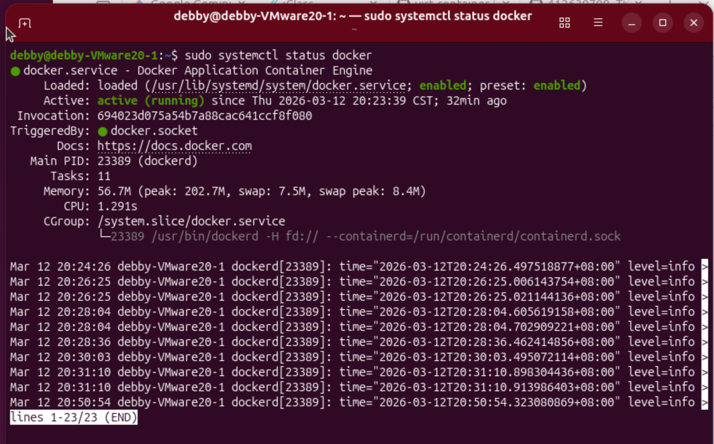
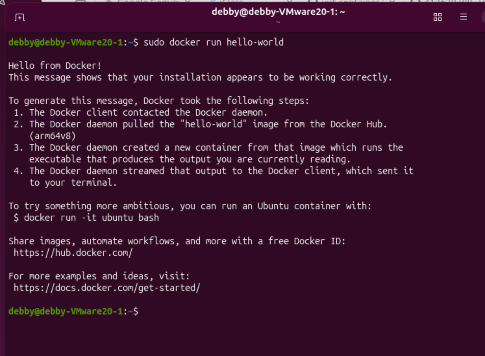
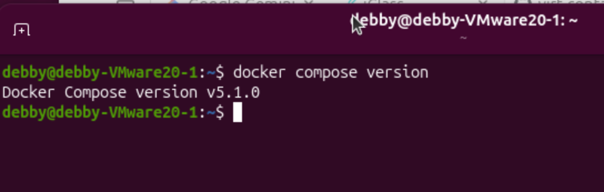
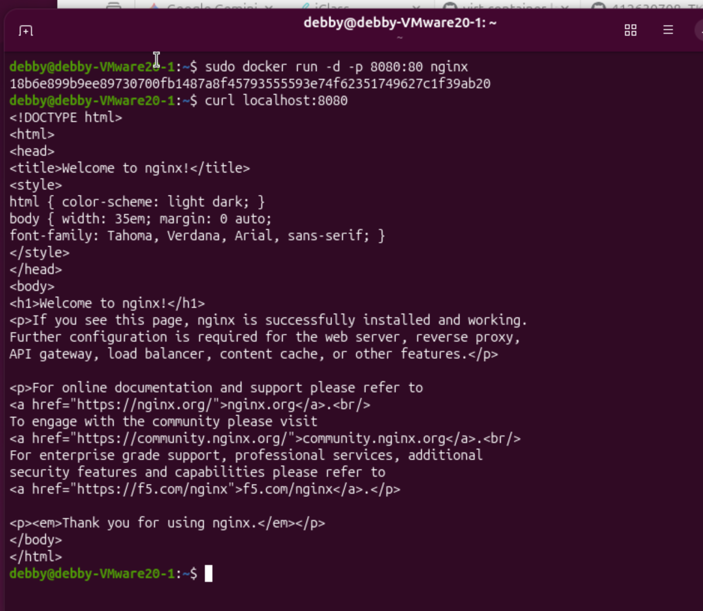
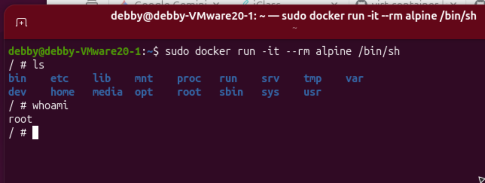
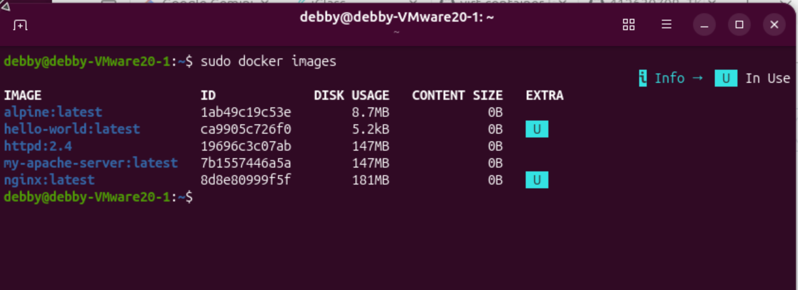

# W01｜虛擬化概論、環境建置與 Snapshot 機制

## 環境資訊
- Host OS: macOS (M4 Mac)
- VM 名稱: vct-w01-412630708
- Ubuntu 版本: Ubuntu 25.10 (Questing)
- Docker 版本: Docker version 29.3.0
- Docker Compose 版本: Docker Compose version v5.1.0

## VM 資源配置驗證

| 項目 | VMware 設定值 | VM 內命令 | VM 內輸出 |
|---|---|---|---|
| CPU | 2 vCPU | `lscpu \| grep "^CPU(s)"` | CPU(s): 2 |
| 記憶體 | 4 GB | `free -h \| grep Mem` | Mem: 3.3Gi |
| 磁碟 | 20 GB | `df -h / \| grep "/$"` | /dev/nvme0n1p2 19G |
| Hypervisor | VMware | `lscpu \| grep Hypervisor` | Hypervisor vendor: VMware |

## 四層驗收證據
- [x] ① Repository：`cat /etc/apt/sources.list.d/docker.list` 輸出

- [x] ② Engine：`dpkg -l | grep docker-ce` 輸出

- [x] ③ Daemon：`sudo systemctl status docker` 顯示 active

- [x] ④ 端到端：`sudo docker run hello-world` 成功輸出

- [x] Compose：`docker compose version` 可執行


## 容器操作紀錄
- [x] nginx：`sudo docker run -d -p 8080:80 nginx` + `curl localhost:8080` 輸出

- [x] alpine：`sudo docker run -it --rm alpine /bin/sh` 內部命令與輸出

- [x] 映像列表：`sudo docker images` 輸出


## Snapshot 清單

| 名稱 | 建立時機 | 用途說明 | 建立前驗證 |
|---|---|---|---|
| clean-baseline | 21:28 | 原始乾淨基線，僅安裝 Docker 引擎 | hostnamectl、docker --version |
| docker-ready | 21:32 | 開發就緒狀態，包含基礎映像檔 | sudo docker images、hello-world |

## 故障演練三階段對照

| 項目 | 故障前（基線） | 故障中（注入後） | 回復後 |
|---|---|---|---|
| docker.list 存在 | 是 | 否 (.broken) | 是 |
| apt-cache policy 有候選版本 | 是 | 否 | 是 |
| docker 重裝可行 | 是 | 否 | 是 |
| hello-world 成功 | 是 | N/A | 是 |
| nginx curl 成功 | 是 | N/A | 是 |

### 故障與回復證據對照


## 手動修復 vs Snapshot 回復

| 面向 | 手動修復 | Snapshot 回復 |
|---|---|---|
| 所需時間 | 約 1 分鐘 | 約 30 秒 |
| 適用情境 | 確切知道哪個設定檔被改動時 | 系統發生毀滅性損壞或不明故障時 |
| 風險 | 可能產生人為二次輸入錯誤 | 強制回到歷史健康時間點，遺失後續變更 |

## Snapshot 保留策略
- 新增條件：重大系統設定變更前，且確保當前環境已通過功能驗證。
- 保留上限：最多保留 3 個活躍 snapshot。
- 刪除條件：新進度節點已驗證穩定，且舊節點確認不再需要回溯。

## 最小可重現命令鏈
```bash
# 故障注入
sudo mv /etc/apt/sources.list.d/docker.list /etc/apt/sources.list.d/docker.list.broken && sudo apt update
# 驗證故障 (應顯示找不到候選版本)
apt-cache policy docker-ce | head -5
# 回復驗證 (執行 Revert Snapshot 後)
ls /etc/apt/sources.list.d/docker.list && sudo docker run --rm hello-world
