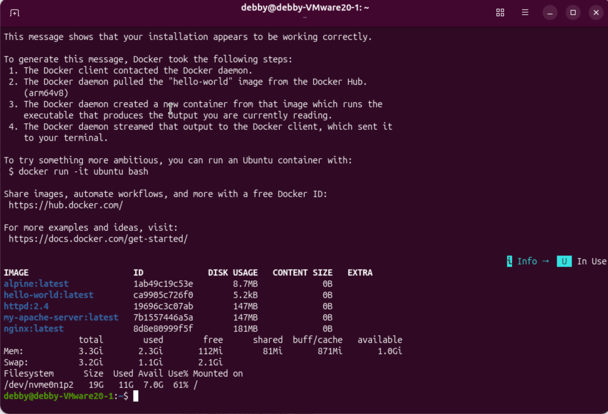
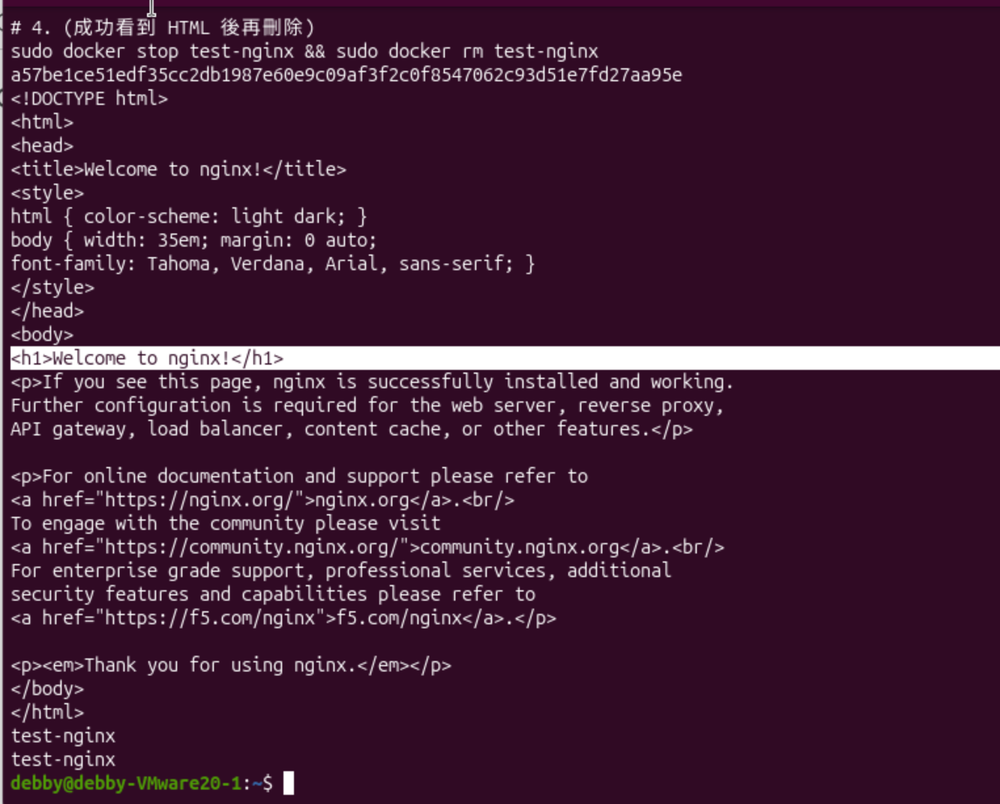
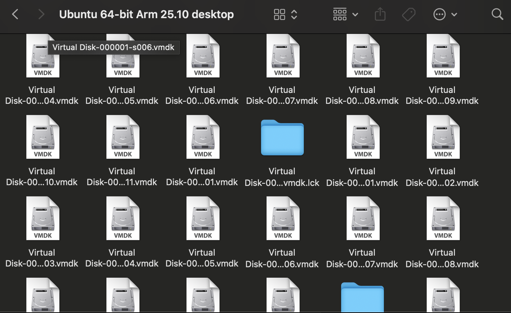
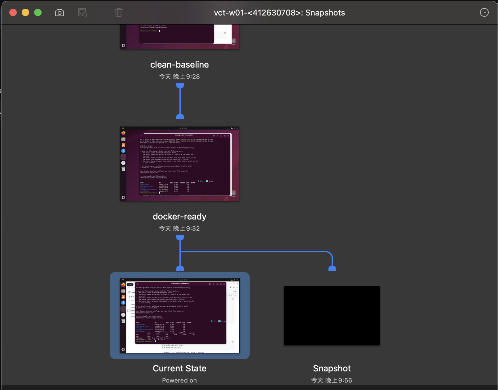
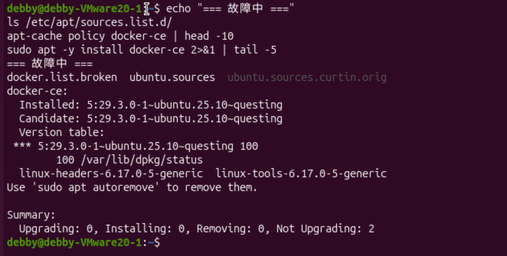
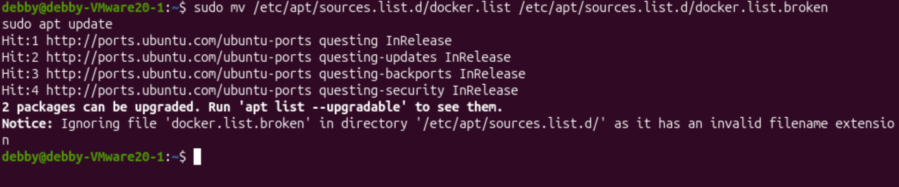

# W01｜虛擬化概論、環境建置與 Snapshot 機制

## 環境資訊
- **Host OS**: macOS (M4 Mac)
- **VM 名稱**: vct-w01-412630708
- **Ubuntu 版本**: 25.10
- **Docker 版本**: 29.3.0
- **Docker Compose 版本**: v5.1.0

## VM 資源配置驗證
| 項目 | VMware 設定值 | VM 內輸出 |
|---|---|---|
| CPU | 2 vCPU | CPU(s): 2 |
| 記憶體 | 4 GB | Mem: 3.3Gi |
| 磁碟 | 20 GB | /dev/nvme0n1p2 19G |
| Hypervisor | VMware | Hypervisor vendor: VMware |

## 四層驗收證據
- [x] ① Repository: docker.list 已配置成功
- [x] ② Engine: docker-ce (5:29.3.0) 已安裝
- [x] ③ Daemon: Active (running) 狀態正常
- [x] ④ 端到端: Hello from Docker! 執行成功
- [x] Compose: v5.1.0 驗證可執行

## 容器操作紀錄
- [x] **nginx**: 成功啟動於 8080 port，並透過 logs 確認啟動完成。
- [x] **alpine**: 進入 /sh 環境並確認 OS 版本。
- [x] **映像列表**: 包含 alpine, nginx, hello-world。

## Snapshot 清單
| 名稱 | 建立時機 | 用途說明 | 建立前驗證 |
|---|---|---|---|
| clean-baseline | 20:35 | 原始乾淨狀態 | hostnamectl、docker --version |
| docker-ready | 20:37 | 包含映像檔狀態 | sudo docker images |

### Snapshot 結構與磁碟觀察

## 故障演練三階段對照
| 項目 | 故障前 | 故障中 | 回復後 |
|---|---|---|---|
| docker.list 存在 | 是 | 否 (.broken) | 是 |
| apt-cache policy | 有版本 | none | 有版本 |
| hello-world | 成功 | N/A | 成功 |

### 故障注入與回復證據
- **故障證據**：顯示軟體源失效

- **再次注入**：確保回復流程正確

## Snapshot 保留策略
- **新增條件**：每次安裝新工具或進行重大系統設定變更前，且確保當前環境已通過功能驗證（如 Docker 可正常啟動）。
- **保留上限**：最多保留 3 個活躍 snapshot，避免占用過多 Host 端磁碟空間。
- **刪除條件**：當新的進度節點已建立並驗證穩定，且舊節點之狀態確認不再需要回溯時，刪除時間點最舊的快照。
