# W02｜VMware 網路模式與雙 VM 排錯

## 網路配置
| VM | 網卡 | 模式 | IP | 用途 |
|---|---|---|---|---|
| dev-a | NIC 1 | Share with my Mac (NAT) | 172.16.109.140 | 對外上網、跳板機 |
| dev-a | NIC 2 | Private to my Mac (Host-only) | 172.16.49.132 | 內部通訊 |
| server-b | NIC 1 | Private to my Mac (Host-only) | 172.16.49.133 | 隔離伺服器 |

---

## 1. 基礎連線驗證

### 系統身份確認
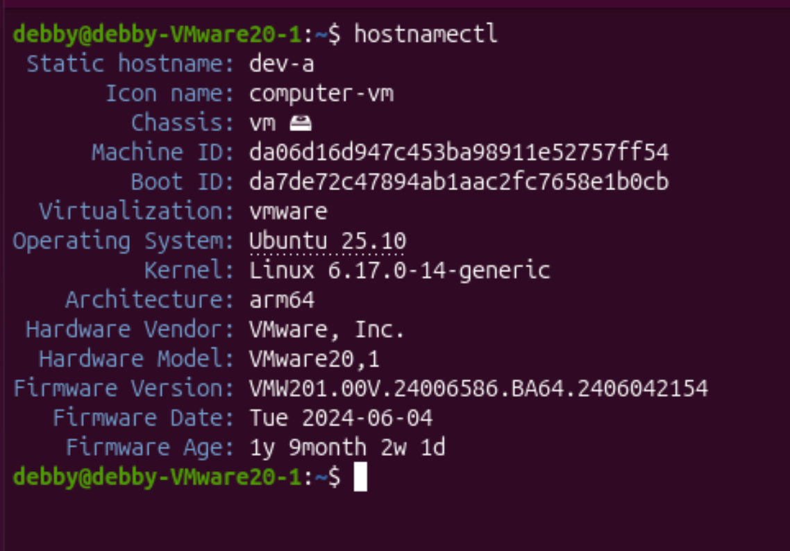
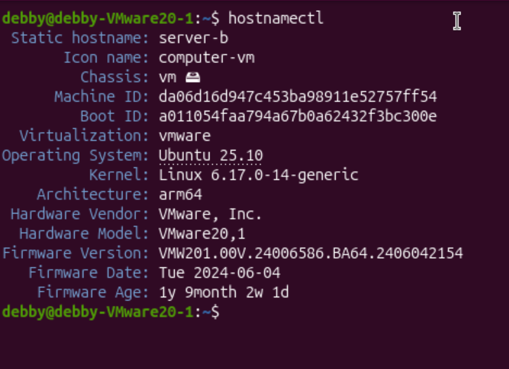

### 網卡 IP 配置
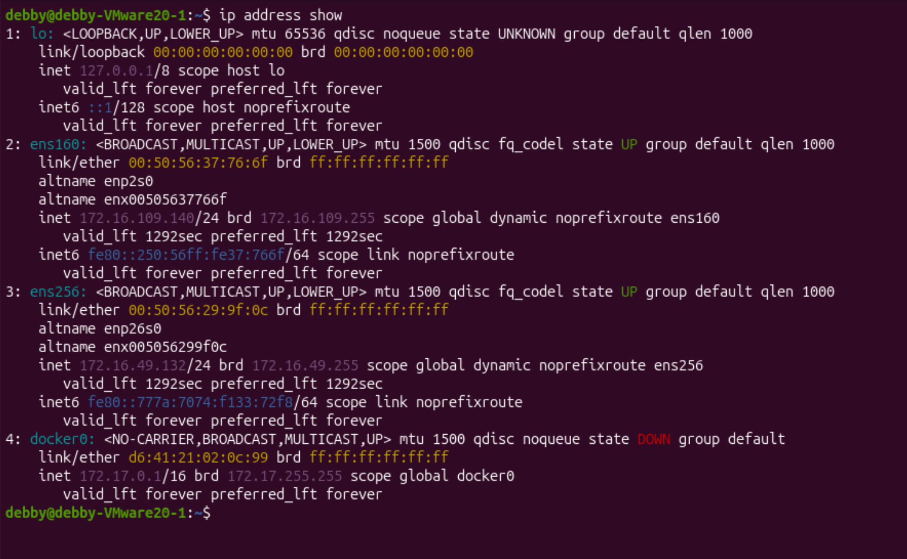
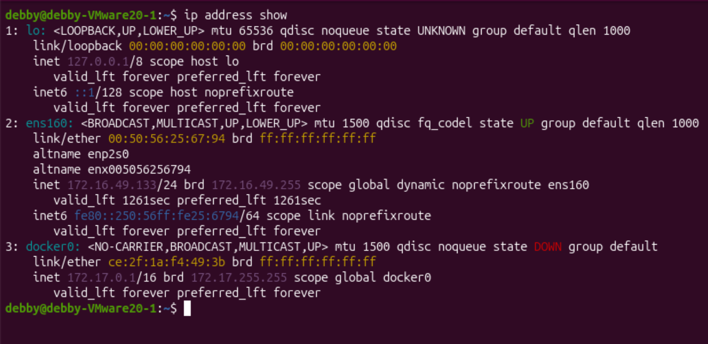

### 連線測試 (NAT & Ping)
* **dev-a 連外網測試**：
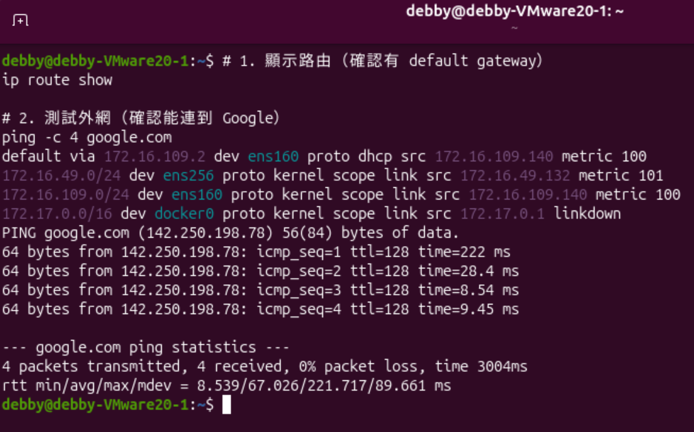

* **雙向互 Ping 測試**：
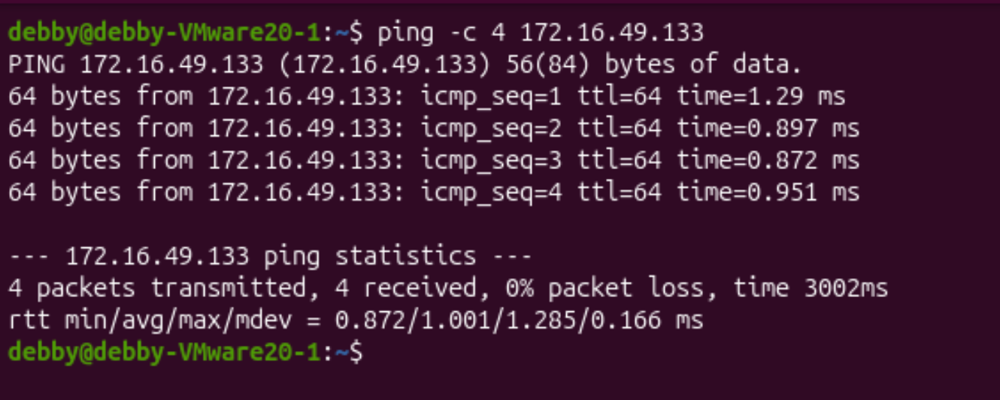
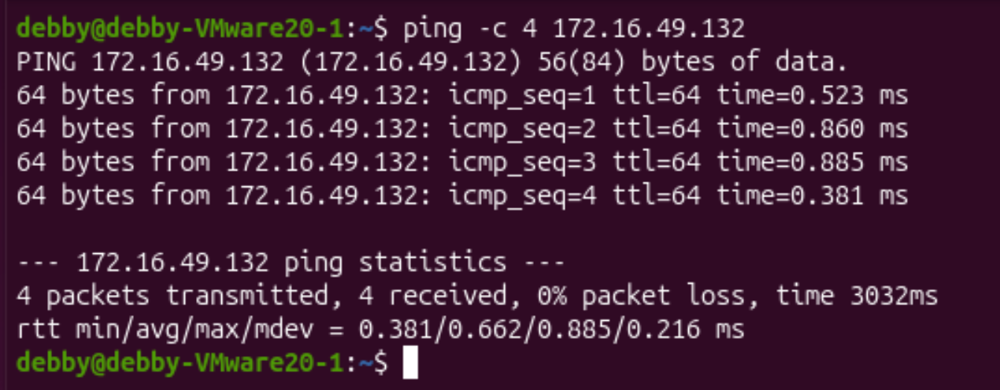

---

## 2. SSH 服務與遠端操作驗證

### SSH 狀態與監聽
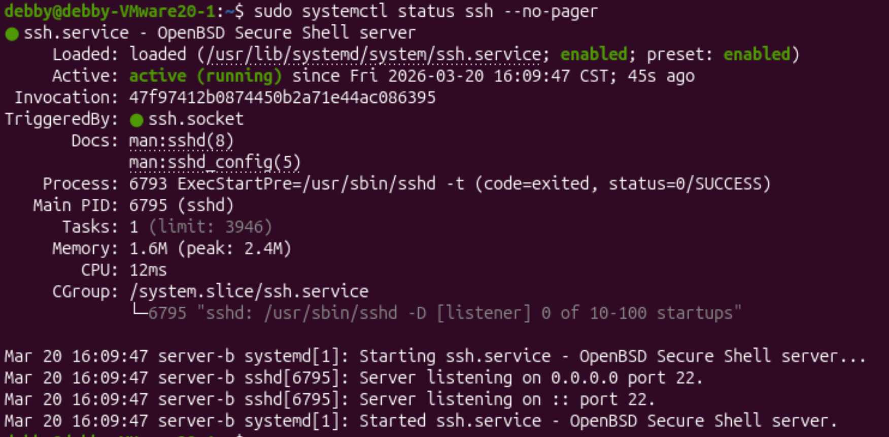
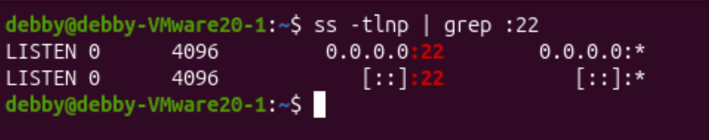

### 遠端登入與指令執行
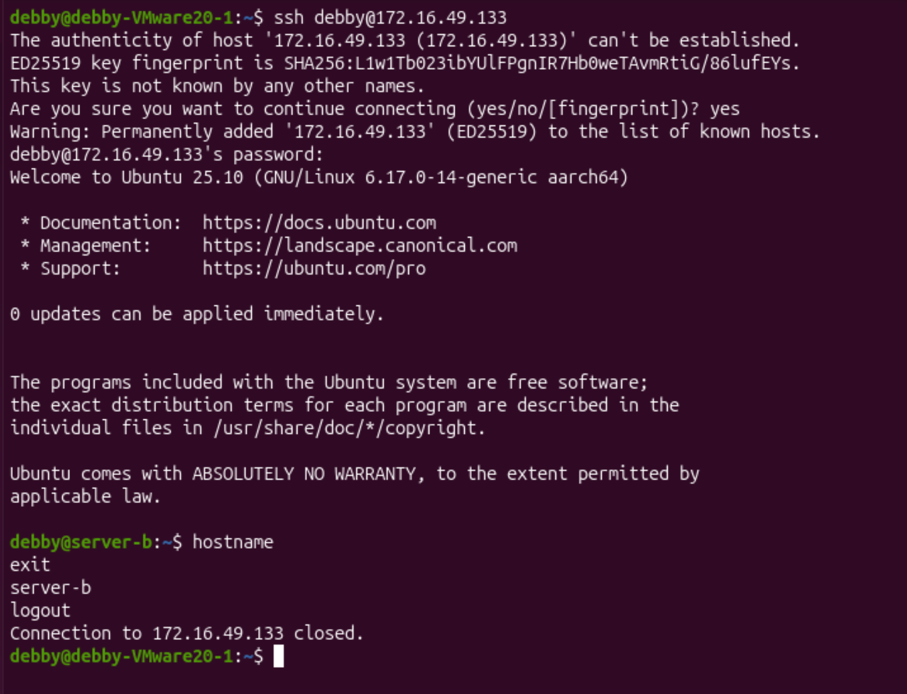
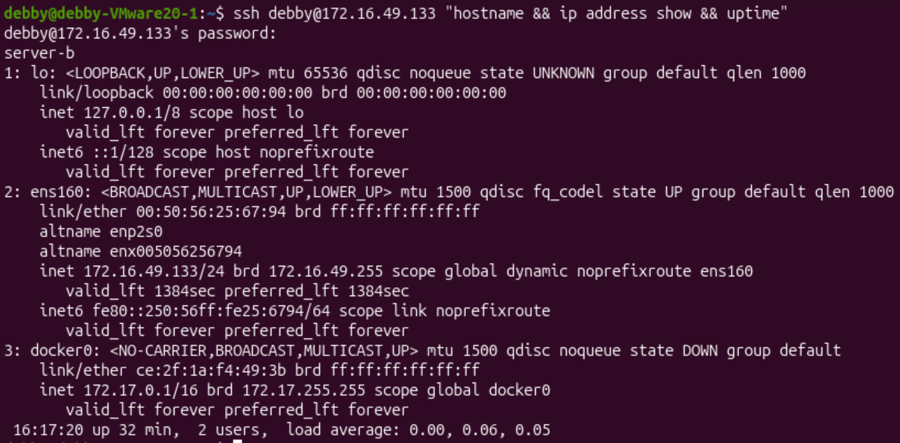

### SCP 檔案傳輸驗證
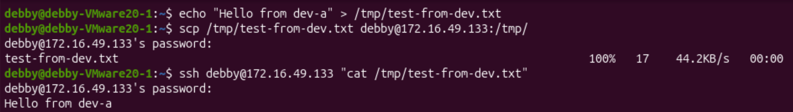

### 隔離驗證 (server-b 確實連不上網)
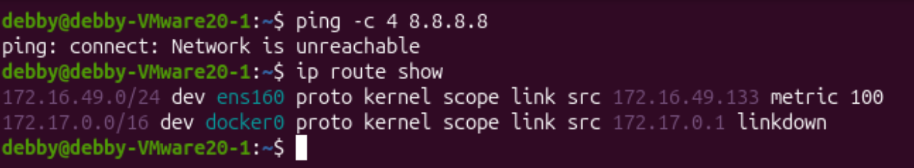

---

## 3. 故障演練 (Troubleshooting)

### 故障前基線紀錄

### 故障演練一：L2 介面停用 (Interface Down)
* **故障注入**：`sudo ip link set ens160 down`
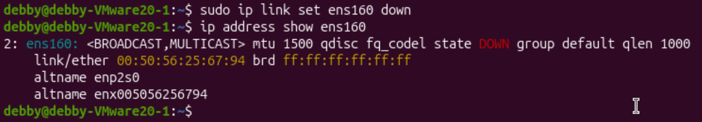

* **觀察失敗**：`No route to host`
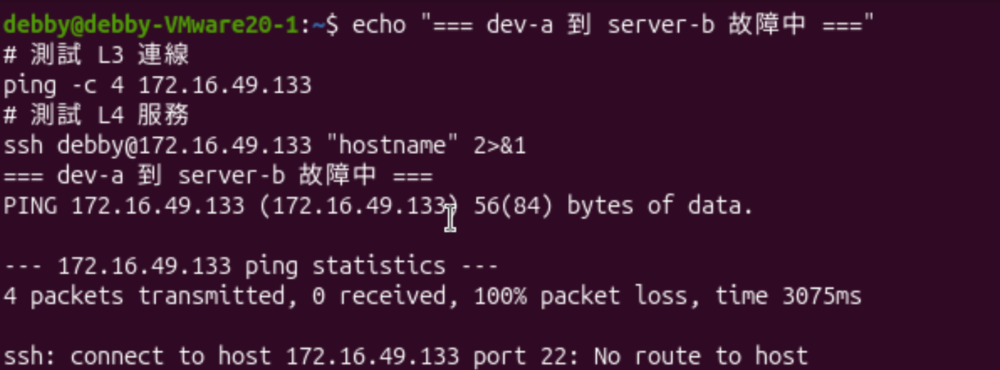

* **回復驗證**：
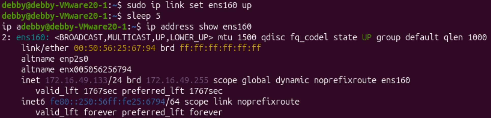
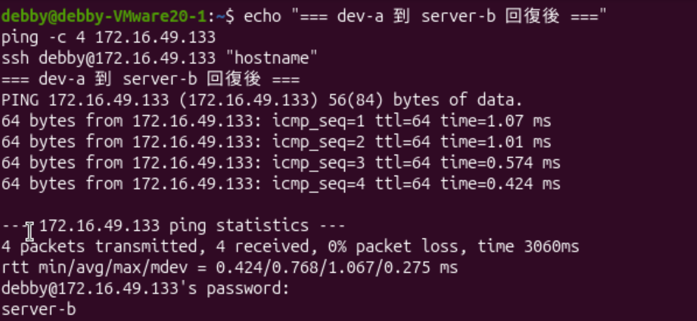

### 故障演練二：L4 服務停止 (SSH Socket Stop)
* **故障注入**：徹底關閉 SSH Socket
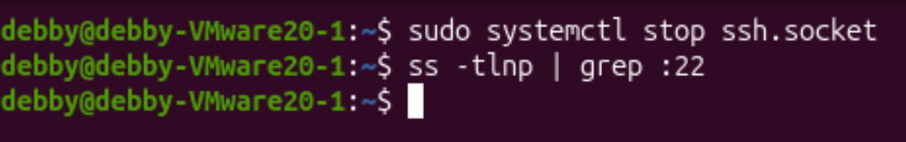

* **觀察失敗**：`Connection refused` (注意：此時 Ping 是通的)
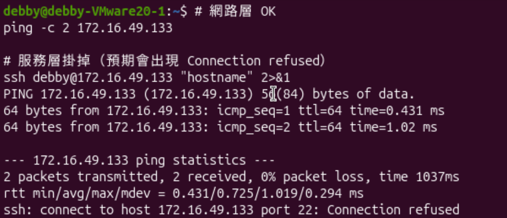

* **回復驗證**：

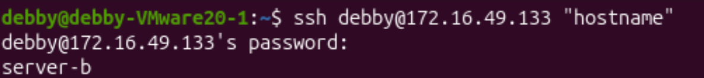

---

## 4. 排錯紀錄 (Troubleshooting Log)

* **症狀**：
    在「故障演練二」中，執行 `sudo systemctl stop ssh` 後，從 dev-a 仍然可以成功 SSH 登入 server-b，故障注入失敗。
* **診斷**：
    1. 首先懷疑服務未真正停止，在 server-b 執行 `systemctl status ssh`。
    2. 發現雖然 `ssh.service` 已停止，但下方顯示 `TriggeredBy: ● ssh.socket`。
    3. 使用 `ss -tlnp | grep :22` 檢查，發現 Port 22 依然處於 `LISTEN` 狀態。
    4. **結論**：Ubuntu 的 SSH 具有 Socket Activation 機制，當有連線進來時會自動喚醒服務。
* **修正**：
    執行 `sudo systemctl stop ssh.socket` 徹底關閉監聽插座。
* **驗證**：
    再次執行 `ss -tlnp | grep :22` 顯示無輸出，且從 dev-a 連線出現 `Connection refused`，確認故障模擬成功。

## 5. 設計決策 (Design Decisions)

### 為什麼 server-b 只設定 Host-only 而不給 NAT？
* **安全性 (Security)**：模擬企業內部的核心資料庫或後端伺服器，這類主機不應直接暴露在網際網路中。透過 Host-only 模式，我們強制所有存取必須經過 `dev-a`（跳板機），建立了一道防線。
* **可控性 (Isolation)**：確保 server-b 的流量完全鎖定在虛擬內網中，避免因外部網路環境（如 DHCP 變動）導致實驗數據異常，並能精確練習 L2/L3/L4 的排錯流程。

## 6. 網路拓樸圖

