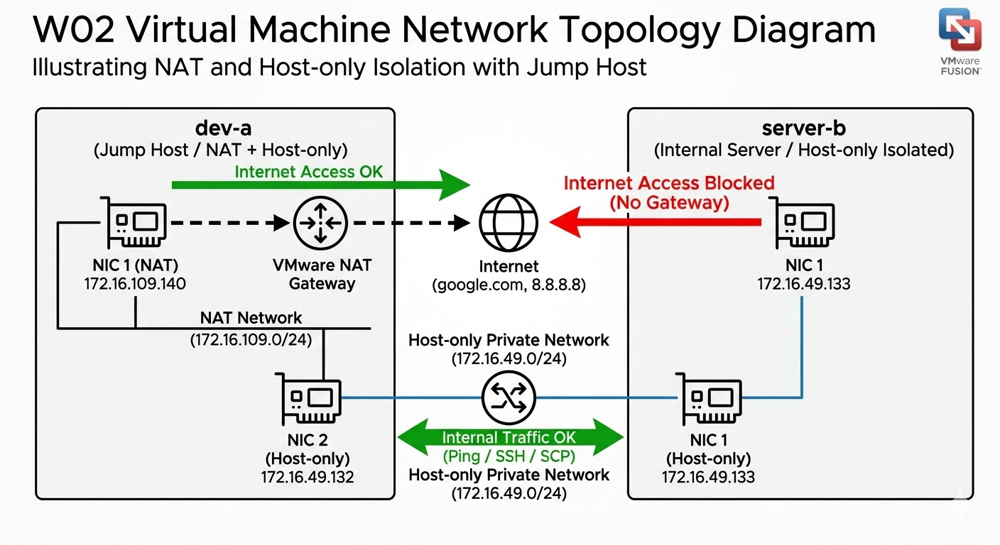

# W02｜VMware 網路模式與雙 VM 排錯

## 網路配置
| VM | 網卡 | 模式 | IP | 用途 |
|---|---|---|---|---|
| dev-a | NIC 1 | Share with my Mac (NAT) | 172.16.109.140 | 對外上網、跳板機 |
| dev-a | NIC 2 | Private to my Mac (Host-only) | 172.16.49.132 | 內部通訊 |
| server-b | NIC 1 | Private to my Mac (Host-only) | 172.16.49.133 | 隔離伺服器 |

## 1. 基礎連線驗證

### 系統身份確認

### 網卡 IP 配置

### 連線測試 (NAT & Ping)
* **dev-a 連外網測試**：

* **雙向互 Ping 測試**：

---

## 2. SSH 服務與遠端操作驗證

### SSH 狀態與監聽

### 遠端登入與指令執行

### SCP 檔案傳輸驗證

### 隔離驗證 (server-b 確實連不上網)

---

## 3. 故障演練 (Troubleshooting)

### 故障前基線紀錄

### 故障演練一：L2 介面停用 (Interface Down)
* **故障注入**：`sudo ip link set ens160 down`

* **觀察失敗**：`No route to host`

* **回復驗證**：

### 故障演練二：L4 服務停止 (SSH Socket Stop)
* **故障注入**：徹底關閉 SSH Socket

* **觀察失敗**：`Connection refused` (注意：此時 Ping 是通的)

* **回復驗證**：

---

## 4. 網路拓樸圖

