# W05｜把容器拆開來看：Namespace / Cgroups / Union FS / OCI

## Docker 環境


- Docker version：29.3.0, build 5927d80
- Storage Driver：overlay2
- Cgroup Driver：systemd
- Cgroup Version：2
- Default Runtime：runc
- Runtimes：io.containerd.runc.v2 runc

cgroup v2 掛載點確認：


`cgroup2 on /sys/fs/cgroup type cgroup2 (rw,nosuid,nodev,noexec,relatime,nsdelegate,memory_recursiveprot)`，所有控制器掛在同一棵樹下，路徑統一為 `/sys/fs/cgroup/`，看到的是 `cpu.max`、`memory.max` 這類 v2 統一檔名。

---

## Namespace 觀察

### 六種 namespace 用途（自己的話）

- **PID**：把 process ID 空間切成獨立隔間。容器內看到的 PID 1 是自己跑的程式，host 看到的是一個普通的大數字 PID。同一支 process，兩個視角。
- **NET**：每個容器有自己的網路協定堆疊——獨立的 lo、eth0、路由表、iptables。host 那一堆 docker0、veth 容器都看不到。
- **MNT**：容器有自己的 mount 視圖，包括自己的 `/`。看不到 host 的 `/home`、`/var/lib/docker` 這些東西。
- **UTS**：隔離 hostname 和 domain name。容器改自己的 hostname 不會影響 host，反之亦然。
- **IPC**：隔離 System V IPC 和 POSIX message queue。不同容器之間不能用共享記憶體或 semaphore 互通。
- **USER**：UID/GID 對映。容器內的 root（uid=0）可以對映到 host 的非特權使用者，提高隔離強度。預設 Docker 不開，所以容器內外 user namespace inode 一樣。

### 啟動長生命週期容器（ns-demo）

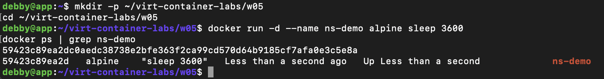

```
docker run -d --name ns-demo alpine sleep 3600
```

容器 ID：`59423c89ea2d...`

### 取得容器在 host 上的 PID

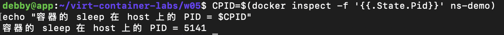

容器的 `sleep 3600` 在 host 上的 PID = **5141**。

### 檢視容器 process 的 namespace（host 視角）

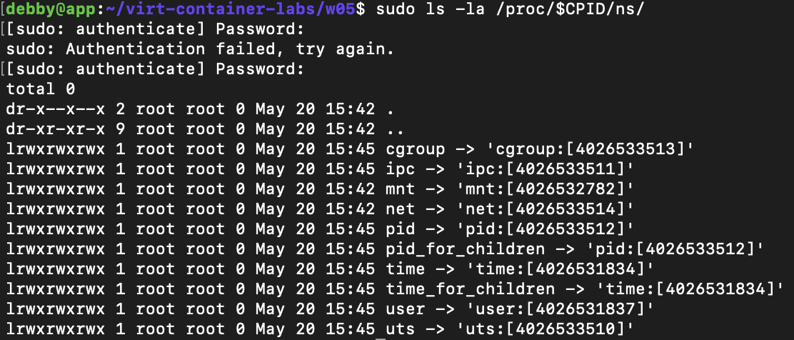

### 對比 Host PID 1 的 namespace

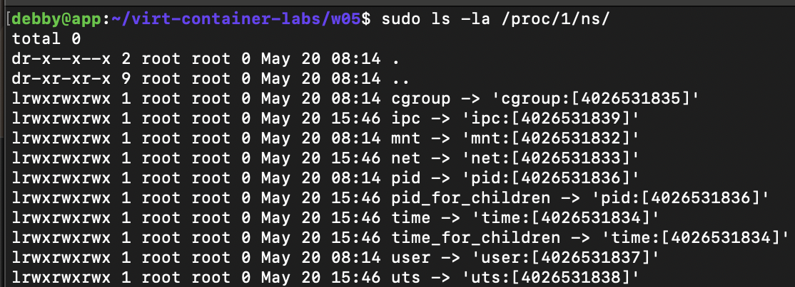

### Host vs 容器 inode 對照表

| Namespace | Host PID 1 inode | 容器 sleep inode | 一樣嗎？ |
| :--- | :--- | :--- | :--- |
| pid  | pid:[4026531836]  | pid:[4026533512]  | 否 |
| net  | net:[4026531833]  | net:[4026533514]  | 否 |
| mnt  | mnt:[4026531832]  | mnt:[4026532782]  | 否 |
| uts  | uts:[4026531838]  | uts:[4026533510]  | 否 |
| ipc  | ipc:[4026531839]  | ipc:[4026533511]  | 否 |
| user | user:[4026531837] | user:[4026531837] | 是 |

五種 namespace inode 不同 → 隔離生效；user namespace 一樣 → 預設 Docker 沒開 user namespace remap，所以容器內的 root 就是 host 的 root（這也是容器安全模型的弱點之一）。

### 容器內 `ps aux` 輸出

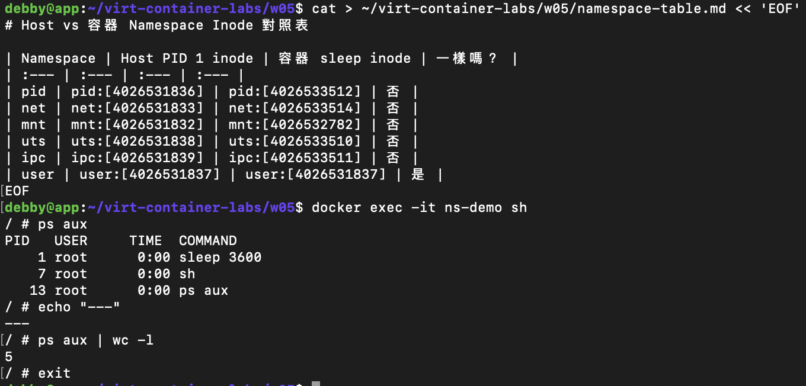

容器內 `ps aux | wc -l` = 5（含 header 跟自己），實際 process 只看到 `sleep 3600`（PID 1）、`sh`、`ps aux`。

**為什麼只看到三支？** PID namespace 把 process ID 空間切開了——容器只看得到「自己這個 namespace 裡」的 process。host 上同時跑著 dockerd、containerd、systemd、各種 daemon，但對容器來說那些都在另一個 PID namespace 裡，不可見。容器內 PID 1 就是它的 init（這裡是 `sleep`）。

### 用 nsenter 從 host 跳進容器的 namespace

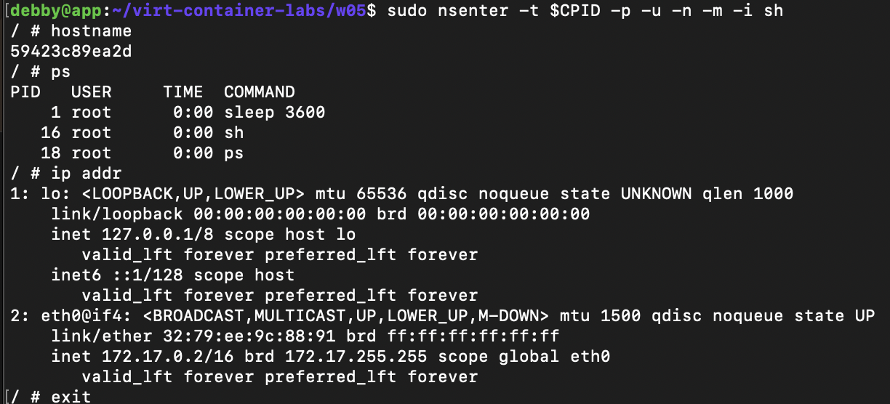

`nsenter -t $CPID -p -u -n -m -i sh` 直接呼叫 kernel 介面把自己塞進指定的 PID/UTS/NET/MNT/IPC namespace。進去後看到的 hostname 是 `59423c89ea2d`、`ps` 只列出三支 process、`ip addr` 只看得到 lo 跟 eth0@if4——跟 `docker exec` 效果一樣，但走的是 kernel 原生介面，不經過 docker CLI。

### UTS / NET namespace 隔離驗證

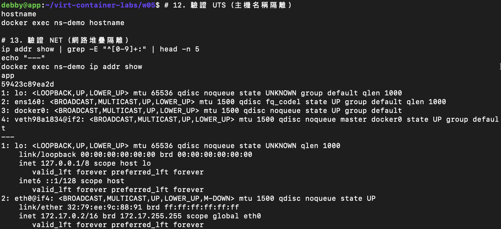

- **UTS**：host 的 hostname 是 `app`，容器的 hostname 是 `59423c89ea2d`（自動生成的 container id 前 12 碼）。兩邊各自有自己的 hostname。
- **NET**：host 看得到 lo、ens160、docker0、veth98a1834@if2 四個 interface；容器只看得到 lo 跟 eth0@if4（172.17.0.2/16）。兩個獨立的網路堆疊，靠 veth pair 把兩端串起來。

---

## Cgroups 實驗

### 啟動資源限制容器

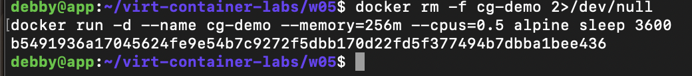

```
docker run -d --name cg-demo --memory=256m --cpus=0.5 alpine sleep 3600
```

### 容器內讀到的限制

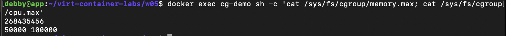

- `memory.max` = **268435456**（bytes，= 256 MiB，對到 `--memory=256m`）
- `cpu.max` = **50000 100000**（每 100ms 最多用 50ms CPU 時間 = 0.5 核，對到 `--cpus=0.5`）

### Host 端對照

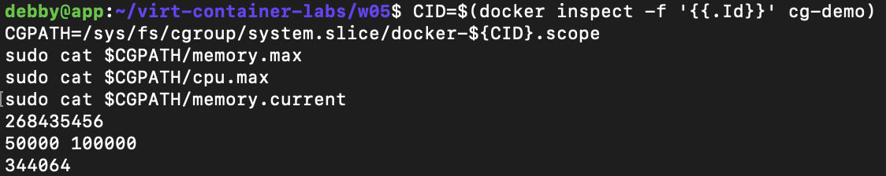

路徑：`/sys/fs/cgroup/system.slice/docker-${CID}.scope`

- `memory.max` = 268435456 ← 與容器內讀到的完全一致
- `cpu.max` = 50000 100000 ← 與容器內讀到的完全一致
- `memory.current` = 344064（執行當下實際使用 bytes，約 336 KiB）

容器內外讀到一致的數值，證明 `docker run --memory=256m --cpus=0.5` 這兩個 flag 經 dockerd → containerd → runc 後，最終就是寫進這個 cgroup scope 目錄裡的 `memory.max` 和 `cpu.max` 檔案，kernel 依此執行限制。

### 觀察 CPU 限制表現

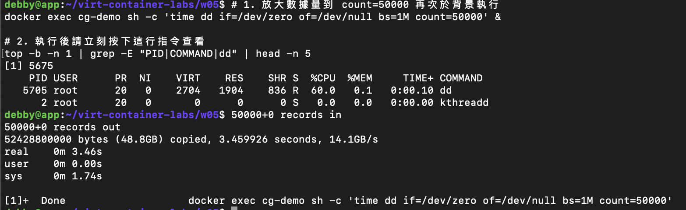

在 `cg-demo`（`--cpus=0.5`）內背景跑 `dd if=/dev/zero of=/dev/null bs=1M count=50000`，從 host 端 `top` 觀察該 dd process：

- `%CPU` = **60.0**，最終 5705 PID 的 dd 跑完顯示 `real 3.46s / sys 1.74s / user 0.00s`
- CPU% 沒有衝到 100%，被壓在 50% 上下 ±10%（受採樣與 burst 影響），印證 `cpu.max=50000 100000` 真的有限制 CPU 配額。

### OOM 故障三階段

#### 故障注入

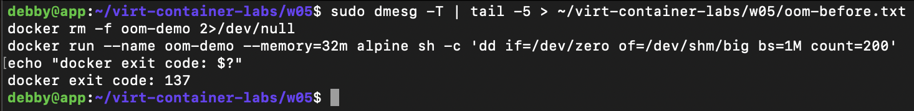

```
docker run --name oom-demo --memory=32m alpine \
    sh -c 'dd if=/dev/zero of=/dev/shm/big bs=1M count=200'
```

`docker exit code: 137`（= 128 + 9 = SIGKILL）

#### 抓取 OOM 核心證據

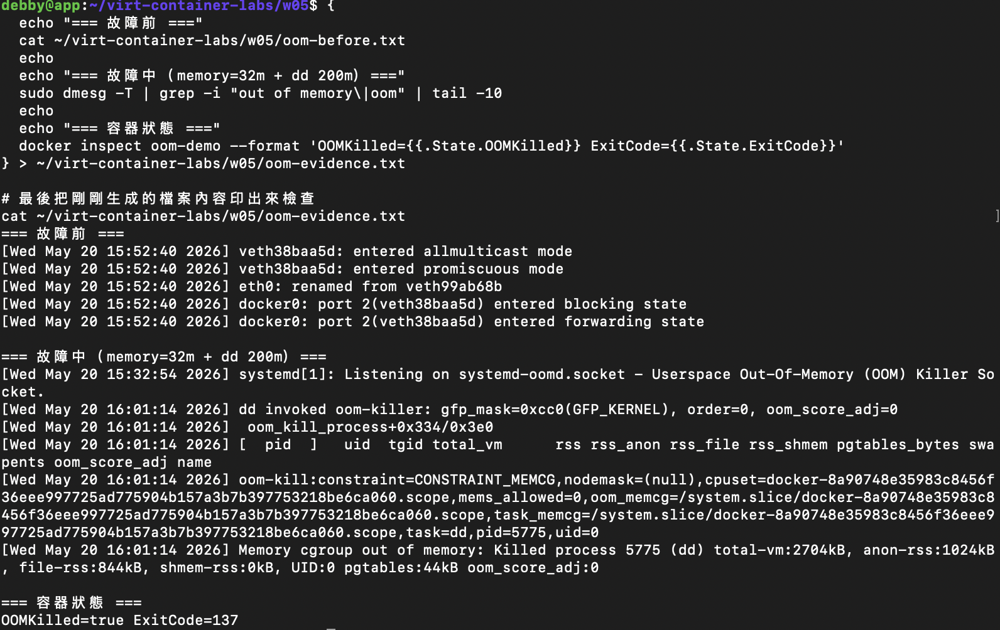

關鍵 kernel log：

```
dd invoked oom-killer: gfp_mask=0xcc0(GFP_KERNEL), order=0, oom_score_adj=0
oom-kill:constraint=CONSTRAINT_MEMCG, ...,
    oom_memcg=/system.slice/docker-8a90748e...scope, task=dd, pid=5775, uid=0
Memory cgroup out of memory: Killed process 5775 (dd) total-vm:2704kB,
    anon-rss:1024kB, file-rss:844kB, shmem-rss:0kB, UID:0 pgtables:44kB
    oom_score_adj:0
```

容器狀態：`OOMKilled=true ExitCode=137`

#### 回復測試

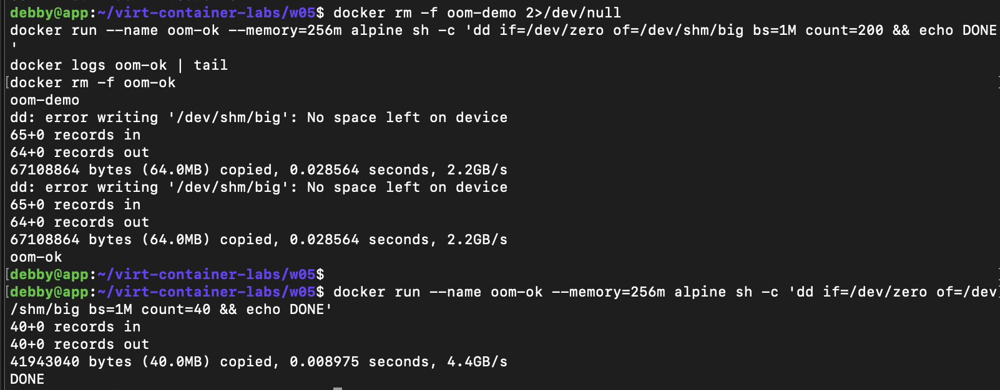

第一次 `--memory=256m + count=200`（寫 200MB 到 /dev/shm）失敗，因為 alpine 的 `/dev/shm` 預設 tmpfs 大小是容器記憶體的一半（~128MB），印出 `dd: error writing '/dev/shm/big': No space left on device`，但這次是 **tmpfs 滿了** 不是 OOM。

放寬到 `count=40`（寫 40MB）後成功跑完印出 DONE，exit code 0。

| 項目 | 故障前 | 故障中（memory=32m + dd /dev/shm 200m）| 回復後（memory=256m + dd /dev/shm 40m）|
| :--- | :--- | :--- | :--- |
| 容器 exit code | - | 137 | 0 |
| OOMKilled | - | true | false |
| dmesg 關鍵字 | 無 OOM | `Memory cgroup out of memory: Killed process ... dd` | 無 OOM |

**為什麼寫 /dev/shm 才能乾淨觸發 OOM？** `/dev/shm` 是 tmpfs，掛在記憶體裡，寫進去的資料會算進 memory cgroup；如果寫到 `/tmp/fill`（overlay2 可寫層），那是磁碟、不吃 RAM，永遠不會 OOM。另外用 `dd` 而不是 `stress-ng` 是因為 `dd` 是單一程序、PID 1 直接被殺，能乾淨拿到 ExitCode=137；stress-ng 的 fork-supervisor 設計會讓 worker 被殺後 parent 自己處理 SIGCHLD，最後 ExitCode=0 但 OOMKilled=true，教學上會混淆。

---

## Image 分層

### docker pull 兩個同源 image

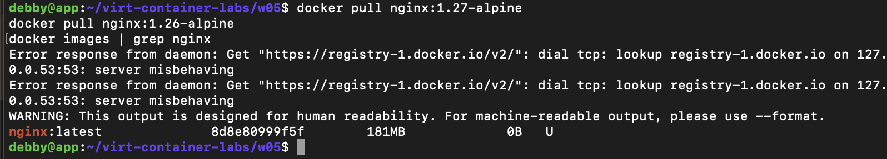

> 排錯紀錄：第一次拉取 `nginx:1.27-alpine` 跟 `nginx:1.26-alpine` 都失敗（`dial tcp: lookup registry-1.docker.io on 127.0.0.53:53: server misbehaving`），是 systemd-resolved 的 DNS 解析失敗。改用 host 上已經有的 `nginx:latest` 做後面的 layer 觀察。

### docker image inspect 看 layer

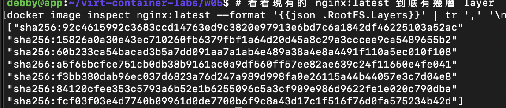

`nginx:latest` 的 RootFS.Layers 共 8 層 sha256：

```
92c4615992c3683ccd14763ed9c3820e97913e6bd7c6a1842df46225103a52ac
15826a0a30e43ec710260fb6379fbf1a64d20d45a8c29a3cccee9ca5489655b2
60b233ca54bacad3b5a7dd091aa7a1ab4e489a38e4a4491f110a5ec010f108
a5f65bcfce751cb0db38b9161ac0a9df560ff57ee82ae639c24f11650e4fe041
f3bb380dab96ec037d6823a76d247a989d998fa0e26115a44b44057e3c7d04e8
84120cfee353c5793a6b52e1b6255096c5a3cf909e986d9622fe1e020c790dba
fcf03f03e4d7740b09961d0de7700b6f9c8a43d17c1f516f76d0fa575234b42d
```

### docker history（layer 的 Dockerfile 指令來源）

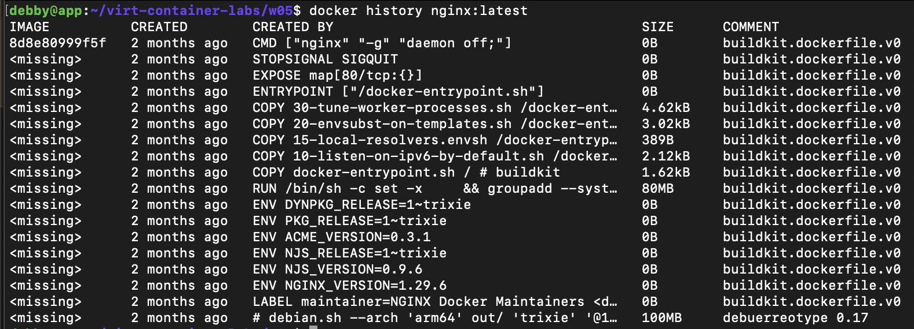

從上到下能看到每個 layer 對應的 Dockerfile 指令：`CMD ["nginx" "-g" "daemon off;"]`、`STOPSIGNAL SIGQUIT`、`EXPOSE 80/tcp`、`ENTRYPOINT`、一連串 `COPY` 進去的 docker-entrypoint shell scripts、一大塊 `RUN` 安裝 nginx 套件（80MB）、各種 `ENV`（NGINX_VERSION、NJS_VERSION 等）、`LABEL maintainer`、最底層的 debian 基底（100MB）。

`<missing>` 不代表那層真的不見了，而是該 layer 沒有對應的 image ID 可以單獨 inspect（builder 的內部 layer），但實體 layer 還是存在的。

### docker diff 觀察可寫層

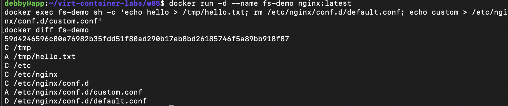

在 `fs-demo` 容器內執行：

```
echo hello > /tmp/hello.txt
rm /etc/nginx/conf.d/default.conf
echo custom > /etc/nginx/conf.d/custom.conf
```

`docker diff fs-demo` 輸出：

```
C /tmp
A /tmp/hello.txt
C /etc
C /etc/nginx
C /etc/nginx/conf.d
A /etc/nginx/conf.d/custom.conf
D /etc/nginx/conf.d/default.conf
```

解讀：
- **A**（Added）= 新增的檔案，例如 `/tmp/hello.txt`、`custom.conf`
- **C**（Changed）= 目錄因為底下內容改變被標記為 changed
- **D**（Deleted）= 刪除的檔案 `default.conf`（在 overlay2 裡實際上是個 whiteout char device，把下層的同名檔案遮蔽掉）

所有變更只發生在這個容器的 upperdir，唯讀的 lower layers 完全沒動 → 其他容器看到的還是原版 image。

### overlay2 實體目錄與可寫層

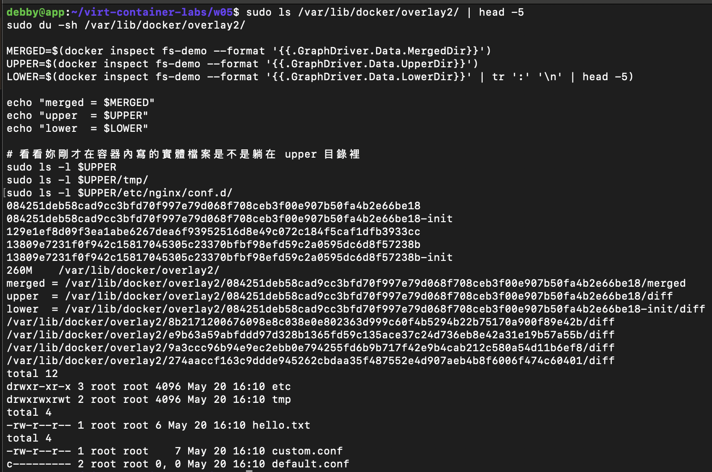

- merged：`/var/lib/docker/overlay2/084251deb58c...be18/merged`（容器內看到的統一視圖）
- upper：`/var/lib/docker/overlay2/084251deb58c...be18/diff`（可寫層的實體位置）
- lower：`...be18-init/diff:/var/lib/docker/overlay2/8b21712.../diff:.../e9b63a59.../diff:...`（一串冒號分隔的唯讀層）

upper 目錄裡實際看到的內容：

```
drwxr-xr-x 3 root root 4096 May 20 16:10 etc
drwxrwxrwt 2 root root 4096 May 20 16:10 tmp
-rw-r--r-- 1 root root    6 May 20 16:10 tmp/hello.txt
-rw-r--r-- 1 root root    7 May 20 16:10 etc/nginx/conf.d/custom.conf
c--------- 2 root root 0, 0 May 20 16:10 etc/nginx/conf.d/default.conf
```

`default.conf` 變成 `c---------`（character device, major/minor = 0,0），這就是 **overlay2 的 whiteout** —— 用一個特殊的 char device 標記「此檔已被刪除」，讓 merged view 把下層同名檔案遮掉。

### 驗證 layer 共享機制

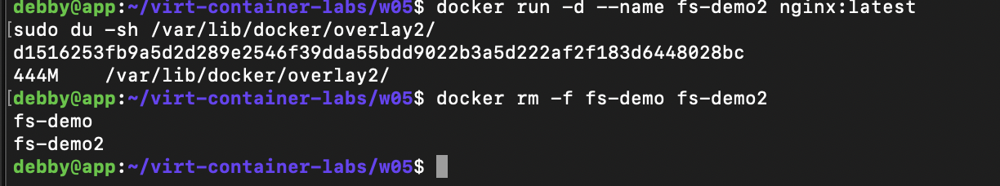

啟動第二個 `fs-demo2`（同樣基於 `nginx:latest`）後，`/var/lib/docker/overlay2/` 總大小 = **444M**。

兩個容器都用同一個 nginx image，磁碟並沒有翻倍 → 大部分 lower layer 是兩個容器共享的同一份實體目錄，每個容器只多出自己那薄薄一層 upperdir（diff 目錄），這就是 union FS 內容定址 + CoW 帶來的空間節省。

---

## OCI 呼叫鏈

### 檢視 daemon 進程

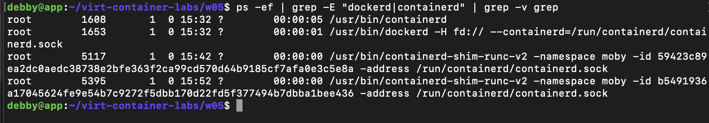

```
root  1608  /usr/bin/containerd
root  1653  /usr/bin/dockerd -H fd:// --containerd=/run/containerd/containerd.sock
root  5117  /usr/bin/containerd-shim-runc-v2 -namespace moby -id 59423c89ea2d... (ns-demo)
root  5395  /usr/bin/containerd-shim-runc-v2 -namespace moby -id b5491936a17... (cg-demo)
```

`dockerd` 跟 `containerd` 是兩個獨立的 daemon，dockerd 透過 unix socket 呼叫 containerd。

### 觀察 shim 與容器 process 的父子關係

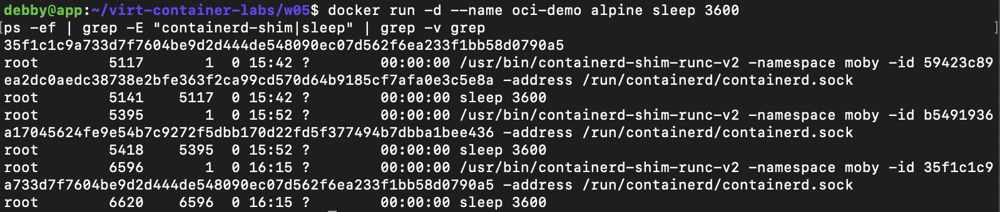

啟動 `oci-demo`（alpine sleep 3600）後 process tree：

```
root  5117  containerd-shim-runc-v2 ... id 59423c89ea2d (ns-demo)
  └─ root  5141  sleep 3600
root  5395  containerd-shim-runc-v2 ... id b5491936a17 (cg-demo)
  └─ root  5418  sleep 3600
root  6596  containerd-shim-runc-v2 ... id 35f1c1c9a733 (oci-demo)
  └─ root  6620  sleep 3600
```

每個容器有一支對應的 shim，容器內的 process（sleep）是 shim 的 child。`runc` 只負責呼叫 `clone()` 開好 namespace、寫好 cgroup、把容器 process 跑起來就退出了；shim 留下來繼續持有容器的 stdio、收 exit code，這樣 containerd 自己重啟也不會把容器一起帶走。

### 讀取 OCI Runtime Spec config.json

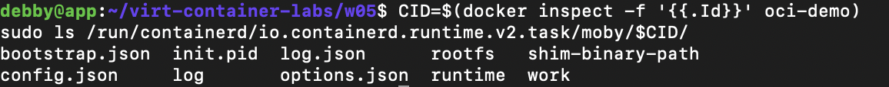

`/run/containerd/io.containerd.runtime.v2.task/moby/$CID/` 目錄就是 runc 眼中的 OCI bundle，內容：

```
bootstrap.json  config.json  init.pid  log  log.json  options.json
rootfs  runtime  shim-binary-path  work
```

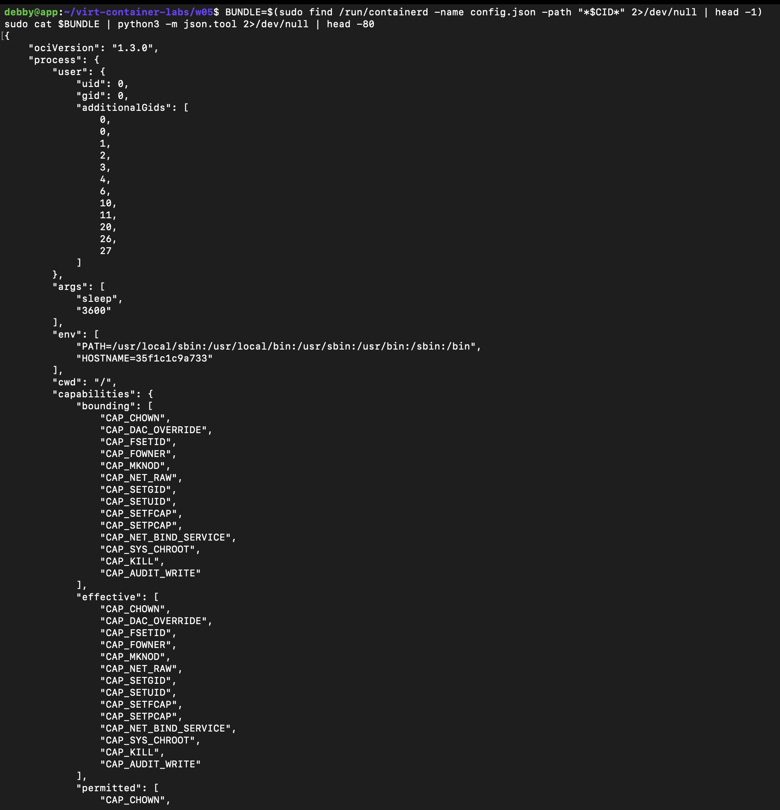

`config.json` 關鍵欄位：

- `ociVersion`: "1.3.0" — 符合 OCI Runtime Spec 1.3.0
- `process.args`: `["sleep", "3600"]` — 容器 PID 1 要跑的指令
- `process.env`: `["PATH=...", "HOSTNAME=35f1c1c9a733"]`
- `process.cwd`: "/"
- `process.user`: `{uid: 0, gid: 0, additionalGids: [...]}`
- `process.capabilities`: bounding/effective/permitted 三組 cap 白名單，可看到 `CAP_CHOWN`、`CAP_NET_RAW`、`CAP_NET_BIND_SERVICE`、`CAP_SYS_CHROOT`、`CAP_KILL` 等 14 個。預設容器不給 `CAP_SYS_ADMIN`、`CAP_NET_ADMIN` 這類危險 cap。

往下還會有 `linux.namespaces`（要開哪些 namespace）、`linux.resources`（cgroup 限制：memory、cpu、pids）、`root.path`（指向 rootfs）等欄位。

### 各層職責

- **dockerd**：使用者友善 API（image build、network、volume、CLI）。不直接管容器生命週期。
- **containerd**：image 管理、snapshot 管理、容器生命週期管理。對 dockerd 暴露 gRPC API。
- **containerd-shim-runc-v2**：每個容器一支。runc 跑完就退出，shim 接住容器 process 的 stdio 和 exit code，讓 containerd 可以重啟而不影響容器。
- **runc**：OCI Runtime Spec 的參考實作。讀 `config.json`，呼叫 `clone()`/`unshare()` 建立 namespace、寫 cgroup 控制檔、setcap、chroot 到 rootfs、execve 容器 process。真正「執行容器」的就是它。

OCI 規範保證了：只要符合 OCI Runtime Spec，runc 可以被 crun、kata-runtime 替換；只要符合 OCI Image Spec，Docker build 出來的 image 可以被 Podman、CRI-O 直接拉來用。

---

## 排錯紀錄

**排錯 1：docker pull 失敗**
- 症狀：`docker pull nginx:1.27-alpine` 報 `dial tcp: lookup registry-1.docker.io on 127.0.0.53:53: server misbehaving`。
- 診斷：systemd-resolved 的 DNS 解析在這個時段不穩定，但 host 已經有 `nginx:latest`。
- 修正：改用 `nginx:latest` 做 layer 共享觀察。
- 驗證：`docker images | grep nginx` 看到 `nginx:latest 8d8e80999f5f`，`docker history nginx:latest` 跟 `docker image inspect` 都能正常跑。

**排錯 2：第一次 OOM 回復測試又失敗**
- 症狀：放寬到 `--memory=256m` 重跑 `dd ... of=/dev/shm/big count=200`，依然失敗，但訊息變成 `dd: error writing '/dev/shm/big': No space left on device`。
- 診斷：這次不是 OOM，是 `/dev/shm` 的 tmpfs 滿了。Alpine 容器 `/dev/shm` 預設大小是容器記憶體的一半（約 128MB），寫 200MB 寫不下。`OOMKilled=false`、ExitCode=1 而不是 137 可以佐證。
- 修正：把 `count` 改成 40（40MB），遠小於 tmpfs 容量也遠小於 256MB 記憶體限制。
- 驗證：dd 成功跑完印 `DONE`，exit code 0，沒有任何 dmesg OOM log。

**排錯 3：sudo 認證失敗**
- 症狀：執行 `sudo ls -la /proc/$CPID/ns/` 跳出 `sudo: Authentication failed, try again.`
- 診斷：密碼輸錯。
- 修正：重新輸入正確密碼。
- 驗證：第二次成功列出 namespace 連結。

---

## 想一想

**1. 容器裡的 PID 1 跟 host PID 1 是同一支 process 嗎？`kill -9 1`（在容器內）會發生什麼？為什麼 Docker 會建議用 `--init`？**

不是同一支。容器內的 PID 1 是 `sleep 3600`，在 host 視角它是 PID 5141；host 的 PID 1 是 systemd。PID namespace 把同一支 process 從兩邊看，分別給它兩個編號。

容器內 `kill -9 1`：PID 1 是 PID namespace 的 init，kernel 預設會忽略 init 對自己發的 fatal signal，所以一般情況下 `kill -9 1` 在自己對自己時不會殺掉自己；但 host 上 root 用真正的 PID（5141）送 SIGKILL 是可以殺的。殺掉之後容器內所有 process 連帶被清掉，容器整體退出。

Docker 建議用 `--init`：因為 PID 1 還有一個被忽略的責任 —— **回收 zombie**。一般應用程式（nginx、python script）沒有寫 SIGCHLD handler，它派生的子孫 process 死掉後會變 zombie 卡在 process table。`--init` 會塞一個小的 init（tini 或 docker-init）當 PID 1 來幫忙 reap，避免 zombie 累積。順便它也會正確轉送 SIGTERM 給子 process，讓 `docker stop` 能優雅關閉。

**2. 兩個容器都基於 `ubuntu:24.04`，磁碟空間是吃兩份還是共用？怎麼驗證？**

共用。Union FS（overlay2）把 image 拆成內容定址（sha256）的 layer，layer 內容一樣就是同一份實體目錄。兩個容器都基於 ubuntu:24.04 → 它們的 LowerDir 指到同一組 layer 目錄，磁碟只有一份。各自只多出自己的 upperdir（diff 目錄）。

驗證方法：

```
docker run -d --name a ubuntu:24.04 sleep 3600
du -sh /var/lib/docker/overlay2/
docker run -d --name b ubuntu:24.04 sleep 3600
du -sh /var/lib/docker/overlay2/
docker inspect a --format '{{.GraphDriver.Data.LowerDir}}'
docker inspect b --format '{{.GraphDriver.Data.LowerDir}}'
```

第二步啟動 b 之後，`du -sh` 增加量只有幾 KB（只多一個空的 upperdir）；對比兩個容器的 LowerDir，會發現底下指向同一組 overlay2 目錄。本次實驗也親自驗證了：開 `fs-demo2` 後 `/var/lib/docker/overlay2/` 只到 444M，不是 image 大小的兩倍。

**3. 如果 host 的 Linux kernel 爆一個 privilege escalation 漏洞（例如 Dirty COW 類），容器還能稱為「隔離」嗎？這個限制跟 VM 的隔離差在哪？為什麼 Kata Containers / Firecracker 要存在？**

不能，至少不能稱為強隔離。容器跟 host **共用同一個 kernel**，namespace 跟 cgroup 都是 kernel 提供的功能。kernel 本身爆漏洞，容器內的 root 拿到 host root 只是時間問題 —— 攻擊者只要在容器內觸發那個 syscall path 就能跨出 namespace。Dirty COW（CVE-2016-5195）當年就是這樣，容器內非 root 都能拿 host root。

跟 VM 的根本差別：VM 多了一層 hypervisor。容器逃逸只要打穿 kernel；VM 逃逸要先打穿 guest kernel，再打穿 hypervisor（KVM、Xen），攻擊面小得多，而且 hypervisor 的程式碼基本上是凍結的、不像 kernel 每天都在改。

這就是 **Kata Containers / Firecracker / gVisor** 存在的理由：

- Kata、Firecracker：每個容器跑在一個極輕量的 microVM 裡，有自己的 guest kernel，獲得 VM 等級的隔離邊界，但啟動時間和資源開銷都壓到接近原生容器（Firecracker 啟動 < 125ms）。AWS Lambda 跟 Fargate 就是用 Firecracker 跑多租戶 workload。
- gVisor：在用戶空間實作一個 syscall 攔截層（Sentry），容器的 syscall 不直接打 host kernel 而是先過 gVisor，等於再加一層 sandbox，攻擊面從整個 kernel 縮到 gVisor 自己。

用一句話總結：**普通容器是同公寓不同房間，VM 是不同棟，Kata/Firecracker 是把房間蓋成迷你公寓**。
