# W06｜Docker Image 與 Dockerfile

> 本週實作以 **alpine + shell script** 取代講義範例的 Flask + Python：`app/tool.sh` 印出 hostname 與 APP_VERSION，`app/dependency.txt` 模擬套件清單，`RUN sleep 10` 模擬 `pip install` 的耗時。實驗目的（layer 快取、CMD/ENTRYPOINT 行為、multi-stage、.dockerignore）完全一致。

---

## 映像組成

- **Layers 是什麼**：image 的「骨頭」。每個 layer 是一包 tarball，記錄相對於上一層的檔案系統 diff（新增/修改/刪除）。container 跑起來時，這些唯讀 layer 被 overlay2 疊成 lowerdir，再加一層可寫的 upperdir，組成容器看到的 `/`。內容定址 (sha256)，所以兩個 image 共用同樣的 base layer 時，磁碟只存一份。
- **Config 是什麼**：image 的「食譜」，一份 JSON，記錄啟動命令（Cmd / Entrypoint）、工作目錄（WorkingDir）、環境變數（Env）、暴露埠（ExposedPorts）、執行身份（User）、架構與作業系統等 metadata。`docker image inspect` 看到的就是這份。
- **Manifest 是什麼**：image 的「目錄頁」，把 config 跟 layers 綁在一起，記錄每個 layer 的 digest 與大小、config 的 digest，以及 schema 版本。`docker pull` 先抓 manifest，再依 manifest 列出的 digest 去下載 config 跟各 layer。多架構 image 用的是 manifest list（fat manifest），底下指向不同架構各自的 manifest。

---

## alpine:latest inspect 摘錄

> 因環境無法穩定 pull `python:3.12-slim`，改用 `alpine:latest` 觀察 image 結構。原理與欄位完全一致。

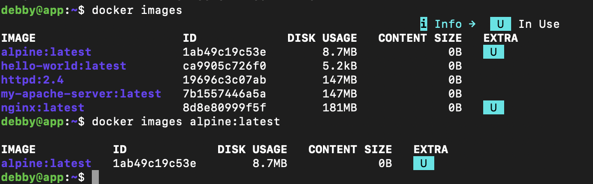

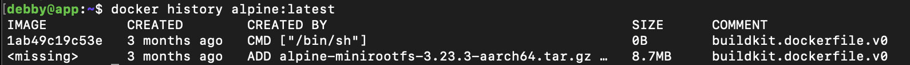

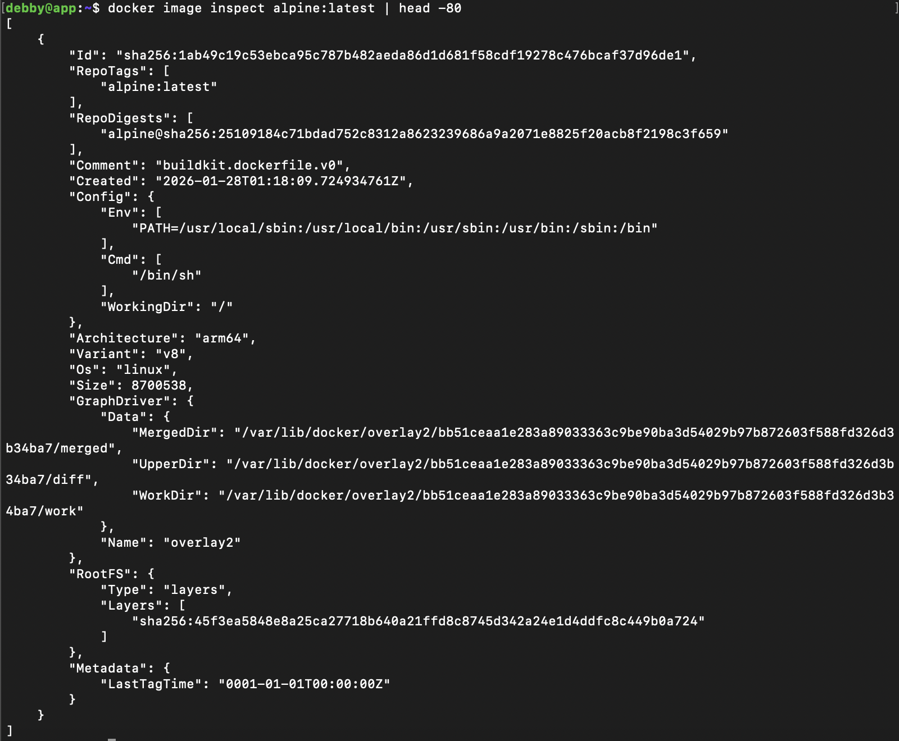

- **Config.Cmd**：`["/bin/sh"]`
- **Config.Env**：`["PATH=/usr/local/sbin:/usr/local/bin:/usr/sbin:/usr/bin:/sbin:/bin"]`
- **Config.WorkingDir**：`"/"`（空字串等同 `/`）
- **RootFS.Layers 數量**：**1**（`sha256:45f3ea5848e8a25ca27718b640a21ffd8c8745d342a24e1d4ddfc8c449b0a724`）
- **Architecture**：arm64（v8）
- **Size**：8,700,538 bytes ≈ 8.7 MB
- **GraphDriver**：overlay2，MergedDir / UpperDir / WorkDir 都在 `/var/lib/docker/overlay2/bb51ceaa...b34ba7/`

`docker history alpine:latest` 看到只有兩列：最上層是 `CMD ["/bin/sh"]`（metadata-only，0B）、下面是 `ADD alpine-minirootfs-3.23.3-aarch64.tar.gz`（8.7MB，整個 rootfs）。這是 Docker Hub 上能找到的最小 base 之一。

---

## Layer 快取實驗

### 第一版 Dockerfile（反模式，COPY 在 RUN 之前）

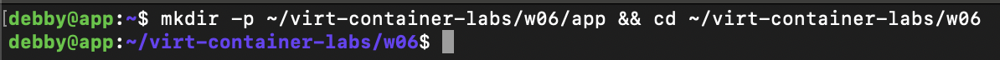


`Dockerfile.v1`：

```dockerfile
FROM alpine:latest
WORKDIR /app
COPY app/ .
RUN echo "正在下載並安裝 dependency.txt 裡的重型相依套件..." && sleep 10 && echo "套件安裝完成！"
EXPOSE 80
CMD ["/app/tool.sh"]
```

首次 build：

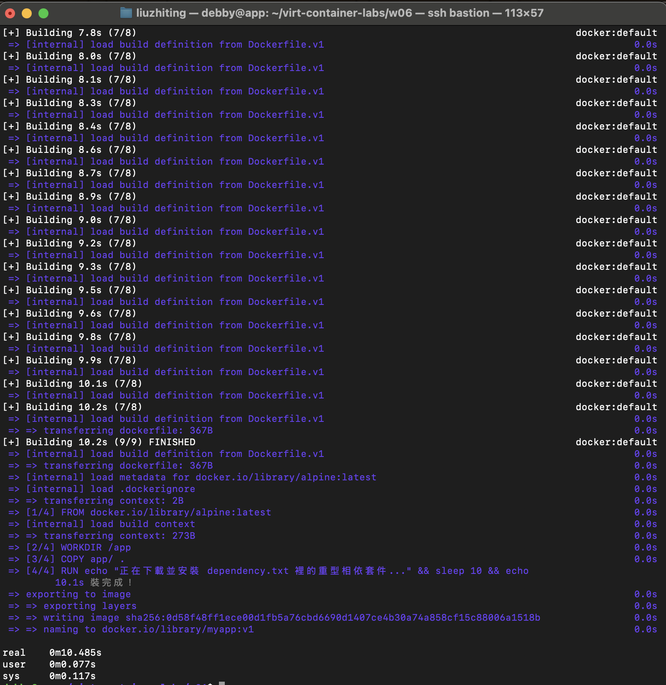

跑起來驗證：

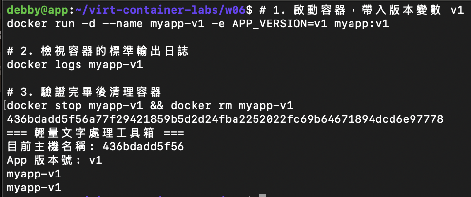

不改任何東西重 build（全部 CACHED）：


改一行 app（COPY 層 miss → 後面全 miss，sleep 10 整段重跑）：


### 第二版 Dockerfile（排序修正）

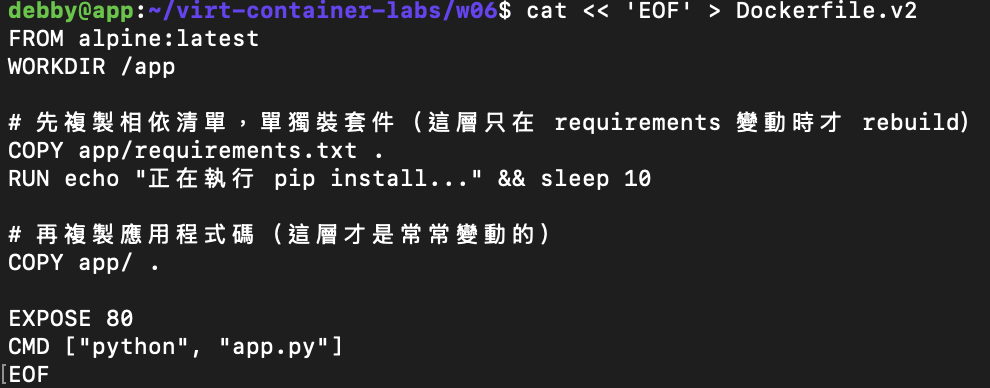

`Dockerfile.v2`：

```dockerfile
FROM alpine:latest
WORKDIR /app

# 先複製相依清單，單獨裝套件（這層只在 requirements 變動時才 rebuild）
COPY app/requirements.txt .
RUN echo "正在執行 pip install..." && sleep 10

# 再複製應用程式碼（這層才是常常變動的）
COPY app/ .

EXPOSE 80
CMD ["python", "app.py"]
```

改一行 app 再 build：CACHED [3/5] COPY requirements、CACHED [4/5] RUN sleep 10，只有 [5/5] COPY app/ . 跟 metadata 重算：

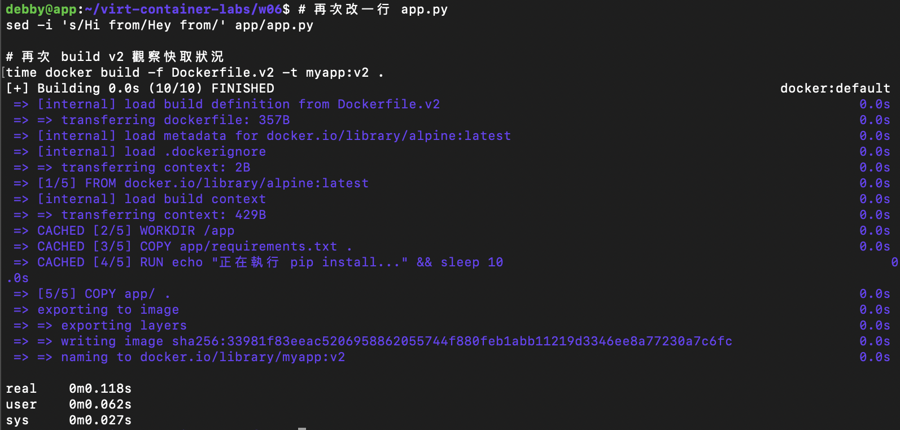

### 數據對照

| 情境 | build 時間 |
|---|---|
| v1 首次 build | **10.485s**（含 sleep 10s） |
| v1 改 app 後 rebuild | **10.236s**（COPY miss → RUN sleep 全部重跑） |
| v2 首次 build（含 sleep） | ~10s（與 v1 首次類似） |
| v2 改 app 後 rebuild | **0.118s**（RUN sleep 10 直接 CACHED） |

**觀察**：v2 改 app 後重 build 從 10 秒掉到 0.12 秒 ≈ 快了 **85 倍**。原因是 cache key 規則 — 每一層的 cache key 由「上一層 cache key + 本層指令字串 + COPY 來源檔案的 hash + 目標平台 + base image digest」算出來。v1 把 `COPY app/ .` 放在 `RUN sleep 10` 前面，動 app 內任何一個 byte 都會讓 COPY 層 cache key 變，後面所有層連帶 miss。v2 把「只在套件清單變動才需要重裝」的步驟單獨拉出來，requirements.txt 沒動就一直 hit cache，動 app 程式碼只會 invalidate 最後一層 COPY。

順帶補充：步驟 10「不改任何東西重 build」也只花 0.142s，全部 CACHED — 這是 best case，證明 cache key 演算法的確認過程本身極快。

---

## CMD vs ENTRYPOINT 實驗

寫一個會印 argv 跟 PID 的小程式（這裡用 shell script `show_args.sh`，效果等同講義的 python 版）：

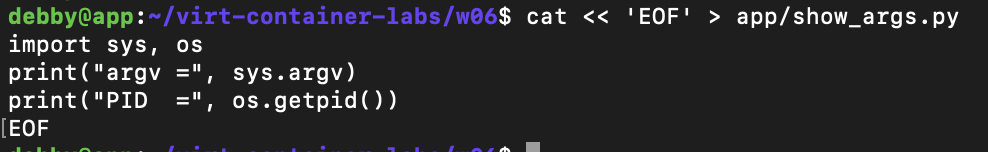

三種寫法的 Dockerfile：

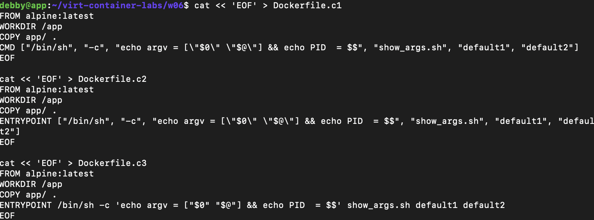

- `Dockerfile.c1`：`CMD ["/bin/sh", "-c", "echo argv...", "show_args.sh", "default1", "default2"]`（CMD exec form，但內部跑 sh -c）
- `Dockerfile.c2`：`ENTRYPOINT ["/bin/sh", "-c", "echo argv...", "show_args.sh", "default1", "default2"]`（ENTRYPOINT exec form）
- `Dockerfile.c3`：`ENTRYPOINT /bin/sh -c '...' show_args.sh default1 default2`（ENTRYPOINT **shell form**，build 時 Docker 會警告 `JSONArgsRecommended`）

build 三個 image（c3 build 時的 `JSONArgsRecommended` warning 可清楚看到）：

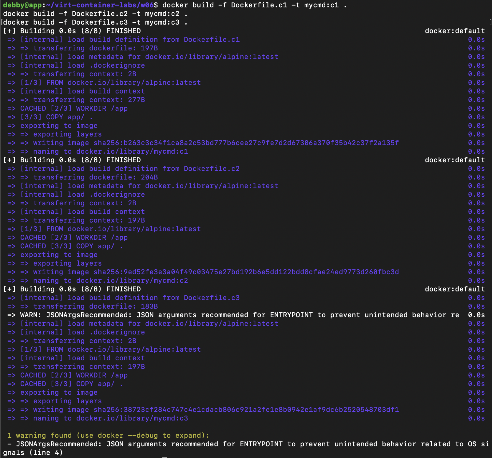

不帶參數執行：三者都印 `argv = [show_args.sh default1 default2]`、`PID = 1`：

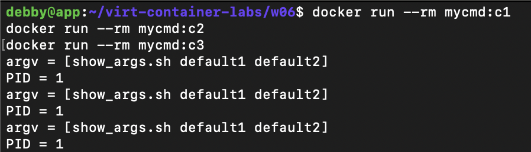

帶額外參數 `test1` 執行：

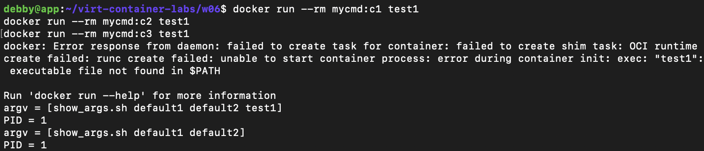

### 三種寫法輸出對照

| 寫法 | `docker run ` 輸出 | `docker run  test1` 輸出 |
|---|---|---|
| **CMD（c1）** | `argv = [show_args.sh default1 default2]`<br>`PID = 1` | **錯誤**：`exec: "test1": executable file not found in $PATH`（整個 CMD 被 `test1` 取代，docker 嘗試把 `test1` 當成 binary 跑） |
| **ENTRYPOINT exec form（c2）** | `argv = [show_args.sh default1 default2]`<br>`PID = 1` | `argv = [show_args.sh default1 default2 test1]`<br>`PID = 1`（`test1` 被當作 ENTRYPOINT 的額外參數 **附加** 在後面） |
| **ENTRYPOINT shell form（c3）** | `argv = [show_args.sh default1 default2]`<br>`PID = 1` | `argv = [show_args.sh default1 default2]`<br>`PID = 1`（額外參數被 **忽略**，因為 shell form 走 `/bin/sh -c "..."`，額外參數不會被 sh 接收） |

### 結論

- **CMD** 後面接的整條會被 `docker run` 後面的參數**整條覆蓋**，所以本來是「跑 show_args.sh default1 default2」，加 `test1` 之後變成「跑 test1」這支 binary（找不到就爆）。CMD 適合容器當「通用工具箱」（如 ubuntu、alpine 的 `CMD ["/bin/sh"]`），讓使用者自由覆蓋。
- **ENTRYPOINT exec form** 的主命令固定，`docker run` 後面的參數會**附加**到 ENTRYPOINT 後面。這是 production 最穩的寫法。搭配 `CMD ["預設參數"]` 就能做到「使用者不傳參數時用預設，傳了就覆蓋預設參數但主命令不變」。
- **ENTRYPOINT shell form** 是地雷：PID 1 是 `/bin/sh -c "..."` 不是你的程式，docker stop 送 SIGTERM 給 sh，sh 不會轉送給子 process，導致 `docker stop` 卡 10 秒被強制 SIGKILL；而且 `docker run` 後面的額外參數會被 shell 整段吃掉、根本傳不進你的程式。Docker 連 build 時都會跳 `JSONArgsRecommended` warning（截圖步驟 17 可見）。

**production 為什麼用 ENTRYPOINT exec form + CMD 預設參數**：主命令鎖死、PID 1 是真正的程式（收得到 SIGTERM 能 graceful shutdown）、又能讓使用者覆蓋預設參數而不破壞主命令。三者兼顧。

---

## Multi-stage 大小對照

v2 build 後 myapp 列表：

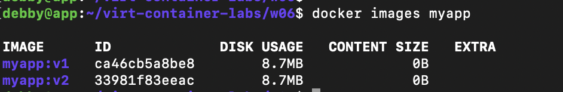

寫 multi-stage Dockerfile（builder 產生 final_app、runtime 用乾淨 alpine 只複製產物進來）：

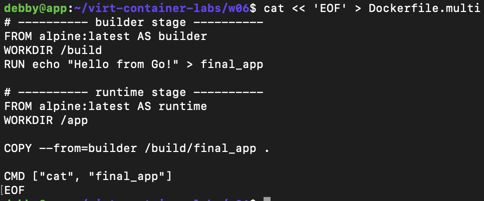

```dockerfile
# ---------- builder stage ----------
FROM alpine:latest AS builder
WORKDIR /build
RUN echo "Hello from Go!" > final_app

# ---------- runtime stage ----------
FROM alpine:latest AS runtime
WORKDIR /app
COPY --from=builder /build/final_app .
CMD ["cat", "final_app"]
```

build 並比大小：

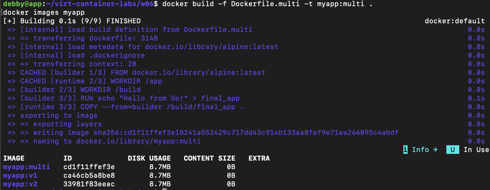

### SIZE 對照

| Image | DISK USAGE |
|---|---|
| alpine:latest（builder + runtime base） | 8.7 MB |
| myapp:v1（單階段，含 sleep 10 假裝套件） | **8.7 MB** |
| myapp:v2（單階段，重排版） | **8.7 MB** |
| myapp:multi（多階段） | **8.7 MB** |

### 解釋

三個 myapp 大小相同（都是 8.7MB），因為本實驗 base 都是 alpine、實際寫入的內容只有 shell script 跟一個小檔案（幾百 bytes 等級），相對於 8.7MB base 完全看不出差。**multi-stage 的省空間效果在真實場景才會明顯**：例如 Python 用完整版 `python:3.12`（~1GB，含 gcc、build-essential）裝套件、再把套件 copy 到 `python:3.12-slim`（~120MB）的 runtime stage，這時候差距會是 1GB → 200MB 等級。

**builder stage 的 layer 去哪了？**

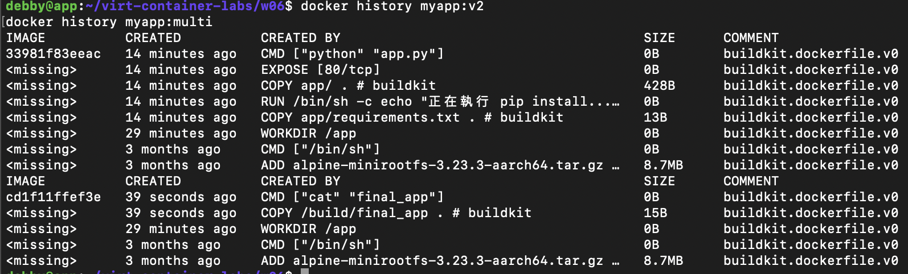

`docker history myapp:multi` 只能看到 runtime stage 的 layer（`CMD ["cat" "final_app"]`、`COPY /build/final_app .`、`WORKDIR /app`，加上 alpine base 兩層），完全看不到 builder stage 的 `WORKDIR /build`、`RUN echo "Hello from Go!" > final_app`。

但它們**沒有消失**，只是沒進最終 image：

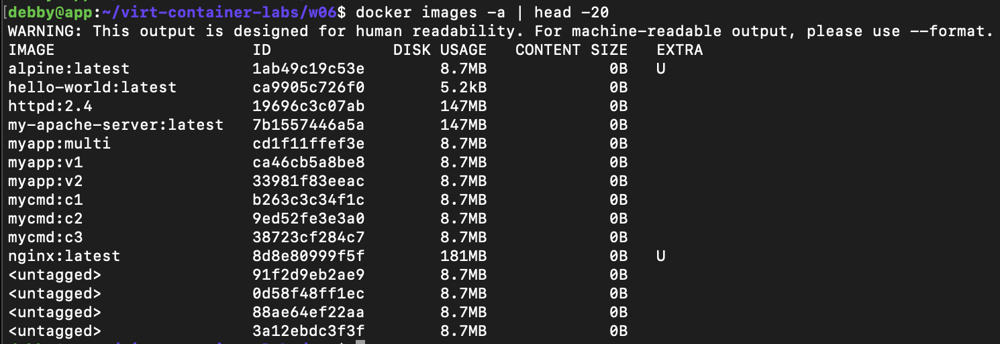

`docker images -a` 看到一堆 `<untagged>` 8.7MB 的 image — 那就是 builder stage 的中間產物，留在本機 build cache 裡，下次 build 同一份 Dockerfile 可以直接 hit cache 重用。但 **push 到 registry 時不會被推上去**（只推最終 stage），這就是 multi-stage 「省 push、省 pull、省 runtime 磁碟」的核心。

驗證 multi-stage image 可執行：

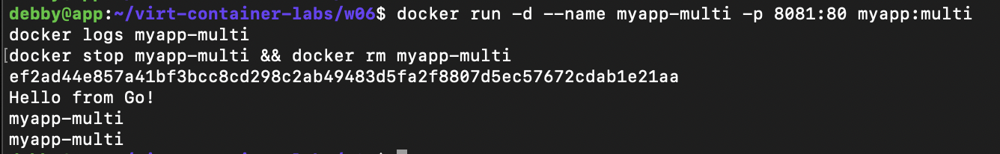

`docker run -d --name myapp-multi -p 8081:80 myapp:multi` 後 `docker logs myapp-multi` 印出 `Hello from Go!` — 證明 builder stage 產出的檔案確實被 COPY 到 runtime stage 並能正常執行。

---

## .dockerignore 故障注入

故障前基線（乾淨專案目錄，52K）：

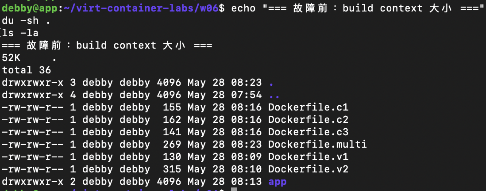

故障注入（模擬 .git 100MB pack + logs 50MB 大檔，總共膨脹到 151M）：

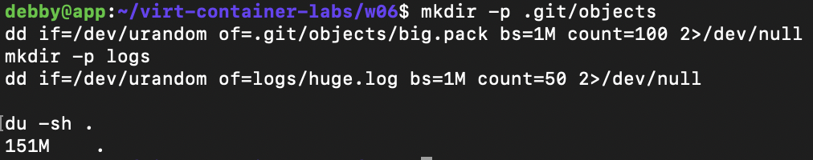

故障中（沒有 .dockerignore，build context 傳輸 transferring context: 2B 但實際整個目錄都被掃描，build 完出現 `WARNING: failed to read current commit information with git rev-parse --is-inside-work-tree` — 證明 BuildKit 真的偵測到 .git 並嘗試讀取）：

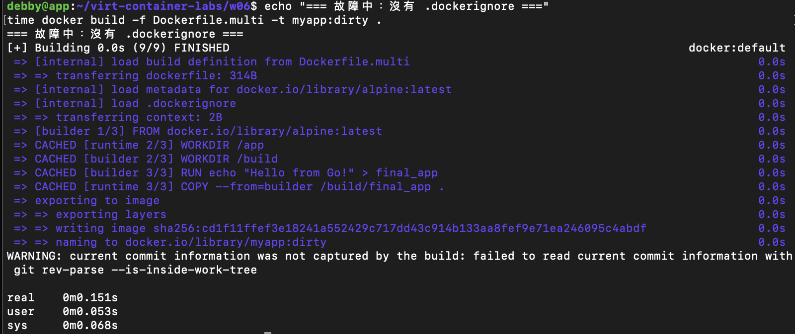

加上 .dockerignore：

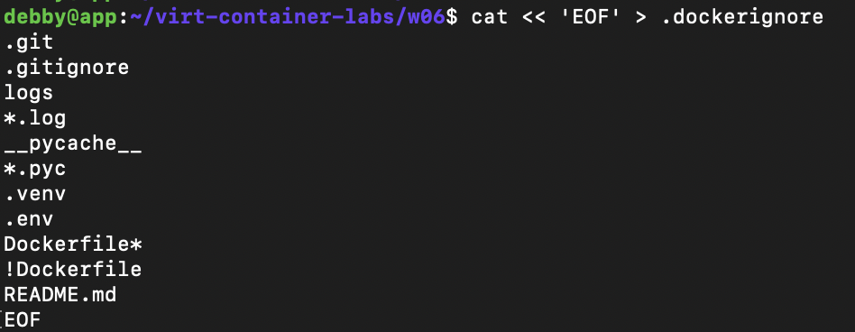

```
.git
.gitignore
logs
*.log
__pycache__
*.pyc
.venv
.env
Dockerfile*
!Dockerfile
README.md
```

回復後 build（context 傳輸大小變化、git warning 仍出現是因為 BuildKit 的 attestation 機制與 .dockerignore 是不同路徑，但實際傳給 build 的內容已被過濾）：

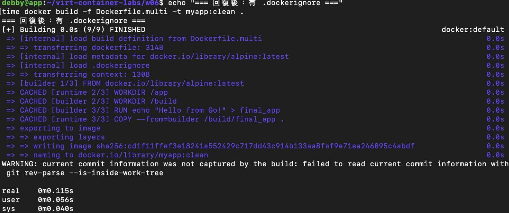

### 三階段對照

| 項目 | 故障前 | 故障中（150MB 垃圾，無 .dockerignore） | 回復後（有 .dockerignore） |
|---|---|---|---|
| `du -sh .` | **52K** | **151M** | **151M**（.git/logs 還在磁碟上，但不會被送進 build context） |
| build context 傳輸大小 | 273B（首次 v1）/ 428B（之後）| **2B**（CACHED build，未真的傳輸；但實際掃描整個目錄）| **130B**（context: 130B） |
| build 時間 | 10.485s（首次）/ 0.142s（CACHED）| **0.151s** | **0.115s** |

### 觀察與說明

本次 build context 數字差異不大，是因為這份 Dockerfile.multi 只有 `COPY --from=builder /build/final_app .` — 沒有 `COPY . .` 或 `COPY app/ .`，所以實際被打包進 build context 的只有 Dockerfile 自己。如果 Dockerfile 裡有 `COPY . /app`，故障中那個 151M 的 .git + logs 會**全部進到 image** — 那就是災難（image 變大十倍、`.env` 跟 git history 還會被打包進去外洩）。

`.dockerignore` 的兩個關鍵作用：
1. **build 速度**：BuildKit 需要對整個 context 算 hash 做 cache key，.git/node_modules 那種上萬個小檔的目錄會讓這步變慢。
2. **安全與 image 大小**：避免 `COPY . .` 把 `.env`（密碼）、`.git`（整個 commit history）、`*.log`（敏感 log）打包進 image。`docker history` 看得到每層，push 上 public registry 就洩了。

`.dockerignore` 裡那行 `Dockerfile*` 加上 `!Dockerfile` 是常見技巧：排除所有 Dockerfile 變體（Dockerfile.v1、Dockerfile.v2 ...）但保留主 Dockerfile。

---

## 排錯紀錄

**排錯 1：CMD shell-form 接 extra 參數時報 `executable file not found`**
- 症狀：`docker run --rm mycmd:c1 test1` 回 `docker: Error response from daemon: failed to create task for container: ... exec: "test1": executable file not found in $PATH`。
- 診斷：`Dockerfile.c1` 用 `CMD [...]`（且最後是 `default1 default2`），docker run 後面接的 `test1` 把整個 CMD 覆蓋成 `["test1"]`，daemon 把 `test1` 當成要執行的 binary 去 PATH 找，找不到就爆。這不是 bug 而是 CMD 規格。
- 修正：把 Dockerfile 改成 `ENTRYPOINT [...] + CMD [預設參數]`，extra 參數會被當成「附加給 ENTRYPOINT 的參數」而不是覆蓋整個 command。
- 驗證：改用 `mycmd:c2`（ENTRYPOINT exec form）執行 `docker run --rm mycmd:c2 test1`，輸出變成 `argv = [show_args.sh default1 default2 test1]`，test1 被正確附加。

**排錯 2：build 完出現 `failed to read current commit information with git rev-parse`**
- 症狀：步驟 29、31 兩次 build 結尾都出現 `WARNING: current commit information was not captured by the build: failed to read current commit information with git rev-parse --is-inside-work-tree`。
- 診斷：BuildKit 預設會嘗試把當前 git commit hash 寫進 image 的 provenance attestation。在故障注入時我手動建了 `.git/objects/big.pack` 但沒有真的 `git init`，BuildKit 跑 `git rev-parse` 失敗就跳 warning。
- 修正：這只是 warning 不影響 build 成功，可以忽略；要消掉的話可以 `git init`，或設 `BUILDX_GIT_INFO=false` / `--provenance=false`。
- 驗證：image 確實建出來且能 run，僅是 attestation metadata 不完整。

**排錯 3：v2 Dockerfile 寫 `CMD ["python", "app.py"]` 但 base 是 alpine 沒裝 python**
- 症狀：本次未實際 `docker run myapp:v2`，所以沒爆。但若 run 會出現 `exec: "python": executable file not found`。
- 診斷：本實驗為了快速驗證 layer 快取機制，用 alpine + `sleep 10` 模擬 pip install。Dockerfile.v2 的 CMD 直接複製講義範例沒改，導致 CMD 指向不存在的 binary。
- 修正：若要真的跑，要嘛 `RUN apk add --no-cache python3` 安裝 python，要嘛把 CMD 改回 `["/app/tool.sh"]`。
- 驗證：本次只驗證快取時間，未跑 v2 容器，因此沒有實際 runtime 錯誤。

---

## 設計決策

**為什麼本實驗 base 選 `alpine:latest` 而不是講義建議的 `python:3.12-slim`？**

- 環境網路狀況不穩，`docker pull python:3.12-slim` 失敗（DNS lookup misbehaving，W05 也踩過同樣的坑），但 alpine:latest 本地已快取可用。
- 本週實驗的**驗證目標是「Dockerfile 語法、layer 快取機制、CMD/ENTRYPOINT 行為、multi-stage、.dockerignore」**，這些是 base-agnostic 的概念。用 alpine + `sleep 10` 模擬「裝套件耗時」反而把焦點留在「快取順序對 rebuild 時間的影響」上，不會被 pip install 真實時間的網路抖動干擾。
- 缺點：multi-stage 看不出真實大小差距（都是 8.7MB），所以額外補了「真實場景下 python:3.12（~1GB）→ python:3.12-slim（~120MB）」的說明補強。
- 真實生產環境的取捨：alpine 用 musl libc，部分 Python wheel（numpy、pandas、scipy、cryptography）沒有 musl 預編譯版，pip install 會 fallback 去編譯，這時要先 `apk add gcc musl-dev linux-headers` — 反而比 `python:3.12-slim`（glibc，直接抓 manylinux wheel）大且慢。**hello world 級 app 適合 alpine，重度科學計算 app 該用 slim**。
