# W07｜Docker Compose 與資料持久化

**姓名：** 劉芷庭  
**學號：** 412630708  

---

## 拓樸圖

### Mermaid（GitHub 預覽可渲染）

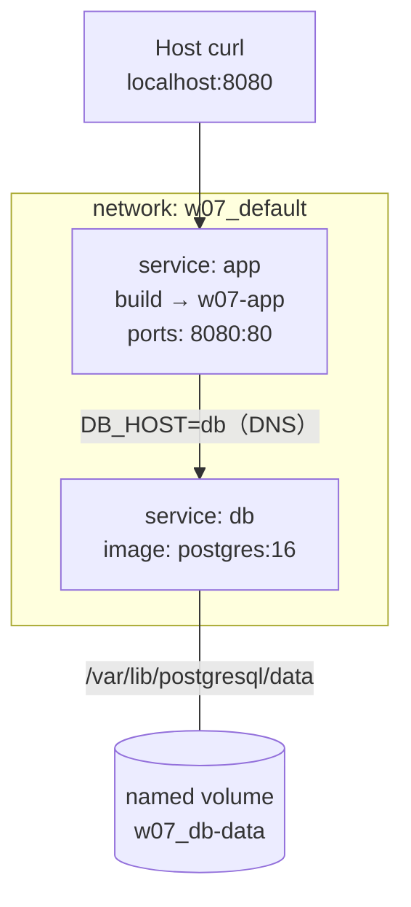

### ASCII（備用）

```
                    ┌─────────────────────────────────────┐
                    │     network: w07_default (bridge)    │
                    │                                      │
  localhost:8080 ──►│  ┌─────────────┐    DNS: "db"        │
       curl         │  │  app        │ ─────────────────►  │
                    │  │  (w07-app)  │    ┌─────────────┐ │
                    │  └─────────────┘    │  db         │ │
                    │                     │ (postgres:16)│ │
                    │                     └──────┬──────┘ │
                    └────────────────────────────│────────┘
                                                 │
                                                 ▼
                                    ┌────────────────────────┐
                                    │ named volume: w07_db-data │
                                    │ (PostgreSQL 資料目錄)      │
                                    └────────────────────────┘
```

---

## 從 docker run 到 compose.yaml

期中若用命令式部署，要依序執行：`docker network create`、`docker volume create`、兩條 `docker run`，密碼寫在多個 `-e` 裡，漏一步或改錯一處就連不上 db，也難讓同學重現。

改用 **Compose（宣告式）** 後，只要維護一份 `compose.yaml` 和同層的 `.env`：

| 改善項目 | 說明 |
|----------|------|
| 一鍵啟停 | `docker compose up -d` / `docker compose down` |
| 網路自動建立 | 不必手動 `network create`，service 名稱即 DNS |
| 密碼集中 | `${DB_PASSWORD}` 從 `.env` 展開，兩個 service 共用 |
| 啟動順序 | `depends_on` + `healthcheck` 避免 app 比 db 早連線 |
| 可重現 | `git clone` 後 `docker compose up -d` 即可 |

**我最有感的一點：** `DB_HOST=db` 不用記 IP，Compose 內建 DNS 會把 `db` 解析到 db 容器；搭配 `service_healthy` 後，第一次 `curl /healthz` 就不會先被 503 洗臉。

### Part A 操作截圖

<p align="center">
  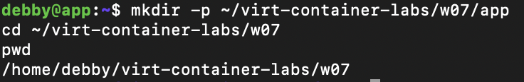<br>
  <sub>圖 1｜w07-partA-01-mkdir.png</sub>
</p>

<p align="center">
  <br>
  <sub>圖 2｜w07-partA-02-app-files.png</sub>
</p>

<p align="center">
  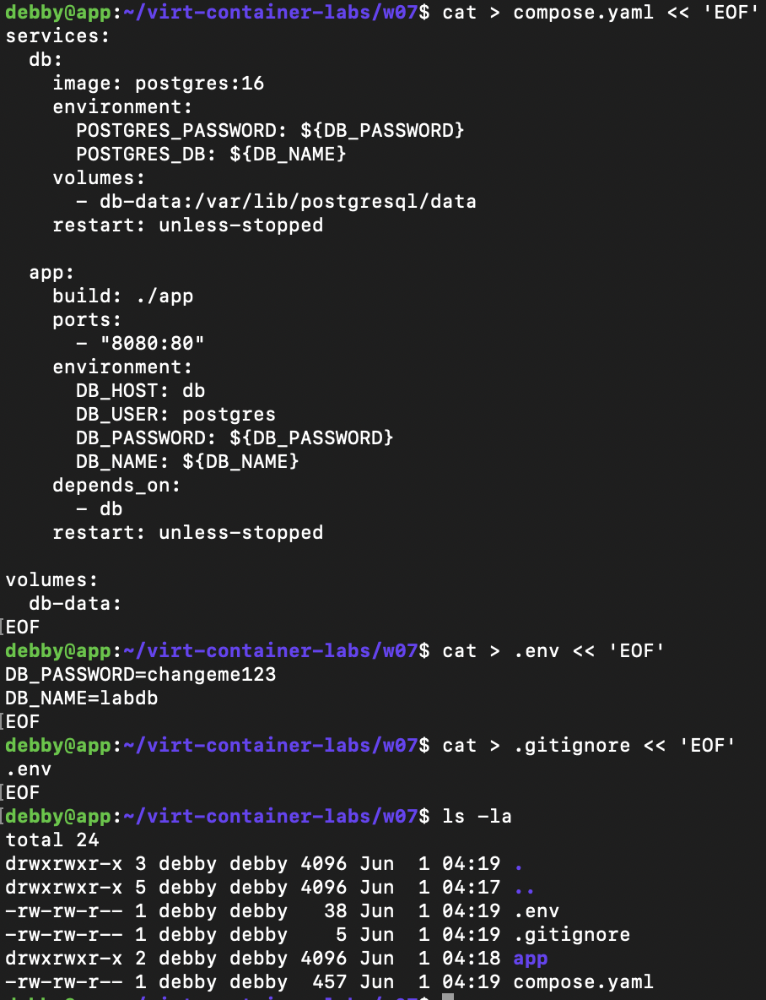<br>
  <sub>圖 3｜w07-partA-03-compose-env.png</sub>
</p>

<p align="center">
  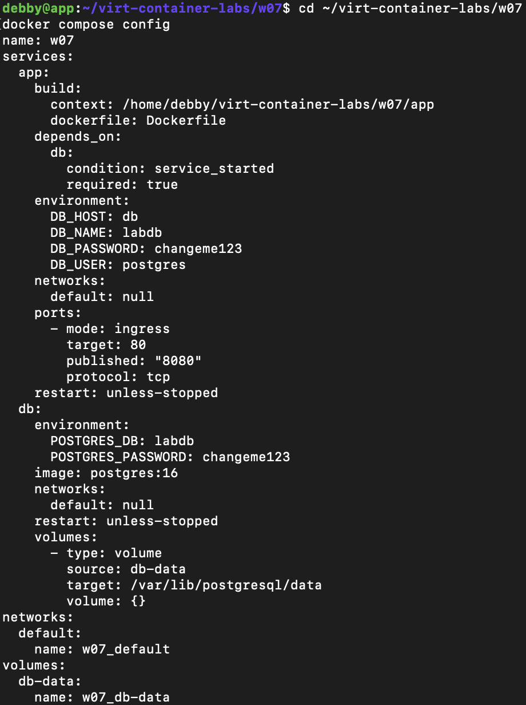<br>
  <sub>圖 4｜w07-partA-04-compose-config.png</sub>
</p>

<p align="center">
  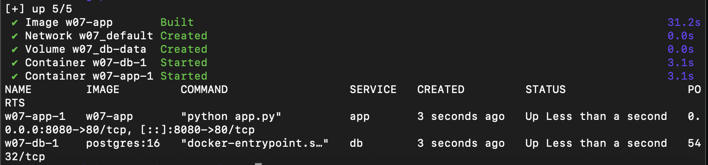<br>
  <sub>圖 5｜w07-partA-05-compose-up.png</sub>
</p>

<p align="center">
  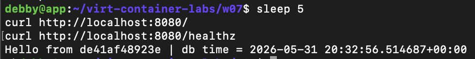<br>
  <sub>圖 6｜w07-partA-06-curl.png</sub>
</p>

**步驟 6 預期結果：**

- `curl http://localhost:8080/` → `Hello from ... | db time = ...`
- `curl http://localhost:8080/healthz` → `ok`

---

## 三種掛載對照

| 掛載類型 | 路徑（host） | 容器砍掉重起後資料還在嗎 | host 上直接看得到嗎 | 重啟容器後資料狀態 | 適合情境 |
|---|---|---|---|---|---|
| **named volume** | Docker 管理：`w07_db-data`（實體約在 `/var/lib/docker/volumes/w07_db-data/_data`） | **在**（`docker compose down` 不帶 `-v`） | 不建議直接改；用 `docker volume` 管理 | `docker compose restart` 後資料仍在；`down -v` 才清空 | **資料庫正式資料** |
| **bind mount** | `./app` 對應容器 `/app` | host 上原始碼**還在** | **是**，用編輯器改 `app/app.py` 即可 | 檔案仍在；Flask 需 `docker compose restart app` 網頁才更新 | **開發時改程式** |
| **tmpfs** | 記憶體掛載 `/tmp/cache`（64MiB） | **不在**（不寫入磁碟） | **否**（只在容器記憶體） | `docker compose restart app` 後 `/tmp/cache` **為空** | **敏感暫存、短期 cache** |

### Part C 實驗紀錄

**named volume：** 寫入 `notes` 表後 `docker compose down`（無 `-v`），再 `up`，`SELECT * FROM notes` 仍見「期中前寫的資料」。`docker compose down -v` 後表消失（`relation "notes" does not exist`）。

<p align="center">
  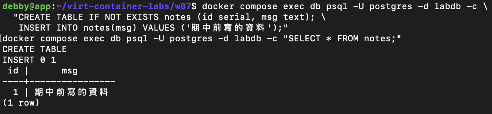<br>
  <sub>圖 7｜w07-partC-10-insert-notes.png</sub>
</p>

<p align="center">
  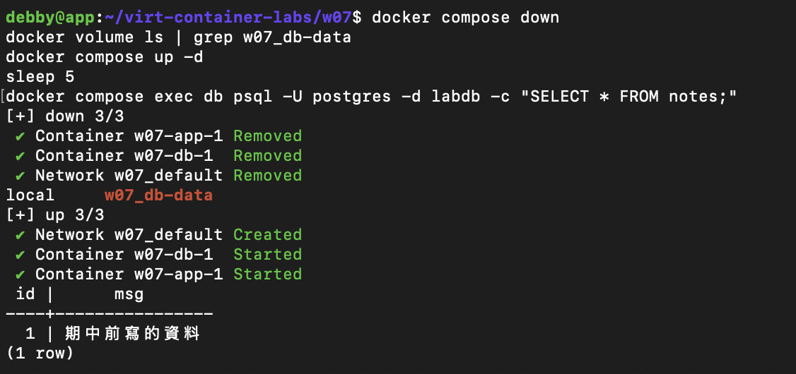<br>
  <sub>圖 8｜w07-partC-11-down-keep-volume.png</sub>
</p>

<p align="center">
  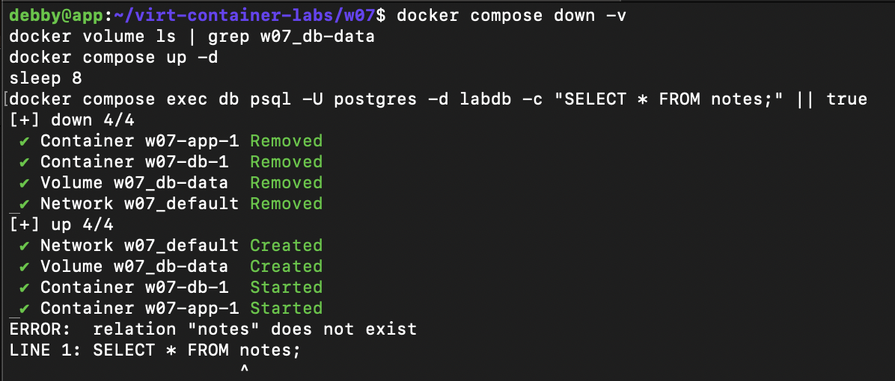<br>
  <sub>圖 9｜w07-partC-12-down-v.png</sub>
</p>

**bind mount：** `sed` 把 `Hello from` 改成 `Hi from`，容器內 `cat /app/app.py` 立即看到變更。

<p align="center">
  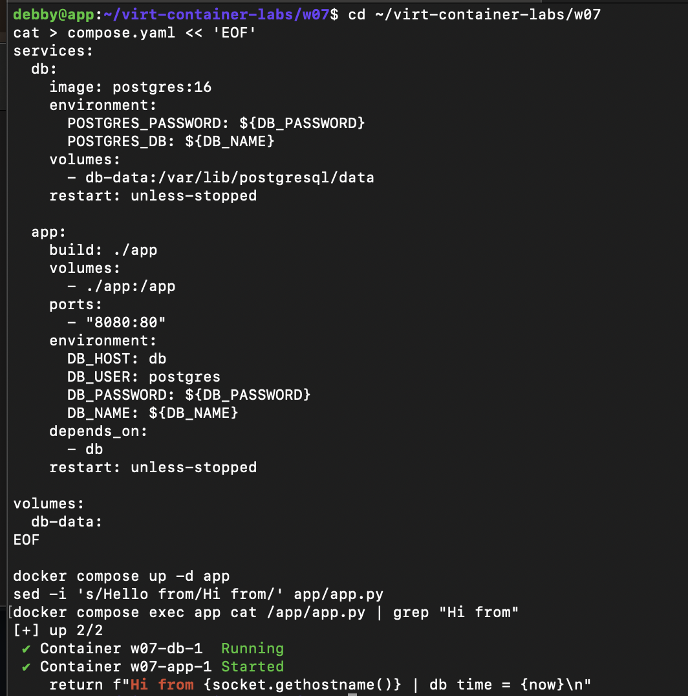<br>
  <sub>圖 10｜w07-partC-14-bind-mount.png</sub>
</p>

**tmpfs：** 寫入 `/tmp/cache/x` 成功，`df` 顯示 `tmpfs`；`restart app` 後目錄為空。

<p align="center">
  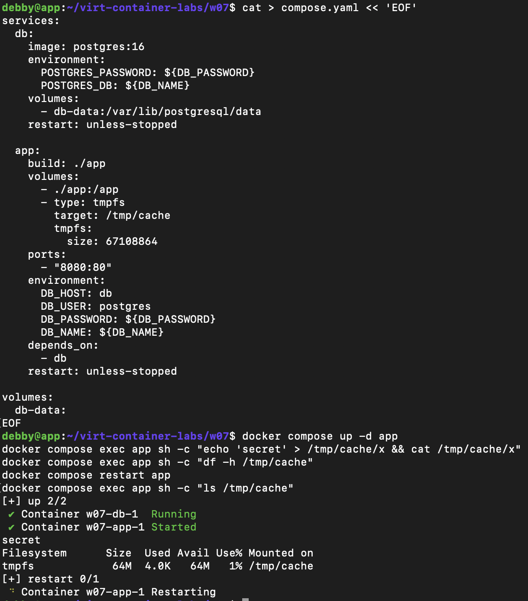<br>
  <sub>圖 11｜w07-partC-15-tmpfs.png</sub>
</p>

---

## healthcheck 前後對照

### 講義對照表（t=1 / 3 / 5 / 10 秒）

| 寫法 | curl /healthz t=1s | t=3s | t=5s | t=10s |
|---|---|---|---|---|
| 只 `depends_on`（db 加 `sleep 8`） | **000** | **503** | **503** | **200** |
| `depends_on` + `condition: service_healthy` | **000** | **200** | **200** | **200** |

### 完整時間序列（實測）

**只 depends_on（步驟 17）：**

| 秒數 | HTTP 狀態碼 |
|------|-------------|
| t=1 | 000 |
| t=2 | 503 |
| t=3 | 503 |
| t=4 | 503 |
| t=5 | 503 |
| t=6 | 503 |
| t=7 | 503 |
| t=8 | 503 |
| t=9 | 200 |
| t=10 | 200 |

**service_healthy（步驟 19）：**

| 秒數 | HTTP 狀態碼 |
|------|-------------|
| t=1 | 000 |
| t=2～12 | 200 |

**觀察（用自己的話寫）：**

只有 `depends_on` 時，Compose 只保證 **db 容器 process 已啟動**，不保證 Postgres 已能 accept 連線；db 還在 `sleep 8` 初始化時，app 已經在跑，所以 `/healthz` 會先 **503**，等 db 好了才 **200**。

加上 `healthcheck`（`pg_isready`）與 `depends_on.db.condition: service_healthy` 後，**app 會等 db 變 healthy 才啟動**。前幾秒 curl 是 **000**（app 還沒 listen），app 一起來就是 **200**，不會再出現一長串 503。

<p align="center">
  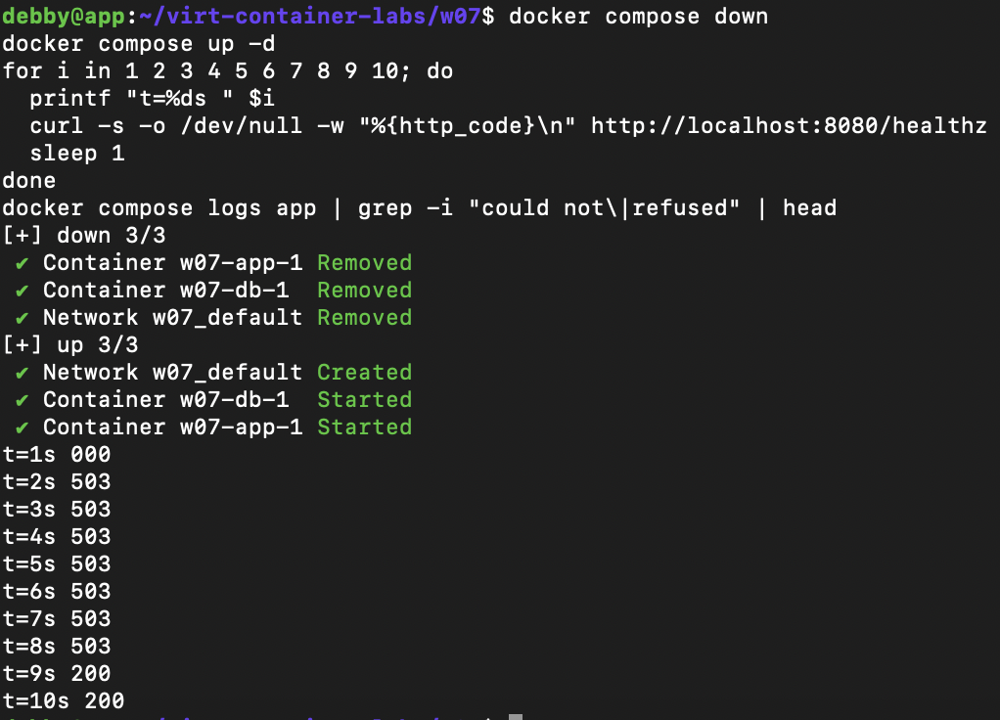<br>
  <sub>圖 12｜w07-partD-17-healthz-loop.png</sub>
</p>

<p align="center">
  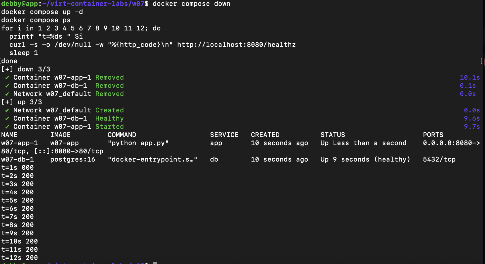<br>
  <sub>圖 13｜w07-partD-19-healthz-healthy.png</sub>
</p>

<p align="center">
  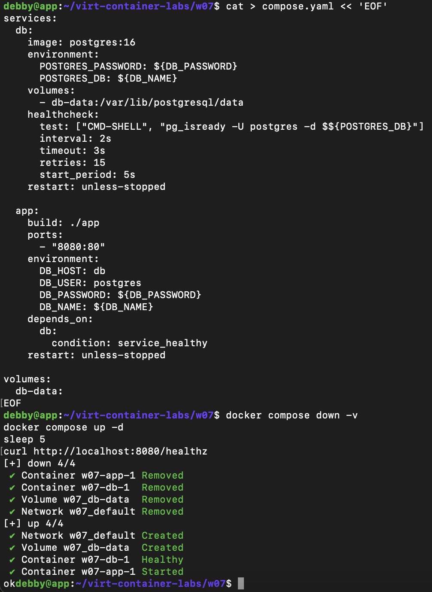<br>
  <sub>圖 14｜w07-partD-20-final-compose.png</sub>
</p>

---

## Part B｜Compose 網路與 DNS

- `docker network ls` 可見 **`w07_default`**
- `docker volume ls` 可見 **`w07_db-data`**
- `getent hosts db` → `172.18.0.2`（與 `socket.gethostbyname("db")` 一致）
- 將 service `db` 改名為 `database` 但 `DB_HOST` 仍為 `db` 時：`db unreachable: could not translate host name "db"`，HTTP **503**（需 `docker compose down --remove-orphans` 後重測）

<p align="center">
  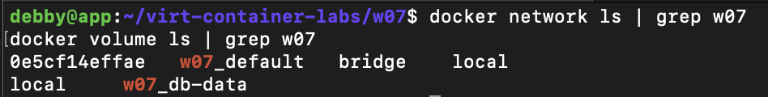<br>
  <sub>圖 15｜w07-partB-07-network-volume.png</sub>
</p>

<p align="center">
  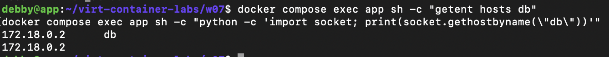<br>
  <sub>圖 16｜w07-partB-08-dns-db.png</sub>
</p>

<p align="center">
  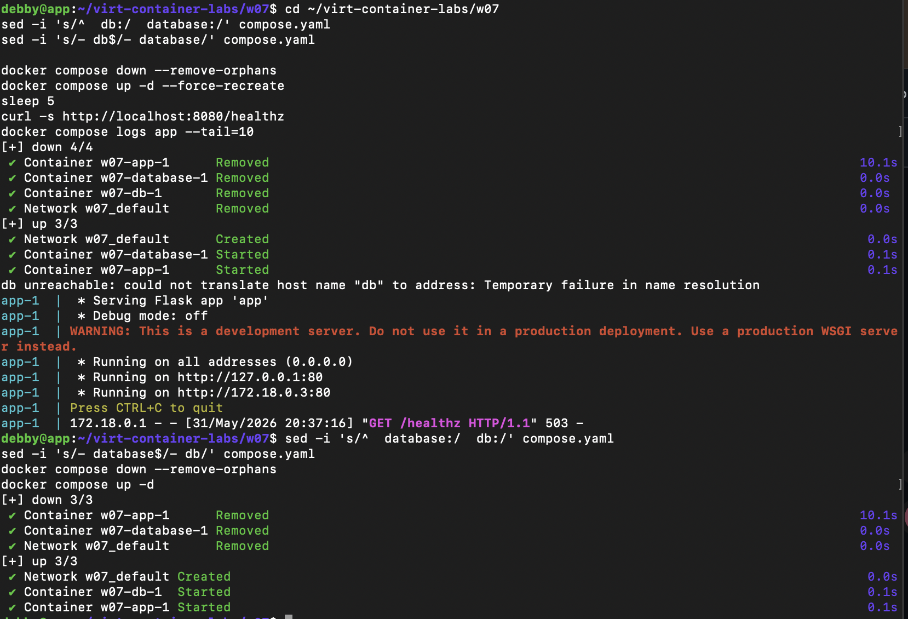<br>
  <sub>圖 17｜w07-partB-09-dns-fail.png</sub>
</p>

---

## Part E｜跨平台與指令速查

- `uname -m`：**aarch64**
- `docker info`：**Architecture: aarch64**
- `docker compose pull`：無外網時失敗（映像已離線 `docker load`）

<p align="center">
  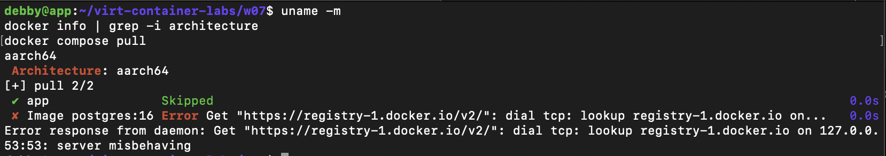<br>
  <sub>圖 18｜w07-partE-21-arch.png</sub>
</p>

### Compose 指令速查

| 指令 | 用途 |
|------|------|
| `docker compose up -d` | 背景啟動所有 service |
| `docker compose up -d app` | 只重建/啟動 app（會處理依賴） |
| `docker compose down` | 停容器、刪網路，**保留** named volume |
| `docker compose down -v` | 連 named volume 一起刪（資料會沒） |
| `docker compose ps` | 查看狀態（含 healthy） |
| `docker compose logs -f app` | 追蹤 app log |
| `docker compose logs --tail=20` | 所有 service 最近 20 行 |
| `docker compose config` | 預覽展開 `.env` 後的 yaml |
| `docker compose exec db psql ...` | 進資料庫 |
| `docker compose up -d --build` | Dockerfile 變更後強制重建 |
| `docker compose restart app` | 重啟 app（**不會**重讀 yaml 變更） |

**`down` vs `down -v`：** 前者只砍容器與網路，volume 還在；後者連 `w07_db-data` 一起刪，資料庫資料會清空。

**`restart` vs `up -d`：** 改 `compose.yaml` 要用 `up -d` 才會套用；只 `restart` 不會重建容器設定。

---

## 排錯紀錄

### 紀錄一：無法 pull 映像與 pip 安裝失敗

- **症狀：** `docker compose up` 報 `postgres:16` pull 失敗；build app 時 `pip` 長時間重試後 `No matching distribution found for flask`。
- **診斷：** app VM 無外網，registry 與 PyPI 皆不可達。
- **修正：** Mac 上 `docker save postgres:16` 與 `w07-wheels-linux.tar.gz`，經閘道 HTTP `curl` 傳入 VM 後 `docker load`；`app/Dockerfile` 改為 `pip install --no-index --find-links=wheels`。
- **驗證：** `docker compose ps` 兩服務皆 running；`curl /` 有 db time；`/healthz` 為 `ok`。

### 紀錄二：改名 database 後 healthz 仍 ok

- **症狀：** `db` 改成 `database` 後，`/healthz` 仍回 200。
- **診斷：** 舊容器 `w07-db-1` 成 orphan，DNS 名稱 `db` 仍指向舊容器。
- **修正：** `docker compose down --remove-orphans` 後 `docker compose up -d --force-recreate`。
- **驗證：** 出現 `could not translate host name "db"`，HTTP 503。

---

## 設計決策

### 為什麼 db 用 named volume 而不是 bind mount？

PostgreSQL 資料目錄有嚴格的權限、檔案配置與初始化流程，應由官方映像搭配 Docker volume 管理。bind mount 容易遇到 uid/gid、SELinux 問題，也不應手動用 vim 改 volume 內檔案。實驗中 `down` 不帶 `-v` 資料仍在、`down -v` 才清空，符合生產環境對「資料與容器生命週期分離」的需求。

### 為什麼生產環境不能用 tmpfs 存資料庫？

tmpfs 資料在 **記憶體**，容器停止或 restart 即消失，不具持久性，也無法備份還原。僅適合暫存密鑰、短期 cache，**不適合** db 資料目錄。

### 無外網環境補充

- base 映像與 Python wheels 離線匯入（與 W06 相同流程）。
- `app/Dockerfile` 使用 `--no-index --find-links=wheels`。
- 最終 `compose.yaml` 含 `healthcheck` 與 `service_healthy`，已移除測試用 `sleep 8`。

---

## 可重跑最小命令鏈

```bash
cd ~/virt-container-labs/w07
cp .env.example .env   # 自行修改密碼
docker compose up -d
sleep 10
curl http://localhost:8080/healthz
```

**預期輸出：** `ok`

---

## 交付清單（對照講義）

| 項目 | 檔案 | 狀態 |
|------|------|------|
| Compose 專案 | `compose.yaml` | 已交 |
| 環境變數範例 | `.env.example` | 已交（勿交 `.env`） |
| 應用程式 | `app/Dockerfile`、`app/app.py`、`app/requirements.txt` | 已交 |
| 忽略機密 | `.gitignore` | 已交 |
| 報告 | `README.md`（本檔） | 已交 |
| 截圖 | `w07-partA-01`～`partE-21` 共 18 張 | 與本 README 同目錄 |

### 截圖檔名清單（共 18 張）

1. `w07-partA-01-mkdir.png`
2. `w07-partA-02-app-files.png`
3. `w07-partA-03-compose-env.png`
4. `w07-partA-04-compose-config.png`
5. `w07-partA-05-compose-up.png`
6. `w07-partA-06-curl.png`
7. `w07-partC-10-insert-notes.png`
8. `w07-partC-11-down-keep-volume.png`
9. `w07-partC-12-down-v.png`
10. `w07-partC-14-bind-mount.png`
11. `w07-partC-15-tmpfs.png`
12. `w07-partD-17-healthz-loop.png`
13. `w07-partD-19-healthz-healthy.png`
14. `w07-partD-20-final-compose.png`
15. `w07-partB-07-network-volume.png`
16. `w07-partB-08-dns-db.png`
17. `w07-partB-09-dns-fail.png`
18. `w07-partE-21-arch.png`
