# W08｜容器生產實踐

**姓名：** 劉芷庭  
**學號：** 412630708  

---

## 前置作業

<p align="center">
  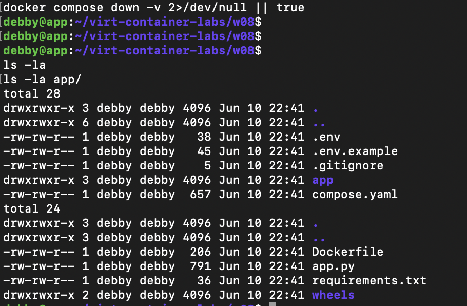<br>
  <sub>w08-prep-01-copy.png</sub>
</p>

從 W07 複製專案到 `~/virt-container-labs/w08/` 作為本週改造基礎。

---

## Part A｜Healthcheck 進階寫法

### 步驟 1：app healthcheck 改為真正查 /healthz

<p align="center">
  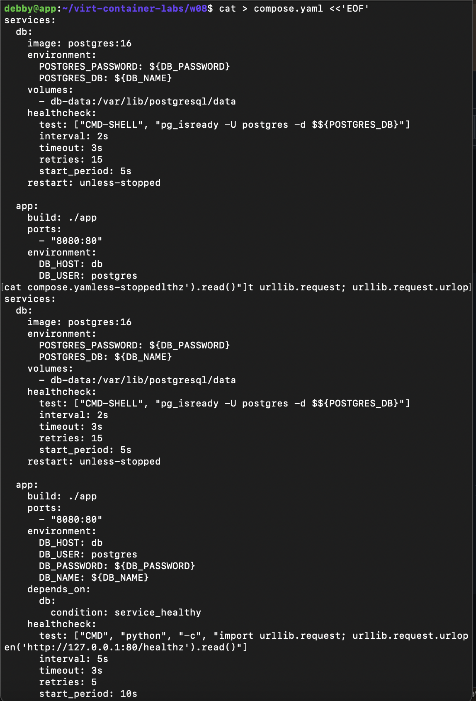<br>
  <sub>w08-partA-01-healthcheck-yaml.png</sub>
</p>

`app` 使用 Python `urllib` 打 `http://127.0.0.1:8080/healthz`（`python:3.12-slim` 沒有 curl）。

### 步驟 2～4：healthy → 停 db → unhealthy → 恢復

<p align="center">
  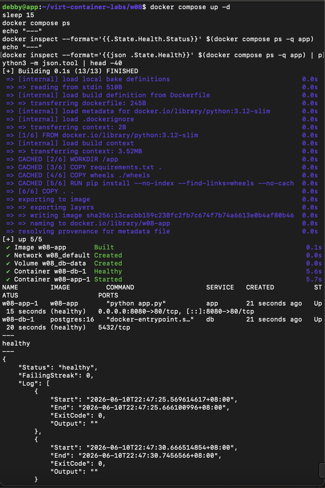<br>
  <sub>w08-partA-02-healthy.png</sub>
</p>

<p align="center">
  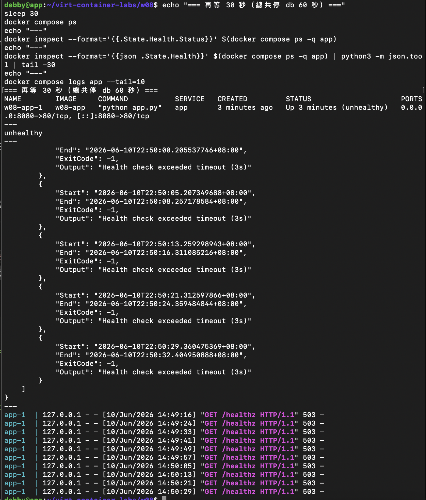<br>
  <sub>w08-partA-03-unhealthy.png</sub>
</p>

<p align="center">
  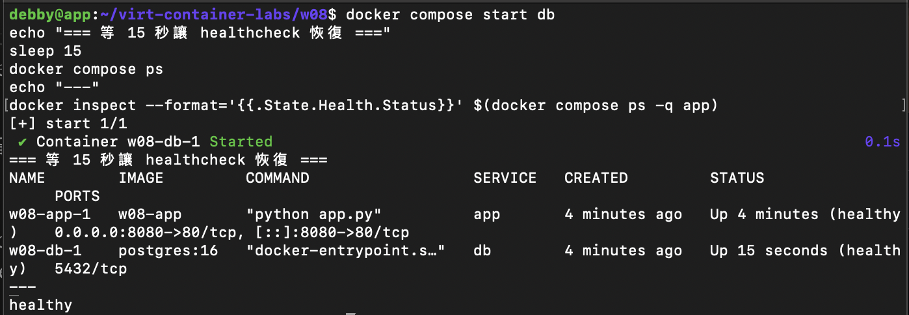<br>
  <sub>w08-partA-04-recovered.png</sub>
</p>

## Healthcheck 故障測試

- **停 db 後幾秒被標 unhealthy：** 約 **30～60 秒**（`docker compose stop db` 後，`Health.Status` 變 `unhealthy`）
- **對應 log 訊息：** `/healthz` 回 **503**；health probe 出現 `Health check exceeded timeout (3s)`；app log 有 `GET /healthz HTTP/1.1" 503`
- **重點：** `unhealthy` **不會**自動重啟容器，需手動 `docker compose start db` 恢復

---

## Part B｜Log 失控與 rotation

<p align="center">
  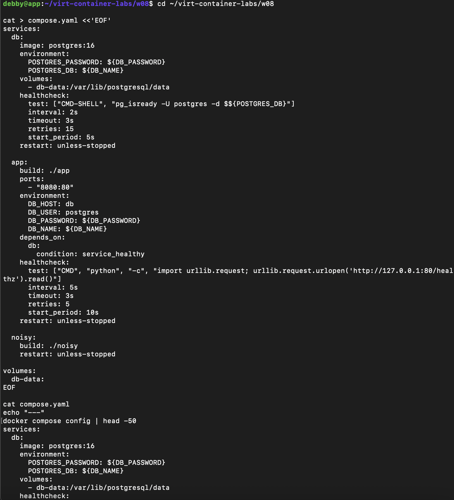<br>
  <sub>w08-partB-05-noisy-files.png</sub>
</p>

<p align="center">
  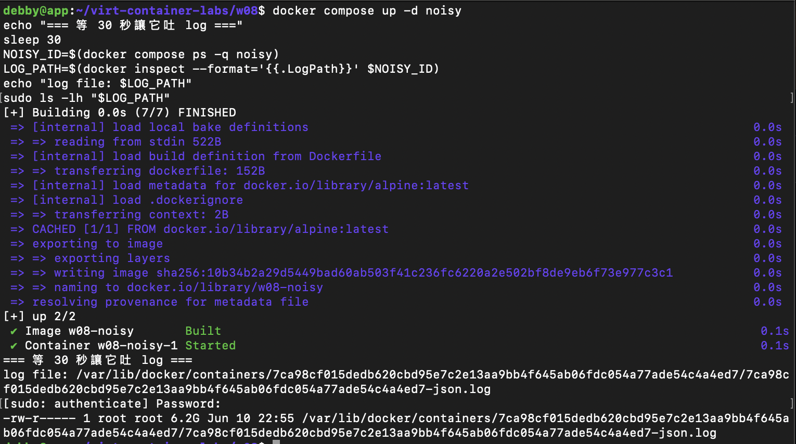<br>
  <sub>w08-partB-06-log-size.png</sub>
</p>

<p align="center">
  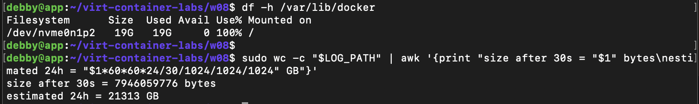<br>
  <sub>w08-partB-07-estimate.png</sub>
</p>

<p align="center">
  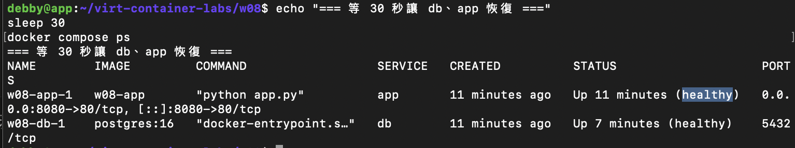<br>
  <sub>w08-partB-07b-recovered.png</sub>
</p>

<p align="center">
  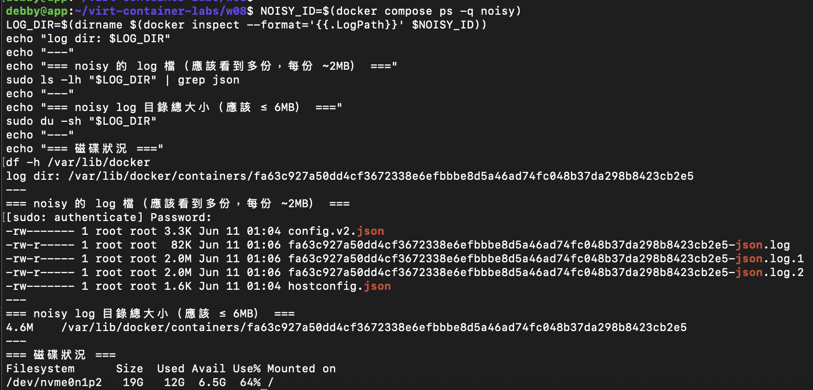<br>
  <sub>w08-partB-09-rotation.png</sub>
</p>

<p align="center">
  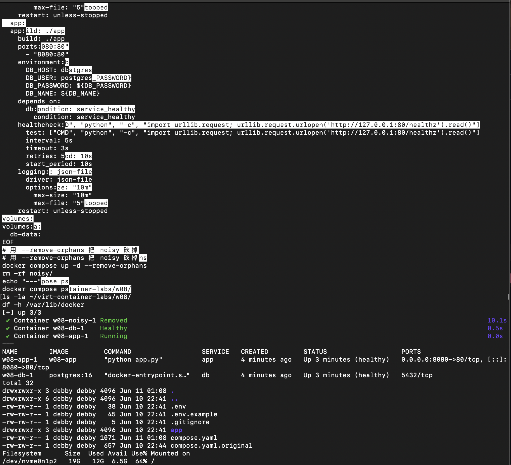<br>
  <sub>w08-partB-09-noisy-removed.png</sub>
</p>

## Log 失控估算

| 項目 | 數值 |
|------|------|
| noisy 容器 **30 秒** log 大小 | **6.2 GB** |
| 預估 **24 小時**大小 | 約 **21313 GB**（實測估算指令輸出） |
| 套 rotation 後穩定上限 | `max-size: 2m` × `max-file: 3` → 約 **≤ 6 MB**（實測目錄約 **4.6 MB**） |
| app / db logging | `max-size: 10m`，`max-file: 5` |

**觀察：** 不設 rotation 時 log 會無限長大，甚至把磁碟打滿（`df` 曾到 **100%**）。加上 `max-size` + `max-file` 後，log 檔維持在固定上限內輪轉。

---

## Part C｜資源限制實驗

<p align="center">
  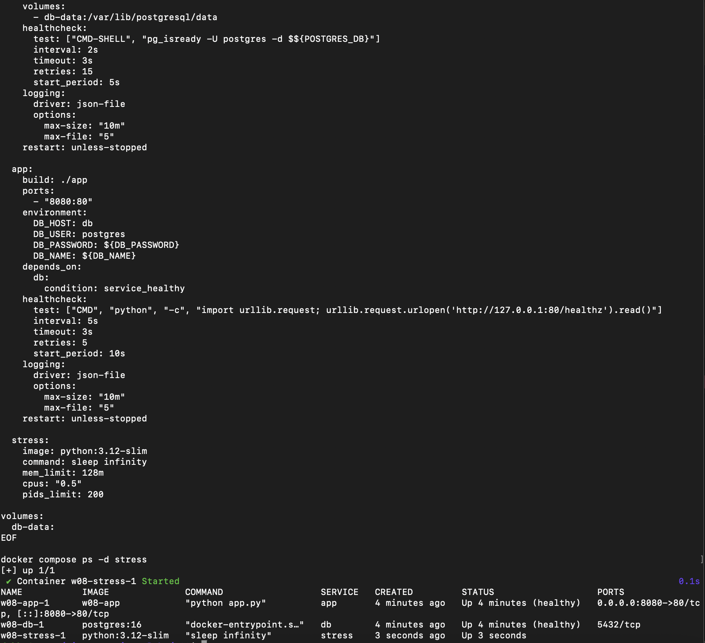<br>
  <sub>w08-partC-11-stress-up.png</sub>
</p>

<p align="center">
  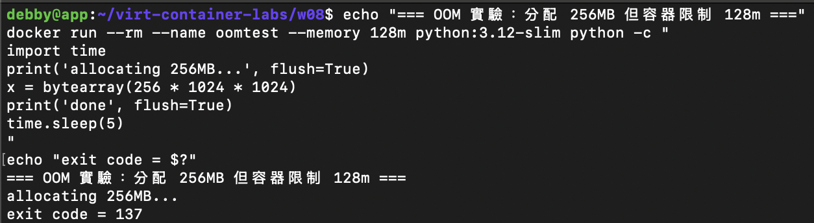<br>
  <sub>w08-partC-12-oom-137.png</sub>
</p>

<p align="center">
  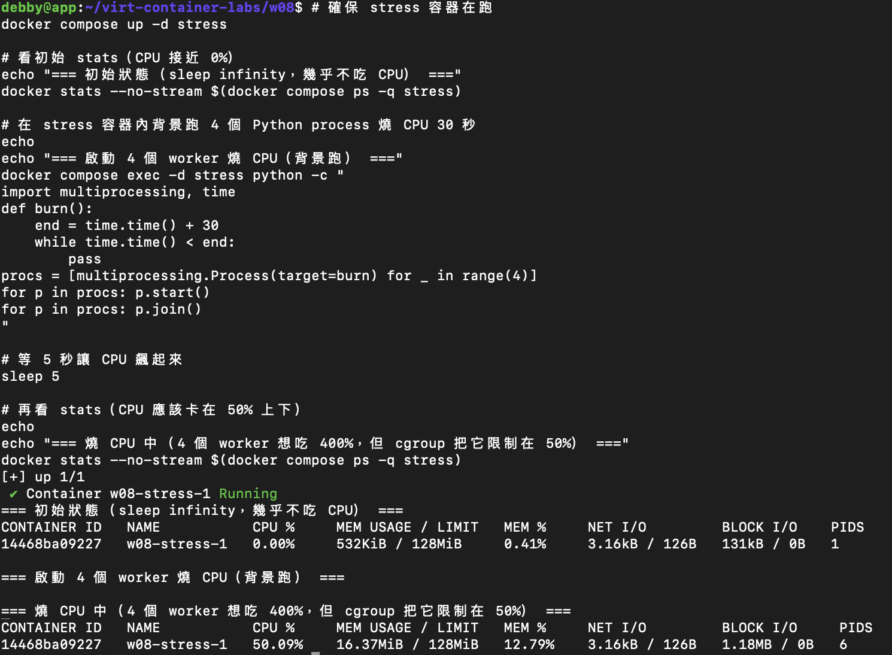<br>
  <sub>w08-partC-13-cpu-throttle.png</sub>
</p>

<p align="center">
  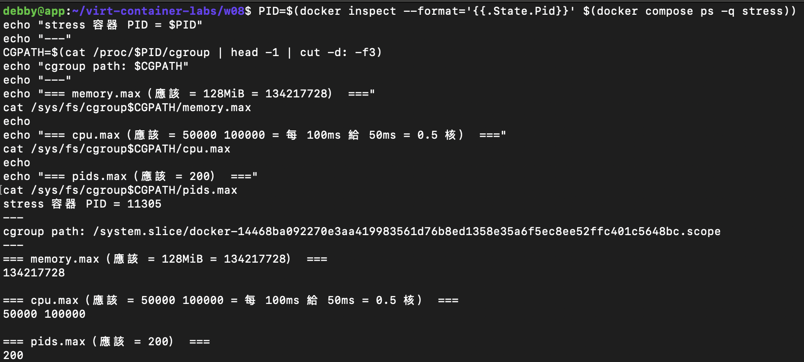<br>
  <sub>w08-partC-14-cgroup-verify.png</sub>
</p>

## 資源限制實驗

| 實驗 | 命令 | 觀察結果 | 對應 cgroup 檔 | 值 |
|------|------|----------|---------------|-----|
| **OOM** | `docker run --rm --memory 128m python:3.12-slim python -c "x=bytearray(256*1024*1024)"` | 印出 `allocating 256MB...` 後被殺；**exit code = 137**（128+9=SIGKILL） | `memory.max` | **134217728**（128 MiB） |
| **CPU throttle** | `stress` 容器 `cpus: "0.5"`，Python 開 4 個 worker 燒 CPU | `docker stats` CPU% 約 **50.09%**（想吃 400% 被限速） | `cpu.max` | **50000 100000**（50%） |
| **pids** | compose `pids_limit: 200` | 正常運行 | `pids.max` | **200** |

---

## Part D｜權限四階對照

<p align="center">
  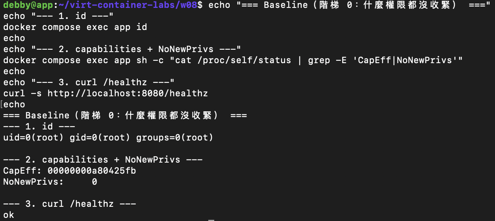<br>
  <sub>w08-partD-15-baseline.png</sub>
</p>

<p align="center">
  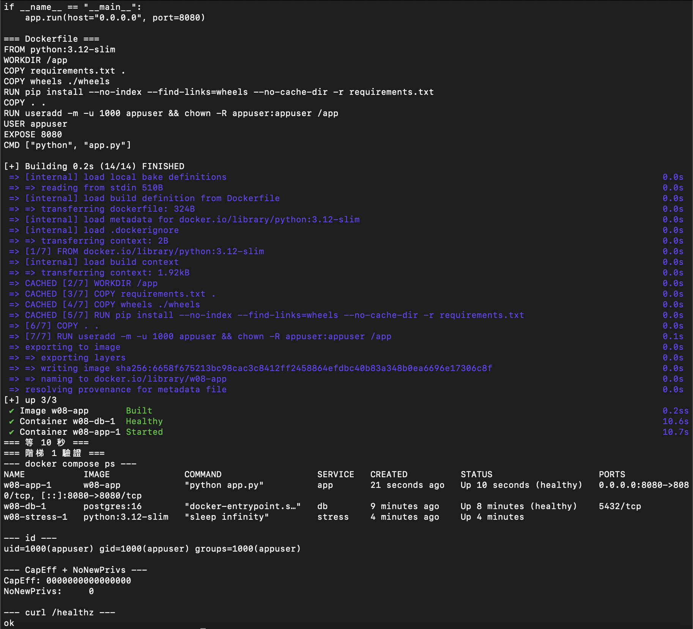<br>
  <sub>w08-partD-16-user-1000.png</sub>
</p>

<p align="center">
  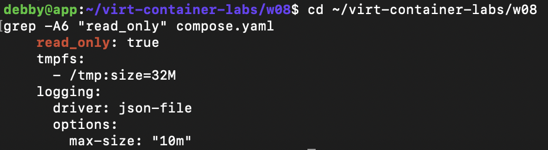<br>
  <sub>w08-partD-17-readonly-tmpfs.png</sub>
</p>

<p align="center">
  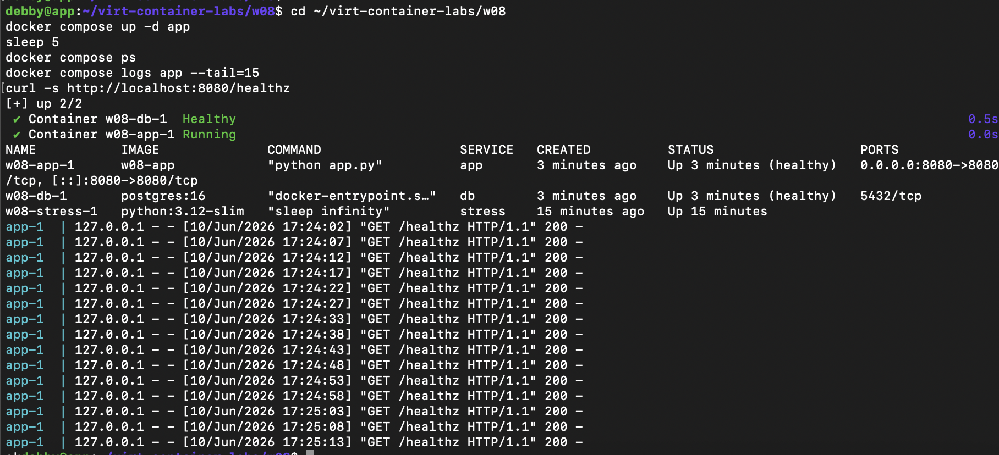<br>
  <sub>w08-partD-18-readonly-verify.png</sub>
</p>

<p align="center">
  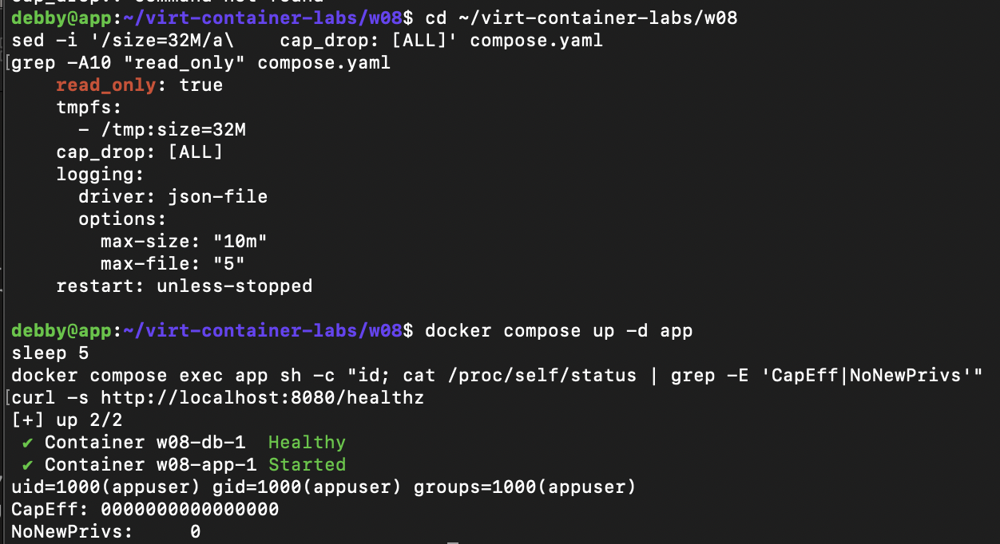<br>
  <sub>w08-partD-19-cap-drop.png</sub>
</p>

<p align="center">
  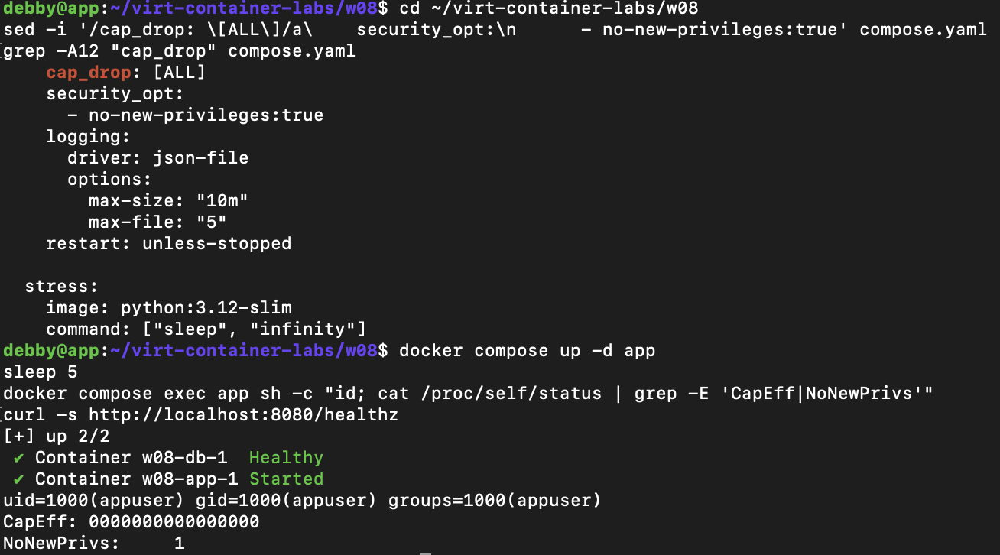<br>
  <sub>w08-partD-20-no-new-priv.png</sub>
</p>

<p align="center">
  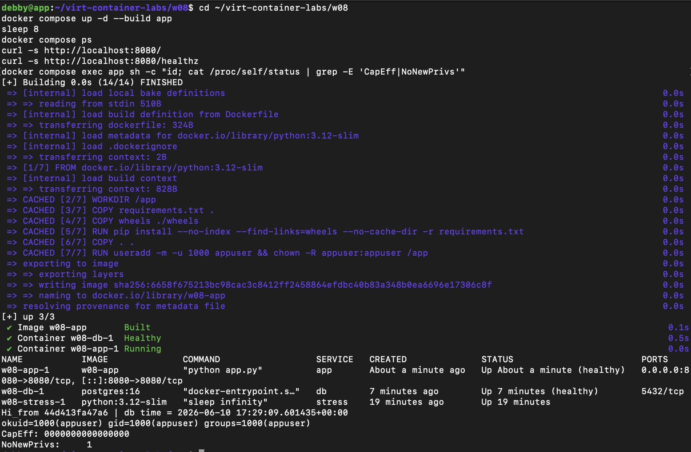<br>
  <sub>w08-partD-21-final-security.png</sub>
</p>

## 權限四階對照

| 階梯 | 設定 | id | CapEff | NoNewPrivs | curl /healthz |
|------|------|-----|--------|------------|---------------|
| 0（baseline） | 什麼都沒收緊 | uid=0(root) | `00000000a80425fb` | 0 | ok |
| 1 | `USER appuser` + `user: "1000:1000"` | uid=1000(appuser) | `0000000000000000` | 0 | ok |
| 2 | + `read_only: true` + `tmpfs: /tmp` | uid=1000 | `0000000000000000` | 0 | ok |
| 3 | + `cap_drop: [ALL]` | uid=1000 | `0000000000000000` | 0 | ok |
| 4 | + `security_opt: no-new-privileges:true` | uid=1000 | `0000000000000000` | **1** | ok |

**說明：** 切成非 root 後 `CapEff` 已是 0；`cap_drop` 是 defense-in-depth，防止 setuid 升權瞬間拿回 capability。

---

## Part E｜Production-ready compose

<p align="center">
  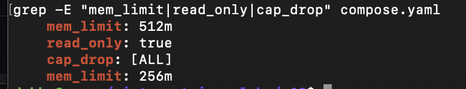<br>
  <sub>w08-partE-23-production-yaml.png</sub>
</p>

<p align="center">
  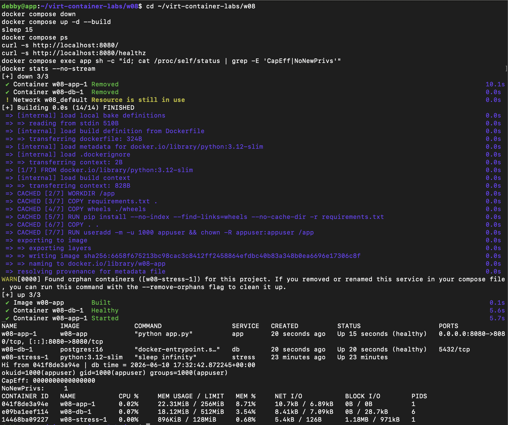<br>
  <sub>w08-partE-24-final-verify.png</sub>
</p>

**最終驗證：**

- `app`、`db` 皆 **healthy**
- `curl /` → `Hi from ... | db time = ...`
- `curl /healthz` → **ok**
- `docker stats`：app **22.31MiB / 256MiB**；db **18.12MiB / 512MiB**

---

## 排錯紀錄

### 1. 無外網無法 pull / pip

- **症狀：** `postgres:16` pull 失敗；build 時 pip 無法連 PyPI
- **診斷：** app VM 無外網
- **修正：** Mac `docker save` + HTTP 傳入；`app/wheels` 離線 `pip install --no-index`
- **驗證：** compose 兩服務正常啟動

### 2. read_only 與 listen 埠

- **症狀：** 非 root 無法 bind 80（< 1024）
- **診斷：** 需 `CAP_NET_BIND_SERVICE` 或改聽 8080
- **修正：** `app.py` port=8080、`EXPOSE 8080`、`ports: 8080:8080`、healthcheck URL 改 8080
- **驗證：** `/healthz` 正常

### 3. orphan stress 容器

- **症狀：** 最終 yaml 移除 `stress` 後仍看到 `w08-stress-1`
- **診斷：** orphan container
- **修正：** `docker compose down --remove-orphans`
- **驗證：** 只剩 `app` 與 `db`

---

## 設計決策

### mem_limit / cpus 怎麼選？

| Service | mem_limit | cpus | 理由 |
|---------|-----------|------|------|
| **db** | 512m | 1.0 | 資料庫需較多記憶體做 cache；實測約 18MiB，512m 留成長空間 |
| **app** | 256m | 0.5 | Flask 輕量，實測約 22MiB；限制防止 bug 吃光 host |
| **pids_limit** | 200（app） | — | 防 fork bomb |

### read_only 後補了哪些 tmpfs？為什麼？

- `/tmp:size=32M` — Python / Flask 暫存
- `/home/appuser/.cache:size=16M` — 部分套件可能寫 cache（production yaml 預防）

唯讀 rootfs 防止寫入 `/usr` 等路徑；可寫區域只用 tmpfs 明確劃出。

### 為什麼 db 用 named volume 而不是 bind mount？

Postgres 資料目錄應由 Docker 管理，避免 host 權限與手動改檔風險（W07 已驗證）。

### 為什麼生產不能用 tmpfs 存資料庫？

tmpfs 在記憶體中，容器停資料即失，無法持久化。

---

## Compose 指令速查

| 指令 | 用途 |
|------|------|
| `docker compose up -d --build` | 啟動並重建 |
| `docker compose down` | 停服務，保留 volume |
| `docker compose down -v` | 連 volume 刪除 |
| `docker compose ps` | 狀態（含 healthy） |
| `docker compose logs -f app` | 追 log |
| `docker stats --no-stream` | 資源用量與 limit |
| `docker inspect --format='{{.State.Health}}'` | health 詳情 |

---

## 可重跑最小命令鏈

```bash
cd ~/virt-container-labs/w08
cp .env.example .env
docker compose up -d --build
sleep 15
curl http://localhost:8080/healthz
```

**預期輸出：** `ok`

---

## 截圖檔名清單（共 24 張）

1. w08-prep-01-copy.png  
2. w08-partA-01-healthcheck-yaml.png  
3. w08-partA-02-healthy.png  
4. w08-partA-03-unhealthy.png  
5. w08-partA-04-recovered.png  
6. w08-partB-05-noisy-files.png  
7. w08-partB-06-log-size.png  
8. w08-partB-07-estimate.png  
9. w08-partB-07b-recovered.png  
10. w08-partB-09-rotation.png  
11. w08-partB-09-noisy-removed.png  
12. w08-partC-11-stress-up.png  
13. w08-partC-12-oom-137.png  
14. w08-partC-13-cpu-throttle.png  
15. w08-partC-14-cgroup-verify.png  
16. w08-partD-15-baseline.png  
17. w08-partD-16-user-1000.png  
18. w08-partD-17-readonly-tmpfs.png  
19. w08-partD-18-readonly-verify.png  
20. w08-partD-19-cap-drop.png  
21. w08-partD-20-no-new-priv.png  
22. w08-partD-21-final-security.png  
23. w08-partE-23-production-yaml.png  
24. w08-partE-24-final-verify.png  

