# 期末實作 — 412630708 <劉芷庭>

## 1. 架構總覽

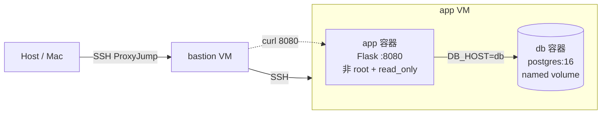

期中 bastion → app 跳板架構上，在 app VM 以 `compose.yaml` 部署 Flask + PostgreSQL 雙服務 stack。app 自行 build、以非 root 執行並加固；db 使用 named volume 持久化資料。

## 2. Part A：底座與基準點

- 從 Mac 執行 `ssh app` 一次成功（ProxyJump 經 bastion，免密碼）
- Docker 29.3.0、Compose v5.1.0
- VMware snapshot 命名 `final-baseline`

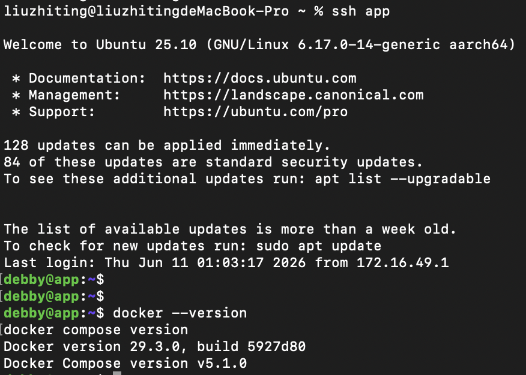

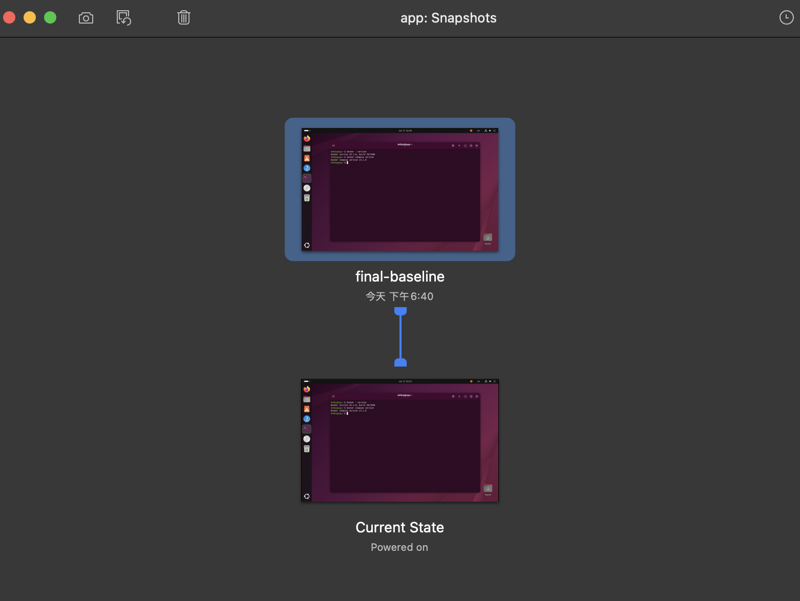

## 3. Part B：Dockerfile 與快取

Dockerfile 依 layer 快取原則排序：先 `COPY requirements.txt` + `RUN pip install`，再 `COPY . .`；建立 `appuser`（uid 1000）並以 `USER` 切換；`CMD` 使用 exec form。

第二次 build 只修改 `app.py` 一行，`pip install` 層顯示 `CACHED`，表示依賴層未被 app 原始碼變動失效。

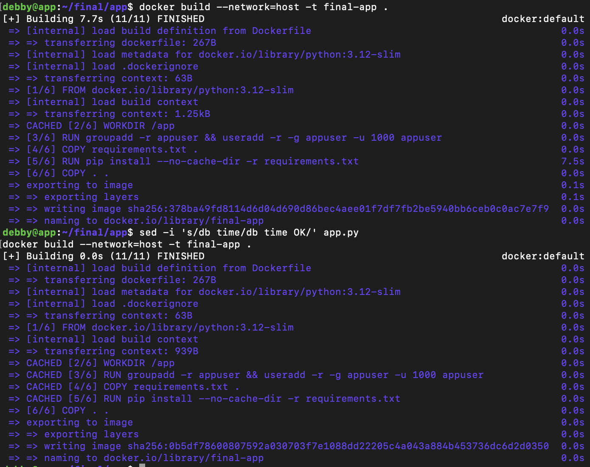

### 為什麼聽 8080 不聽 80？

Linux 預設僅 root 或具 `CAP_NET_BIND_SERVICE` 的 process 可綁定 1024 以下 port。本專案 app 以非 root（uid 1000）執行，且 `cap_drop: [ALL]`，無法綁定 port 80，故改聽 8080。

## 4. Part C：Compose 與資料持久化

- `db` 使用 `postgres:16`，資料掛 named volume `db-data`
- 密碼與 DB 名稱在 `.env`，repo 只交 `.env.example`
- `db` healthcheck 使用 `pg_isready`（`$${POSTGRES_DB}` 在容器內展開）
- `app` 以 `depends_on` + `condition: service_healthy` 等待 db

**三段對照：**

| 階段 | 命令 | 結果 |
| ---- | ---- | ---- |
| 寫入後 | INSERT 412630708 | 有資料 |
| `down && up` | 砍容器重建 | 資料還在 |
| `down -v && up` | 連 volume 一起砍 | relation 不存在 |

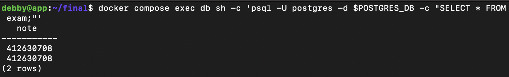

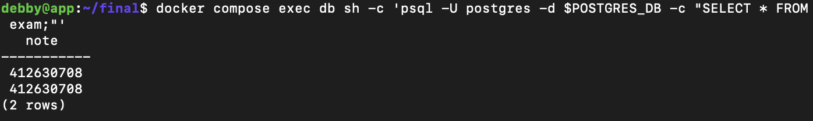

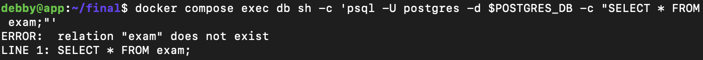

### down vs down -v

- `docker compose down`：移除容器與 network，**不刪** named volume
- `docker compose down -v`：額外刪除 compose 宣告的 named volume

named volume 生命週期獨立於容器；容器刪除後 volume 仍存在，直到明確 `down -v` 或 `docker volume rm`。

## 5. Part D：生產化加固

| 類別 | app | db |
| ---- | --- | --- |
| Log rotation | max-size 10m, max-file 3 | 同左 |
| 資源上限 | mem 256m, cpus 0.5, pids 200 | 同左 |
| 權限階梯 | user 1000:1000, read_only, tmpfs /tmp, cap_drop ALL, no-new-privileges | — |
| 健康檢查 | /healthz | pg_isready |

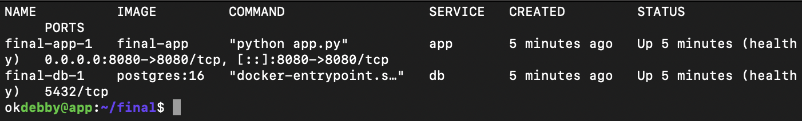

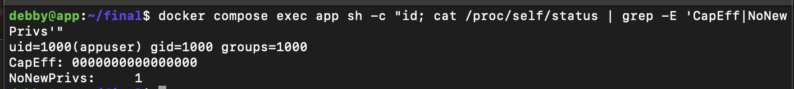

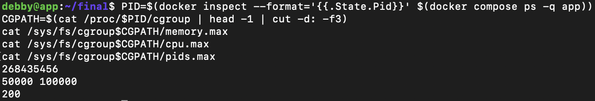

### yaml 的值怎麼對回 cgroup 檔案？

- `mem_limit: 256m` → 256 × 1024 × 1024 = **268435456** bytes
- `cpus: "0.5"` → `cpu.max` 格式為 `quota period`，50000/100000 = 50% = 0.5 CPU
- `pids_limit: 200` → `pids.max: 200`

## 6. Part E：故障演練

### 故障 1：F1 — stop db

- **注入方式：** `docker compose stop db`
- **診斷推論：** db 停掉後 app 容器仍在跑，但 healthcheck 偵測 DB 連線失敗 → HTTP 503。unhealthy ≠ 容器死掉。

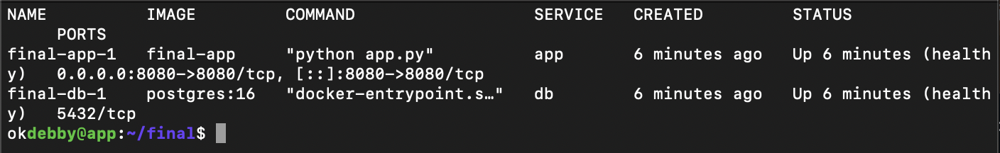

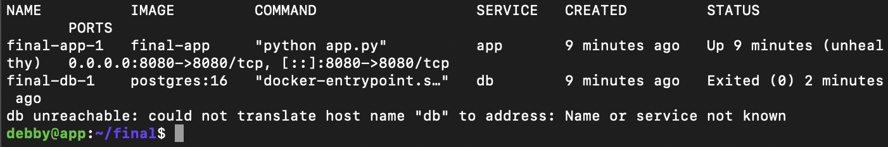

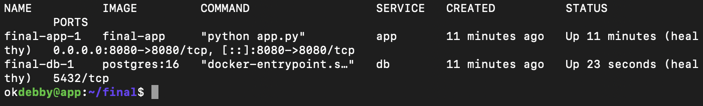

### 故障 2：F2 — stop app

- **注入方式：** `docker compose stop app`
- **診斷推論：** 容器層沒有 process 監聽 8080，TCP 連線直接被拒絕，與 F1 的 HTTP 503 不同。

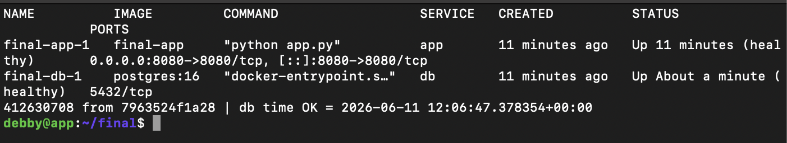

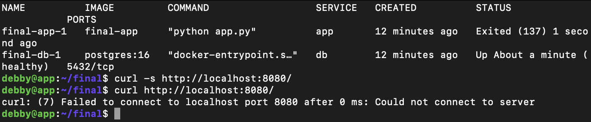

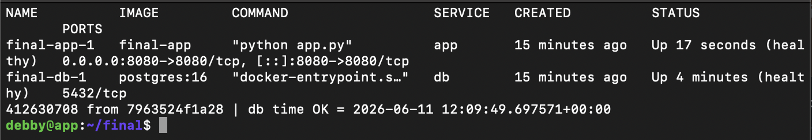

### 三症狀分層表（必答）

| 症狀 | 最可能的層 | 第一條驗證命令 |
| ---- | ---------- | -------------- |
| timeout | 網路 / 路由 / 防火牆 | `ping <目標 IP>` 或 `curl -v --connect-timeout 5 <URL>` |
| connection refused | 容器 / 應用未監聽 | `docker compose ps -a` + `ss -tlnp \| grep 8080` |
| HTTP 503 | 應用層 / 相依服務故障 | `curl -v http://localhost:8080/healthz` + `docker compose logs app` |

## 7. 反思（200 字）

這學期從 VM 做到 production-ready 容器，「隔離」在 VM、namespace、cgroup、權限階梯四處都出現，但防的東西不完全相同。VM 隔離整台機器的 kernel 與硬體；namespace 讓容器以為自己獨佔 PID、network、mount；cgroup 限制 CPU、記憶體、程序數等資源用量；權限階梯則限制容器內 process 能做的事（非 root、cap_drop、read_only）。它們層層疊加：VM 分機器，namespace 分視野，cgroup 分資源，capabilities 分權限。期中只需 SSH 進 app，期末則要在 app 無外網的條件下，透過 bastion 轉發完成 build，更理解「最小暴露」不只是關 port，而是每一層都只給剛好夠用的能力。

## 8. Bonus（選做）

未實作。
