# 期中實作 — 412630708 劉芷庭

## 1. 架構與 IP 表

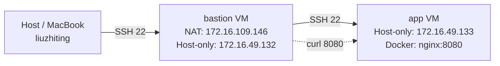

| VM      | 網卡           | IP              | 角色     |
|---------|----------------|-----------------|----------|
| bastion | NAT            | 172.16.109.146  | 唯一入口 |
| bastion | Host-only      | 172.16.49.132   | 內網跳板 |
| app     | Host-only only | 172.16.49.133   | 實際服務 |

---

## 2. Part A：VM 與網路

### IP 確認

**bastion：**
```
ens160: 172.16.109.146/24   # NAT
ens256: 172.16.49.132/24    # Host-only
```

**app：**
```
ens160: 172.16.49.133/24    # Host-only
```

### 互 ping 驗證

**bastion ping app：**

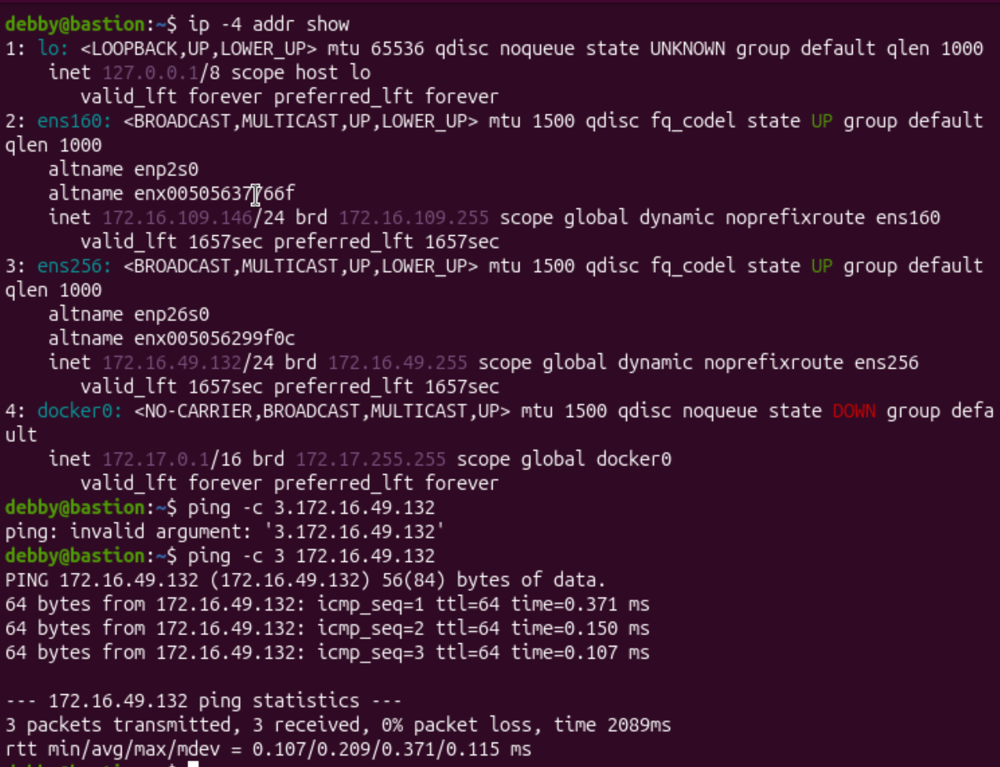

**app ping bastion：**

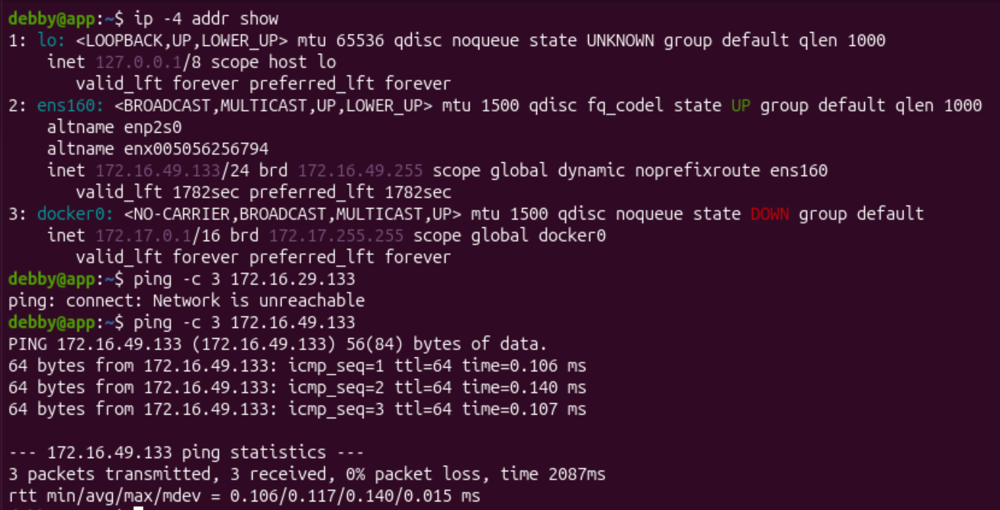

兩端 0% packet loss，Host-only 網段互通。

---

## 3. Part B：金鑰、ufw、ProxyJump

### SSH 金鑰部署

在 Host（MacBook）產生 ed25519 金鑰，分別部署到 bastion 和 app：

```bash
ssh-keygen -t ed25519 -C "midterm-key"
ssh-copy-id debby@172.16.109.146
ssh-copy-id -o ProxyJump=debby@172.16.109.146 debby@172.16.49.133
```

關閉兩台的密碼認證：

```bash
echo "PasswordAuthentication no" | sudo tee /etc/ssh/sshd_config.d/no-password.conf
sudo systemctl restart ssh
```

**bastion 關閉密碼認證：**

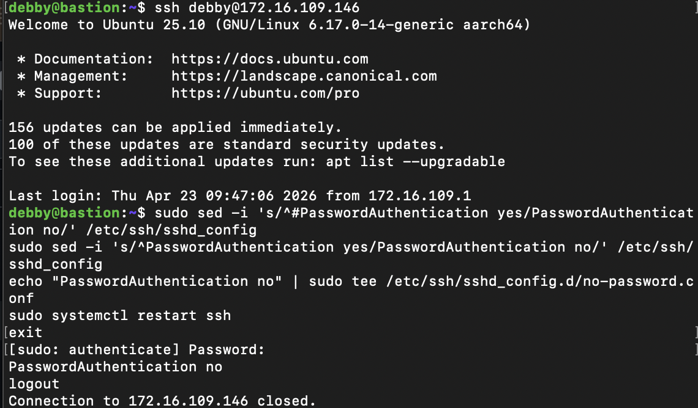

**app 關閉密碼認證：**

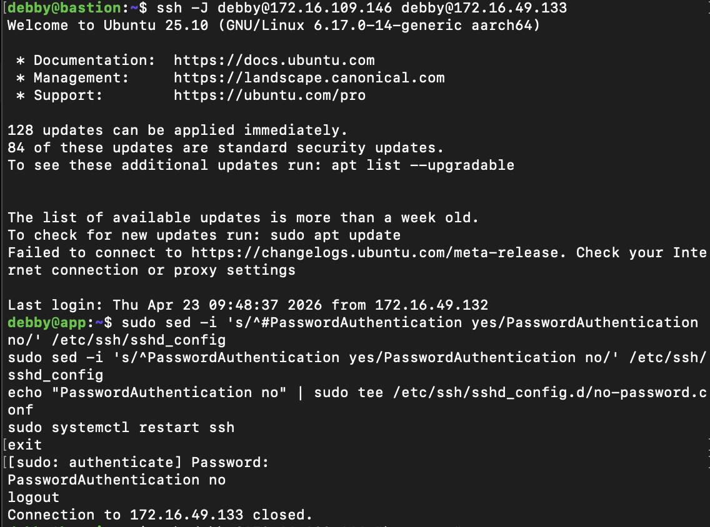

### 防火牆規則表

| VM      | 規則                            | 說明                     |
|---------|---------------------------------|--------------------------|
| bastion | 22/tcp ALLOW IN Anywhere        | 對外開放 SSH             |
| app     | 22/tcp ALLOW IN 172.16.49.132   | 只允許 bastion SSH 進來  |
| app     | 8080/tcp ALLOW IN 172.16.49.132 | 只允許 bastion curl 測試 |

**bastion ufw status：**

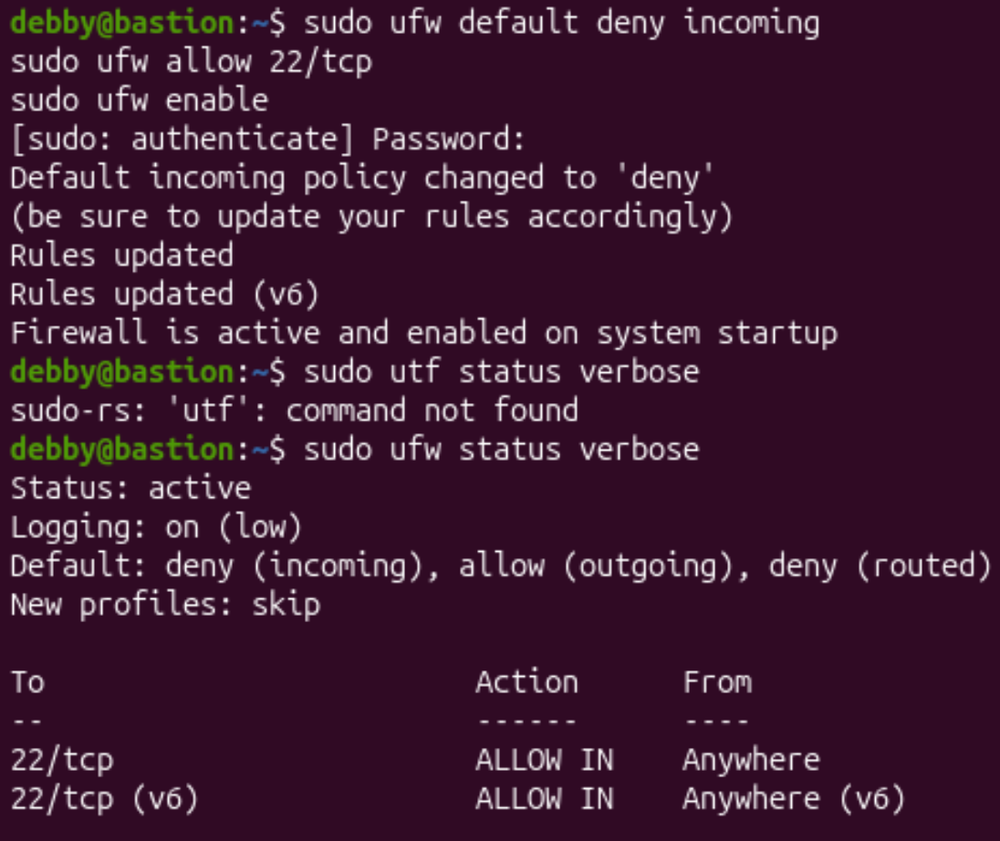

**app ufw status：**

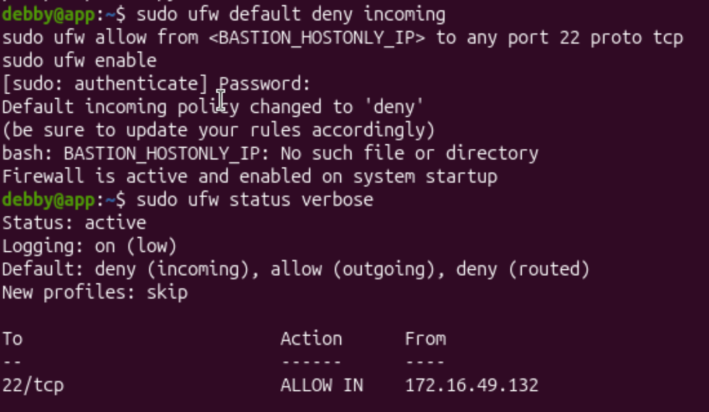

**app 開放 8080（補充規則）：**

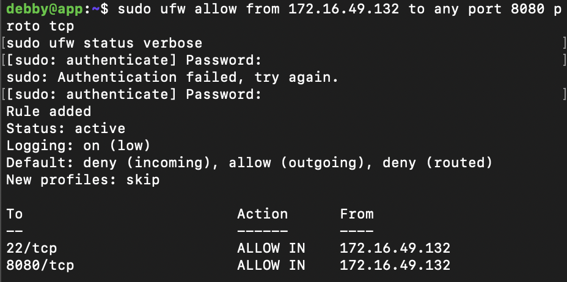

### SSH config（Host 端 ~/.ssh/config）

```
Host bastion
    HostName 172.16.109.146
    User debby

Host app
    HostName 172.16.49.133
    User debby
    ProxyJump bastion
```

### ProxyJump 驗證

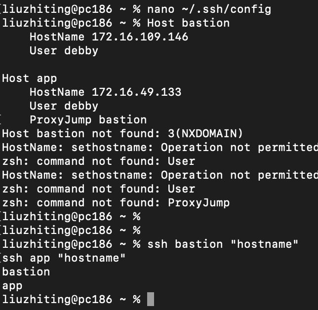

從 Host 執行 `ssh app` 直接進入 app VM，全程免密碼。

---

## 4. Part C：Docker 服務

### Docker daemon 狀態

```bash
systemctl status docker
```

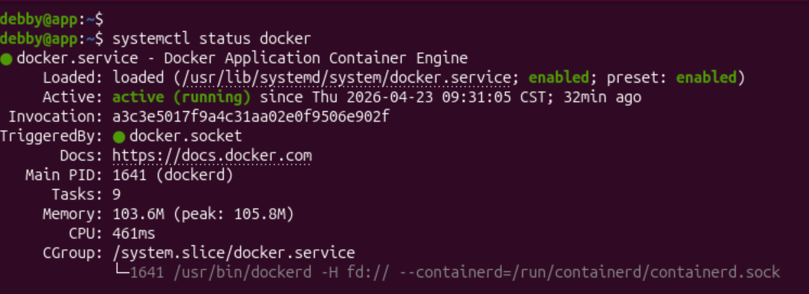

`active (running)`，由 docker.socket 觸發啟動，Main PID: 1641 (dockerd)。

### 啟動 nginx 容器

```bash
docker run -d --name web -p 8080:80 nginx
docker ps
```

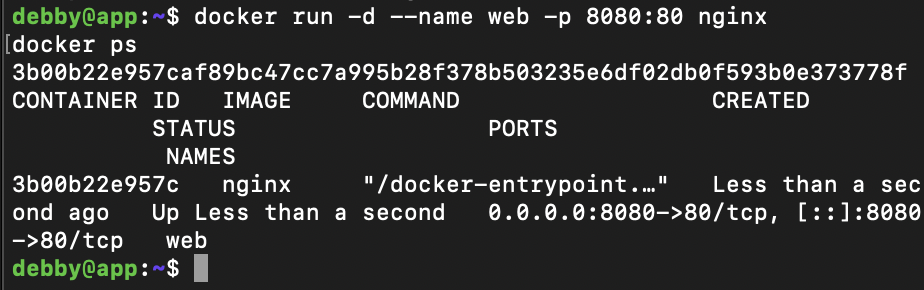

容器 `web` 狀態 `Up`，port `0.0.0.0:8080->80/tcp` 正常對應。

### 從 bastion 驗證服務可達

```bash
curl -I http://172.16.49.133:8080
```

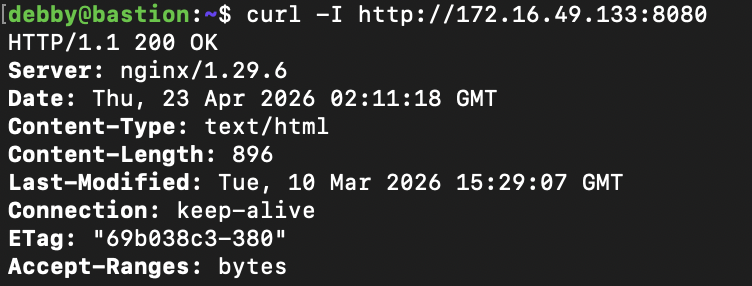

回傳 `HTTP/1.1 200 OK`，nginx 服務正常可達。

---

## 5. Part D：故障演練

### 故障 A：F2 — ufw 全封鎖

**注入方式：** 在 app 上執行 `sudo ufw reset` 並設定 deny all incoming + outgoing，移除所有允許規則。

#### 故障前

從 bastion 記錄正常狀態：

```bash
ssh debby@172.16.49.133 "hostname"
ping -c 3 172.16.49.133
ssh -o ConnectTimeout=5 debby@172.16.49.133 "echo 'bastion -> app OK'"
```

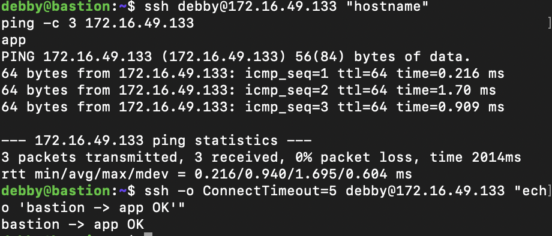

結果：hostname 回傳 `app`，ping 0% packet loss，SSH 正常。

#### 故障中

在 app 上注入故障：

```bash
sudo ufw reset
sudo ufw default deny incoming
sudo ufw default deny outgoing
sudo ufw enable
```


從 bastion 觀測：

```bash
ping -c 3 172.16.49.133
ssh -o ConnectTimeout=5 debby@172.16.49.133 "hostname"
```

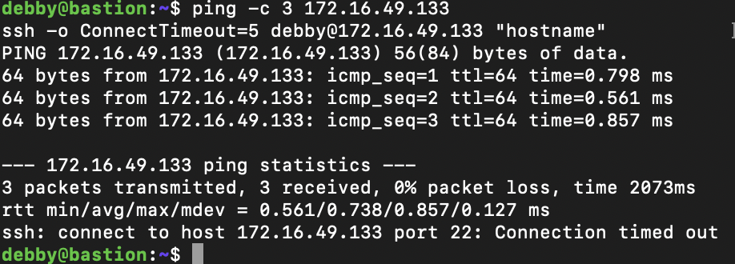

結果：ping 仍然通（0% packet loss），SSH 出現 `Connection timed out`。

#### 回復後

在 app 上恢復規則：

```bash
sudo ufw reset
sudo ufw default deny incoming
sudo ufw default allow outgoing
sudo ufw allow from 172.16.49.132 to any port 22 proto tcp
sudo ufw allow from 172.16.49.132 to any port 8080 proto tcp
sudo ufw enable
```


從 bastion 驗證：

```bash
ssh -o ConnectTimeout=5 debby@172.16.49.133 "hostname"
ping -c 3 172.16.49.133
```

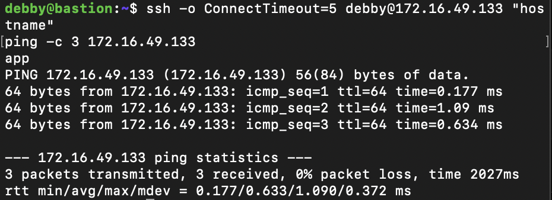

結果：SSH 恢復正常，hostname 回傳 `app`，ping 0% packet loss。

#### 診斷推論

故障中 ping 仍然通，但 SSH timeout。這是關鍵線索：

- **ping 通** → L3 網路層正常，app 網卡活著，IP 路由沒問題
- **SSH timeout** → 封包送到 app 後被防火牆丟棄，沒有任何回應

因此判斷問題在防火牆層（L4）：ufw 把 22/tcp 的封包全部 deny，SSH 客戶端等不到回應而逾時。這跟網卡掛掉（F1）的差異是：F1 會讓 ping 也失敗，F2 的 ping 還是通的，這是分辨兩種故障最重要的依據。

---

### 故障 B：F3 — 停止 Docker Daemon

**注入方式：** 在 app 上執行 `sudo systemctl stop docker docker.socket`。

#### 故障前

```bash
systemctl status docker | head -5
docker ps
```

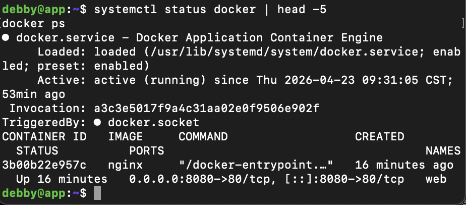

結果：docker `active (running)`，`web` 容器 `Up 16 minutes`。

#### 故障中

在 app 上注入故障：

```bash
sudo systemctl stop docker docker.socket
systemctl status docker | head -5
docker ps
```

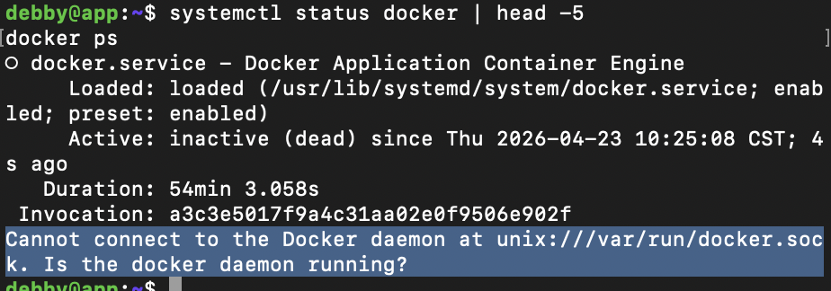

結果：docker `inactive (dead)`，`docker ps` 回傳 `Cannot connect to the Docker daemon`。

從 bastion 確認 SSH 仍然可達：

```bash
ssh -o ConnectTimeout=5 debby@172.16.49.133 "hostname"
```


結果：SSH 正常，hostname 回傳 `app`。

#### 回復後

```bash
sudo systemctl start docker
systemctl status docker | head -5
docker ps
```

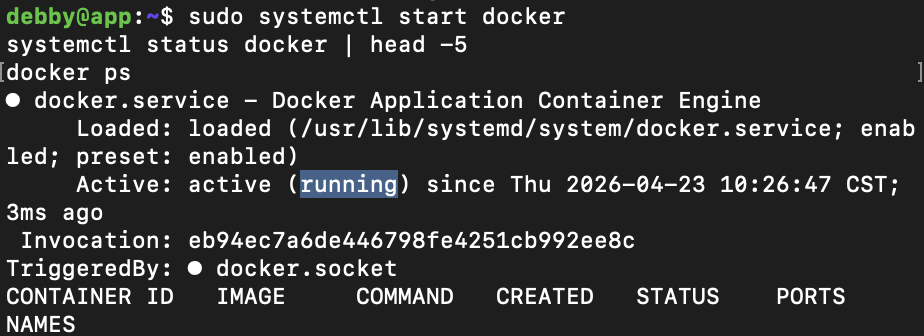

結果：docker 恢復 `active (running)`，容器重新啟動。

#### 診斷推論

SSH 仍然可以連進 app，代表網路層（L3）和防火牆（L4）完全正常。但 `docker ps` 失敗，這是服務層的問題。

Docker CLI（`/usr/bin/docker`）是獨立執行檔，daemon 停了 CLI 還是存在，`docker --version` 也正常。但 CLI 需要透過 `/var/run/docker.sock` 跟 daemon 溝通，daemon 停了之後 socket 消失，所有需要與 daemon 溝通的指令都會失敗。

診斷方向：先 `systemctl status docker` 確認 daemon 狀態，再 `journalctl -u docker` 看日誌找原因，最後 `systemctl start docker` 恢復服務。

---

## 6. 反思（200 字）

這次期中實作讓我對「分層隔離」有了更具體的體會。以前只知道 OSI 模型是理論，但這次親手操作後才發現，每一層的故障真的有不同的「症狀特徵」，不能混為一談。

最印象深刻的是 F2 和 F3 的對比。F2 的 ping 通但 SSH timeout，一開始直覺會以為是網路壞了，但其實網路完全正常，只是防火牆在 L4 把封包丟掉；F3 的 SSH 正常但 docker ps 失敗，代表問題完全在服務層，跟網路和防火牆無關。

這讓我學到一個重要觀念：**timeout 不等於壞了**。timeout 只是「沒有收到回應」，原因可能是防火牆丟包、網路中斷、服務沒回應等很多種，必須用分層的方式逐一排除。先 ping 確認 L3，再測試 port 確認 L4，最後才看服務本身的狀態。這個推理鏈比直接猜測有效得多，讓排錯有了系統性的方法，不再是亂槍打鳥。
