# W03｜多 VM 架構：分層管理與最小暴露設計

## 網路配置

| VM | 角色 | 網卡 | 模式 | IP | 開放埠與來源 |
|---|---|---|---|---|---|
| bastion | 跳板機 | NIC 1 | NAT | 172.16.109.146 | SSH from any |
| bastion | 跳板機 | NIC 2 | Host-only | 172.16.49.132 | — |
| app | 應用層 | NIC 1 | Host-only | 172.16.49.133 | SSH from 172.16.49.0/24 |
| db | 資料層 | NIC 1 | Host-only | 172.16.49.134 | SSH from app (172.16.49.133) + bastion (172.16.49.132) |

### bastion 網路架構

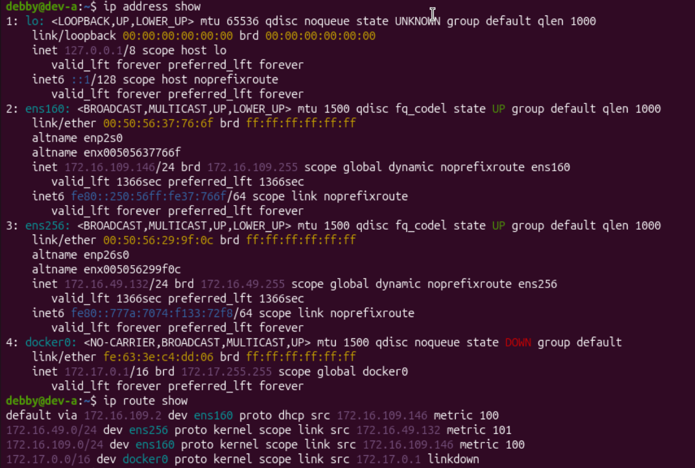

### app 網路架構

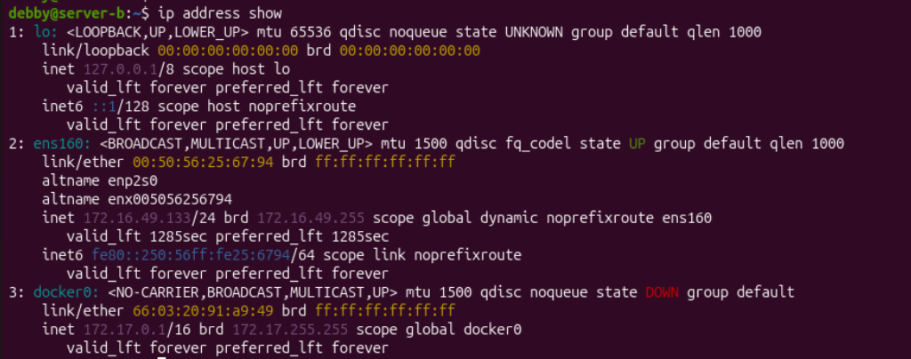

### db 網路架構

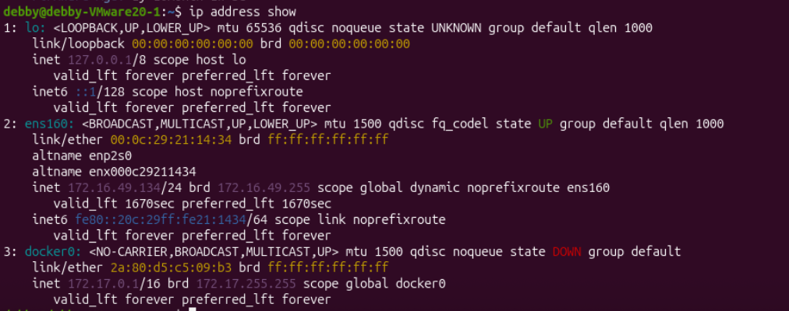

### bastion 可上網（NAT 正常）


### 三台 Host-only 互 ping 全通


---

## SSH 金鑰認證

- 金鑰類型：ed25519
- 公鑰部署到：app 和 db 的 `~/.ssh/authorized_keys`（透過 `ssh-copy-id` 各部署 1 把金鑰）
- 免密碼登入驗證：
  - bastion → app：`金鑰認證成功`
  - bastion → db：`金鑰認證成功`

### 啟用 SSH — bastion


### 啟用 SSH — app


### 啟用 SSH — db


### 在 bastion 上產生 SSH 金鑰對


### 部署公鑰到 app 和 db


### 驗證金鑰已部署

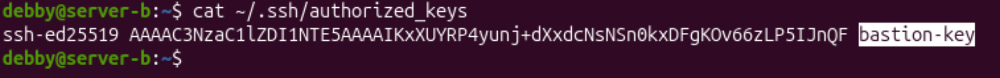

### 停用密碼認證

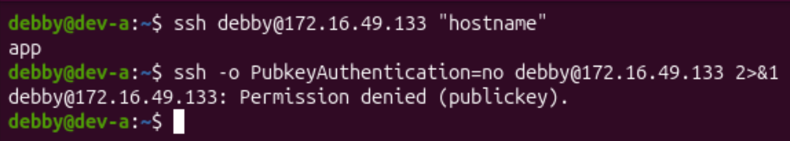

### 從 bastion SSH 到 app 和 db（免密碼驗證）


---

## 防火牆規則

### app 的 ufw status

```
Status: active
Logging: on (low)
Default: deny (incoming), allow (outgoing), deny (routed)
New profiles: skip

To          Action     From
--          ------     ----
22/tcp      ALLOW IN   192.168.56.0/24
```


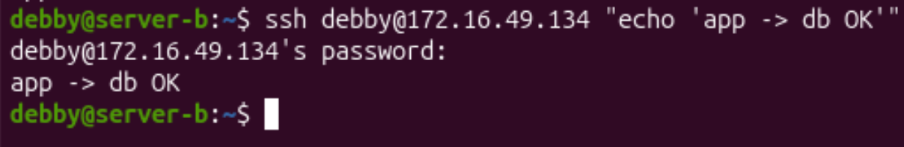

### db 的 ufw status

```
Status: active
Logging: on (low)
Default: deny (incoming), allow (outgoing), deny (routed)
New profiles: skip

To          Action     From
--          ------     ----
22/tcp      ALLOW IN   172.16.49.133
22/tcp      ALLOW IN   172.16.49.132
```


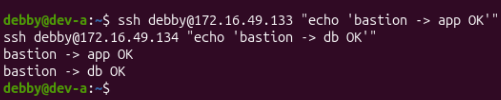

### 防火牆確實在擋的證據

從 bastion 對 app 的 8080 port 執行 curl，防火牆封鎖連線，連線逾時：

```
debby@dev-a:~$ curl -m 5 http://172.16.49.133:8080 2>&1
curl: (28) Connection timed out after 5001 milliseconds
```

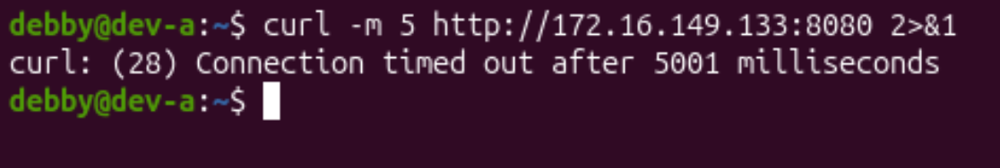

---

## ProxyJump 跳板連線

- 指令（`~/.ssh/config` 設定）：

```
Host bastion
    HostName 172.16.49.132
    User debby

Host app
    HostName 172.16.49.133
    User debby
    ProxyJump bastion

Host db
    HostName 172.16.49.134
    User debby
    ProxyJump bastion
```

### 設定 SSH config 簡化跳板連線


### 從 Host 靠 bastion 跳板連到 app（驗證輸出）


### ProxyJump 失敗排錯過程


### SCP 傳檔驗證

```
echo "Test file via ProxyJump" > /tmp/proxy-test.txt
scp /tmp/proxy-test.txt db:/tmp/
proxy-test.txt    100%    24    36.5KB/s    00:00

ssh db "cat /tmp/proxy-test.txt"
Test file via ProxyJump
```


---

## 故障場景一：防火牆全封鎖

| 項目 | 故障前 | 故障中 | 回復後 |
|---|---|---|---|
| app ufw status | active + rules（允許 22/tcp from bastion） | deny all（incoming + outgoing 全封） | active + rules（重設後允許 22/tcp from 172.16.49.132） |
| bastion ping app | 成功（0% packet loss） | 成功（ICMP 不受 ufw 封鎖） | 成功（0% packet loss） |
| bastion SSH app | 成功 | **timed out** | 成功（hostname 回傳 `app`） |

### 記錄故障前基線

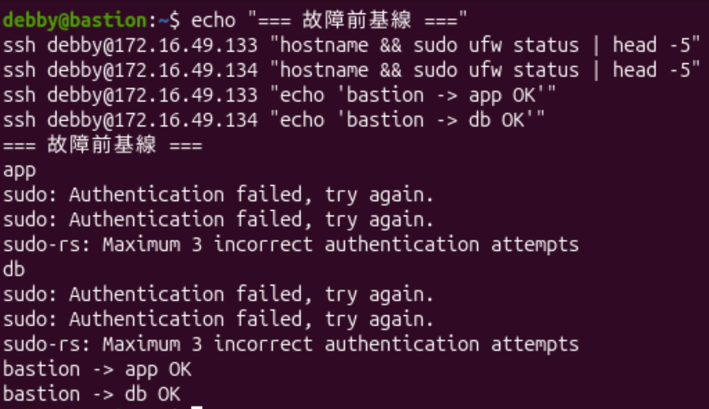

### 故障注入：在 app 上重設防火牆為全部拒絕


### 從 bastion 觀測故障（timed out）


### 在 app 上回復防火牆規則


---

## 故障場景二：SSH 服務停止

| 項目 | 故障前 | 故障中 | 回復後 |
|---|---|---|---|
| ss -tlnp \| grep :22 | 有監聽（`0.0.0.0:22` 及 `[::]:22`） | 無監聽 | 有監聽（恢復 `0.0.0.0:22` 及 `[::]:22`） |
| bastion ping app | 成功（0% packet loss） | 成功（L3 網路層正常） | 成功（0% packet loss） |
| bastion SSH app | 成功 | **refused** | 成功（hostname 回傳 `app`） |

### 故障注入：在 app 上停止 SSH 服務


### 從 bastion 觀測故障並對比兩種錯誤


### 回復 SSH 服務 — app


### 回復 SSH 服務 — bastion 端驗證


### 回復後驗證

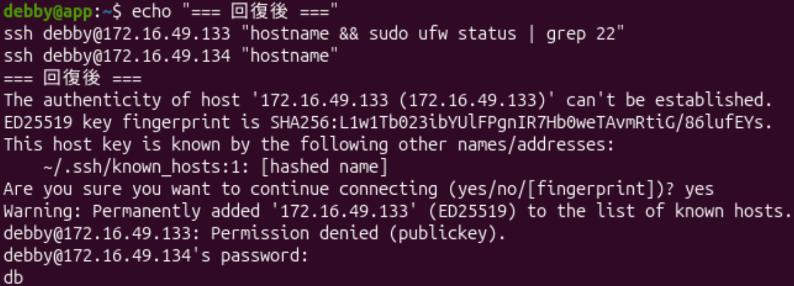

---

## timeout vs refused 差異

**Connection timed out（連線逾時）**：
封包送出去後完全沒有任何回應，TCP 握手未完成也沒有收到 RST，客戶端只能等到超時才放棄。代表封包被「丟棄」，通常是防火牆（`ufw deny`）造成的。
排錯方向：先檢查防火牆規則（`sudo ufw status`），再用 `ping` 確認網路路由是否正常。

**Connection refused（連線拒絕）**：
封包送達目標主機後，主機立刻回傳 TCP RST，表示該 port 沒有程式在監聽。代表網路層是通的，但服務沒有啟動。
排錯方向：確認服務是否在跑（`ss -tlnp | grep :22`）、確認服務狀態（`sudo systemctl status ssh`）。

**總結**：`timed out` 指向防火牆／網路層問題；`refused` 指向服務未啟動問題。關鍵差異在於對方有沒有「回應」——有回應（即使是拒絕）代表網路通，沒回應才是被防火牆擋住。

---

## 網路拓樸圖

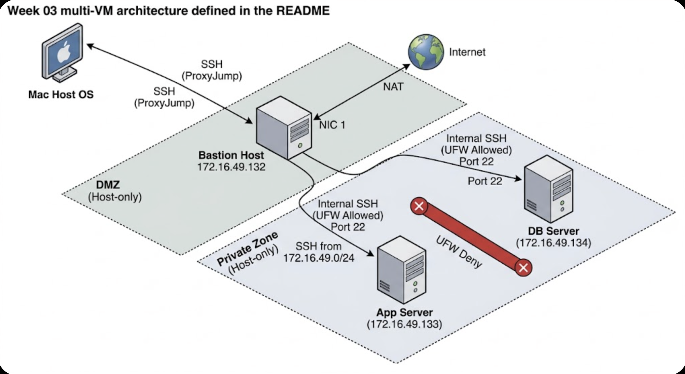

```
Internet / Host
     │
     │ NAT（172.16.109.146）
     ▼
┌─────────────┐
│   bastion   │──── Host-only（172.16.49.132）────┐
└─────────────┘                                   │
                                       ┌───────────┴───────────┐
                             ┌─────────▼──────────┐  ┌─────────▼──────────┐
                             │        app          │  │         db          │
                             │   172.16.49.133     │  │   172.16.49.134     │
                             └────────────────────┘  └────────────────────┘
                              SSH: from bastion         SSH: from app + bastion
```

---

## 排錯紀錄

- **症狀**：從 Host 使用 `ssh -J debby@172.16.49.132 debby@172.16.49.133 "hostname"` 出現 `zsh: unknown file attribute: J` 及 `Permission denied (publickey)` 錯誤，無法透過跳板連線到 app。
- **診斷**：首先確認 bastion 本身連通（`ssh bastion "hostname"` 回傳 `bastion` 成功）；再確認 bastion → db 連線（`ssh bastion "ssh debby@172.16.49.134 hostname"` 回傳 `db`），判斷問題出在 Host 端的 `-J` 語法解析失敗（zsh 不支援該寫法），以及 app 公鑰尚未正確部署。
- **修正**：改用 `~/.ssh/config` 設定 `ProxyJump bastion`，替代命令列的 `-J` 參數；同時透過 `ssh-copy-id` 確認公鑰已部署到 app 的 `~/.ssh/authorized_keys`。
- **驗證**：執行 `ssh app "hostname"` 回傳 `app`，`ssh db "hostname"` 回傳 `db`，全程無需輸入密碼，ProxyJump 與金鑰認證均正常。

---

## 設計決策

**為什麼 db 允許 bastion 直連，而不是只允許從 app 跳？**

本週設計讓 db 同時允許來自 app（172.16.49.133）與 bastion（172.16.49.132）的 SSH 連線，而非只開放 app。

從純粹安全角度來看，只允許 app → db 是更嚴格的設計，確保 db 只被應用層存取，完全符合最小暴露原則。但在實務維運上，若 app 發生故障（服務掛掉或 SSH 停止），管理員就完全無法直接登入 db 進行排查或緊急修復，必須先修好 app 才能繼續，大幅增加維運風險。

因此，允許 bastion 直連 db 是在「安全性」與「可維運性」之間的取捨：犧牲一點理論上的最嚴格隔離，換取管理員在緊急情況下仍能透過受信任的跳板機直接進入 db 排錯的能力。bastion 本身已是受控的進入點，透過 bastion 直連 db 的風險是可以接受的，這也是實務上常見的設計模式。
